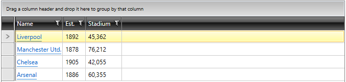
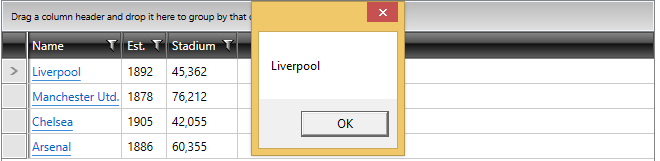

# Subscribe to Click Event in GridViewHyperlinkColumn

If you have defined a __GridViewHyperlinkColumn__ within your __RadGridView__, you might need to subscribe to its "Click" event for some internal operations. This article describes two approaches that you can take.

If the first column of the __RadGridView__ is a __GridViewHyperlinkColumn__, as in the picture below:

#### __Figure1: RadGridView with GridViewHyperLinkColumn__ 


## First Approach

You can apply the following logic in the code behind:

__Subscribe to Click Event in GridViewHyperlinkColumn__
```C#	
		public MainWindow()
        {
            InitializeComponent();
            this.AddHandler(Hyperlink.ClickEvent, new RoutedEventHandler(hyperlinkClicked));
        }

        private void hyperlinkClicked(object sender, RoutedEventArgs e)
        {
            Hyperlink hyperLink = e.OriginalSource as Hyperlink;
            MessageBox.Show(hyperLink.NavigateUri.ToString());
        }
```

__Figure 2__ shows the result after clicking the hyperlink:

#### __Figure 2: The result after clicking the hyperlink__ 


## Second Approach
Declare a standard __GridViewDataColumn__ instead of __GridViewHyperlinkColumn__. You can subscribe to the MouseLeftButtonUp event of the TextBlock element defined within the CellTemplate of the __GridViewDataColumn__ and use a Style to imitate a hyperlink:

__Declare the GridViewHyperlinkColumn and its CellTemplate:__
```XAML	
		<Style x:Key="HyperlinkStyle" TargetType="TextBlock">
            <Setter Property="Foreground" Value="Blue" />
            <Setter Property="TextDecorations" Value="Underline" />
        </Style>					...

	   <telerik:GridViewDataColumn DataMemberBinding="{Binding Name}">
                    <telerik:GridViewDataColumn.CellTemplate>
                        <DataTemplate>
                            <TextBlock Style="{StaticResource HyperlinkStyle}" Text="{Binding Name}" MouseLeftButtonUp="TextBlock_MouseLeftButtonUp"/>
                        </DataTemplate>
                    </telerik:GridViewDataColumn.CellTemplate>
       </telerik:GridViewDataColumn>
```

__Handle the MouseLeftButtonUp event__
```C#	
		private void TextBlock_MouseLeftButtonUp(object sender, MouseButtonEventArgs e)
        {
            var teamName = (e.Source as TextBlock).Text;
            MessageBox.Show(teamName);
        }
```

The result will be the same as the one shown in __Figure 2__.

## See Also
 * [CellTemplate and CellEditTemplate]()
 * [CheckBox Column]() 