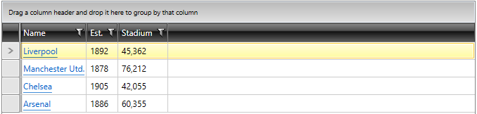
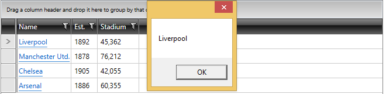

# Subscribe to Click Event in GridViewHyperlinkColumn

If you have defined a __GridViewHyperlinkColumn__ within your __RadGridView__, you might need to subscribe to its "Click" event for some internal operations. This article describes two approaches that you can take.

If the first column of the __RadGridView__ is a __GridViewHyperlinkColumn__, as in the picture below:

#### __Figure1: RadGridView with GridViewHyperLinkColumn__ 

## First Approach

You can apply the following logic in the code behind:

__Subscribe to Click Event in GridViewHyperlinkColumn__
<snippet id='radgridview-columns-how-to-hyperlink-column-click-event-subscribe_to_click_event_in_gridviewhyperlinkcolumn-cs' />

__Figure 2__ shows the result after clicking the hyperlink:

#### __Figure 2: The result after clicking the hyperlink__ 

## Second Approach
Declare a standard __GridViewDataColumn__ instead of __GridViewHyperlinkColumn__. You can subscribe to the MouseLeftButtonUp event of the TextBlock element defined within the CellTemplate of the __GridViewDataColumn__ and use a Style to imitate a hyperlink:

__Declare the GridViewHyperlinkColumn and its CellTemplate:__
<snippet id='radgridview-columns-how-to-hyperlink-column-click-event-declare_the_gridviewhyperlinkcolumn_and_its_celltemplate-xaml' />

__Handle the MouseLeftButtonUp event__
<snippet id='radgridview-columns-how-to-hyperlink-column-click-event-handle_the_mouseleftbuttonup_event-cs' />

The result will be the same as the one shown in __Figure 2__.

## See Also
 * [CellTemplate and CellEditTemplate]()
 * [CheckBox Column]() 