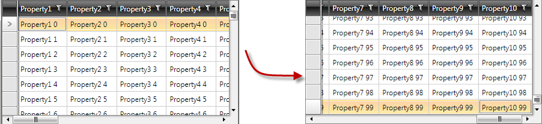

# Scroll to Particular Row or Column

This article shows how to scroll RadGridView to a particular row and / or column. There are two methods that can be invoked:

* __ScrollIntoViewAsync__ 
* __ScrollIndexIntoViewAsync__. 

We can use them against RadGridView with many rows and columns. The ultimate goal would be to scroll to the last column of the last row:
#### __Figure 1: Scroll to the last column of the last row__                     


## ScrollIntoViewAsync

__ScrollIntoViewAsync__ method accepts the following parameters:
            

* DataItem of type Object - the business object you want to scroll to.

* [optional] Column of type GridViewColumn - GridViewColumn you want to scroll to

* CallBack method - it will be called when the method succeeds

Here is the code that will scroll to the last row and last column of RadGridView:

__Example 1: Scroll to the last row and last column__

```C#
	this.radgridView.ScrollIntoViewAsync(this.radgridView.Items[this.radgridView.Items.Count - 1], //the row
	                                  this.radgridView.Columns[this.radgridView.Columns.Count - 1], //the column
	                                  new Action<FrameworkElement>((f) =>
	                                  {
	                                      (f as GridViewRow).IsSelected = true; // the callback method; if it is not necessary, you may set that parameter to null;
	                                  }));
```
```VB.NET
	Me.radgridView.ScrollIntoViewAsync(Me.radgridView.Items(Me.radgridView.Items.Count - 1), Me.radgridView.Columns(Me.radgridView.Columns.Count - 1),
	                                   New Action(Of FrameworkElement)(Sub(f)
	                                                                       TryCast(f, GridViewRow).IsSelected = True ' the callback method; if it is not necessary, you may set that parameter to null;
	                                                                   End Sub)) 'the column - the row
```

You should use this method when [UI virtualization]() is turned on (which is by default). If for some reason you have disabled the virtualization - you can use the __ScrollIntoView__ counterpart. The only difference in terms of programming API is that no callback method is called when the ScrollIntoView succeeds.
 
## ScrollIndexIntoViewAsync (added Q3 2011)

__ScrollIndexIntoViewAsync__ method accepts the following parameters:
            

* Index of type int - index of the business object you want to scroll to.

* [optional] Column of type GridViewColumn - GridViewColumn you want to scroll to

* CallBack method - it will be called when the method succeeds

* [optional] CallBack method - the method to execute when scrolling has failed.

Here is the code that will scroll into the last row and last column of RadGridView:

__Example 2: Scroll into the last row and last column of RadGridView__

```C#
	this.radgridView.ScrollIndexIntoViewAsync(this.radgridView.Items.Count - 1, //the row
	                                  this.radgridView.Columns[this.radgridView.Columns.Count - 1], //the column
	                                  new Action<FrameworkElement>((f) =>
	                                  {
	                                      (f as GridViewRow).IsSelected = true; // the callback method; if it is not necessary, you may set that parameter to null;
	                                  }), null);
```
```VB.NET
	Me.radgridView.ScrollIndexIntoViewAsync(Me.radgridView.Items.Count - 1, Me.radgridView.Columns(Me.radgridView.Columns.Count - 1),
	                                        New Action(Of FrameworkElement)(Sub(f)
	                                                                            TryCast(f, GridViewRow).IsSelected = True ' the callback method; if it is not necessary, you may set that parameter to null;
	                                                                        End Sub),
	                                        Nothing) 'the column - the row
```

You should use this method when [UI virtualization]() is turned on (which is by default). If you have disabled the virtualization - you can use the __ScrollIndexIntoView__ counterpart. The only difference in terms of programming API is that no callback method is called when the ScrollIndexIntoView succeeds.
            


