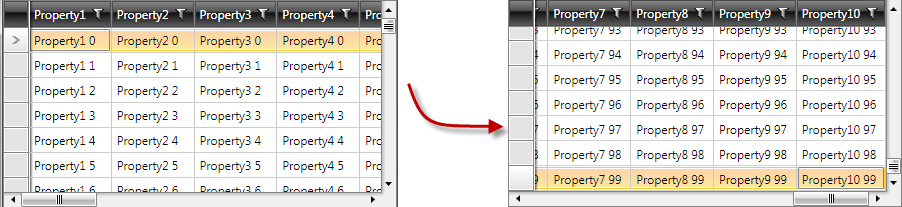

# Scroll to Particular Row or Column

This article shows how to scroll RadGridView to a particular row and / or column. There are two methods that can be invoked:

* __ScrollIntoViewAsync__ 
* __ScrollIndexIntoViewAsync__. 

We can use them against RadGridView with many rows and columns. The ultimate goal would be to scroll to the last column of the last row:
#### __Figure 1: Scroll to the last column of the last row__                     

## ScrollIntoViewAsync

__ScrollIntoViewAsync__ method accepts the following parameters:
            

* DataItem of type Object - the business object you want to scroll to.

* [optional] Column of type GridViewColumn - GridViewColumn you want to scroll to

* CallBack method - it will be called when the method succeeds

Here is the code that will scroll to the last row and last column of RadGridView:

__Example 1: Scroll to the last row and last column__

<snippet id='radgridview-columns-how-to-scroll-item-example_1_scroll_to_the_last_row_and_last_column-cs' />

<snippet id='radgridview-columns-how-to-scroll-item-example_1_scroll_to_the_last_row_and_last_column-vb' />

You should use this method when [UI virtualization]() is turned on (which is by default). If for some reason you have disabled the virtualization - you can use the __ScrollIntoView__ counterpart. The only difference in terms of programming API is that no callback method is called when the ScrollIntoView succeeds.
 
## ScrollIndexIntoViewAsync (added Q3 2011)

__ScrollIndexIntoViewAsync__ method accepts the following parameters:
            

* Index of type int - index of the business object you want to scroll to.

* [optional] Column of type GridViewColumn - GridViewColumn you want to scroll to

* CallBack method - it will be called when the method succeeds

* [optional] CallBack method - the method to execute when scrolling has failed.

Here is the code that will scroll into the last row and last column of RadGridView:

__Example 2: Scroll into the last row and last column of RadGridView__

<snippet id='radgridview-columns-how-to-scroll-item-example_2_scroll_into_the_last_row_and_last_column_of_radgridview-cs' />

<snippet id='radgridview-columns-how-to-scroll-item-example_2_scroll_into_the_last_row_and_last_column_of_radgridview-vb' />

You should use this method when [UI virtualization]() is turned on (which is by default). If you have disabled the virtualization - you can use the __ScrollIndexIntoView__ counterpart. The only difference in terms of programming API is that no callback method is called when the ScrollIndexIntoView succeeds.
            

