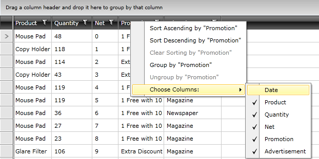

# Use a RadContextMenu in MVVM

This tutorial will show you how use a RadContextMenu with a RadGridView

## Define a RadContextMenu with MenuItems

First you need to define the context menu with menu items.

```XAML
	<local:ObjectToStringConverter x:Key="ObjectToStringConverter" />
	<local:RadContextMenuXamlHolder x:Key="ContextMenuHolder">
	    <telerik:RadContextMenu DataContext="{Binding Path=UIElement.Column.DataControl.DataContext, RelativeSource={RelativeSource Self}}" InheritDataContext="False">
	        <telerik:RadMenuItem Command="{Binding SortAscendingCommand}"
	                    CommandParameter="{Binding Path=Menu.UIElement,
	                                            RelativeSource={RelativeSource Self}}"
	                    Header="{Binding Path=Menu.UIElement.Column.Header,
	                                    RelativeSource={RelativeSource Self},
	                                    Converter={StaticResource ObjectToStringConverter},
	                                    ConverterParameter='Sort Ascending by &quot;{0}&quot;'}" />
	        <telerik:RadMenuItem Command="{Binding SortDescendingCommand}"
	                    CommandParameter="{Binding Path=Menu.UIElement,
	                                            RelativeSource={RelativeSource Self}}"
	                    Header="{Binding Path=Menu.UIElement.Column.Header,
	                                    RelativeSource={RelativeSource Self},
	                                    Converter={StaticResource ObjectToStringConverter},
	                                    ConverterParameter='Sort Descending by &quot;{0}&quot;'}" />
	        <telerik:RadMenuItem Command="{Binding ClearSortCommand}"
	                    CommandParameter="{Binding Path=Menu.UIElement,
	                                            RelativeSource={RelativeSource Self}}"
	                    Header="{Binding Path=Menu.UIElement.Column.Header,
	                                    RelativeSource={RelativeSource Self},
	                                    Converter={StaticResource ObjectToStringConverter},
	                                    ConverterParameter='Clear Sorting by &quot;{0}&quot;'}" />
	        <telerik:RadMenuItem Command="{Binding GroupbyCommand}"
	                    CommandParameter="{Binding Path=Menu.UIElement,
	                                            RelativeSource={RelativeSource Self}}"
	                    Header="{Binding Path=Menu.UIElement.Column.Header,
	                                    RelativeSource={RelativeSource Self},
	                                    Converter={StaticResource ObjectToStringConverter},
	                                    ConverterParameter='Group by &quot;{0}&quot;'}" />
	        <telerik:RadMenuItem Command="{Binding UngroupCommand}"
	                    CommandParameter="{Binding Path=Menu.UIElement,
	                                            RelativeSource={RelativeSource Self}}"
	                    Header="{Binding Path=Menu.UIElement.Column.Header,
	                                    RelativeSource={RelativeSource Self},
	                                    Converter={StaticResource ObjectToStringConverter},
	                                    ConverterParameter='Ungroup by &quot;{0}&quot;'}" />
	        <telerik:RadMenuItem Header="Choose Columns:" ItemsSource="{Binding Path=Menu.UIElement.Column.DataControl.Columns, RelativeSource={RelativeSource Self}}">
	            <telerik:RadMenuItem.ItemContainerStyle>
	                <Style TargetType="telerik:RadMenuItem">
	                    <Setter Property="Header" Value="{Binding Header}" />
	                    <Setter Property="IsChecked" Value="{Binding IsVisible, Mode=TwoWay}" />
	                    <Setter Property="IsCheckable" Value="True" />
	                </Style>
	            </telerik:RadMenuItem.ItemContainerStyle>
	        </telerik:RadMenuItem>
	    </telerik:RadContextMenu>
	</local:RadContextMenuXamlHolder>
```

## Create a style for the column headers

You need to attach the defined context menu to the column headers. 

```XAML
	<Style TargetType="telerik:GridViewHeaderCell">
	    <Setter Property="telerik:RadContextMenu.ContextMenu" Value="{Binding Path=ContextMenu, Source={StaticResource ContextMenuHolder}}" />
	</Style>
```

## Define the RadGridView

The style targeting GridViewHeaderCell will be automatically applied for the RadGridView

```XAML
	<Grid x:Name="LayoutRoot" Background="White" DataContext="{StaticResource ViewModel}">
	    <telerik:RadGridView ItemsSource="{Binding Items}" />
	</Grid>
```

## Implementaions in code behind

The RadContextMenuXamlHolder class is defined in code behind like so:

```C#
	[ContentProperty("ContextMenu")]
	public class RadContextMenuXamlHolder : INotifyPropertyChanged
	{
	    private RadContextMenu contextMenu;
	    public event PropertyChangedEventHandler PropertyChanged;
	
	    public RadContextMenu ContextMenu
	    {
	        get
	        {
	            return this.contextMenu;
	        }
	        set
	        {
	            if (this.contextMenu != value)
	            {
	                this.contextMenu = value;
	                this.RaisePropertyChanged("ContextMenu");
	            }
	        }
	    }
	
	    private void RaisePropertyChanged(string propertyName)
	    {
	        if (this.PropertyChanged != null)
	        {
	            this.PropertyChanged(this, new PropertyChangedEventArgs(propertyName));
	        }
	    }
	}
```

The RadContextMenuXamlHolder class is defined as follows:
   
```C#
	public class ObjectToStringConverter : IValueConverter
	{
	    public object Convert(object value, Type targetType, object parameter, System.Globalization.CultureInfo culture)
	    {
	        return string.Format(System.Convert.ToString(parameter), value);
	    }
	
	    public object ConvertBack(object value, Type targetType, object parameter, System.Globalization.CultureInfo culture)
	    {
	        throw new NotImplementedException();
	    }
	}
```

The implementation of the ViewModel is below:

```C#
	public ViewModel()
	{
	    this.Items = LoadData();
	
	    this.SortAscendingCommand = new DelegateCommand(OnSortAscending, CanSortAscending);
	    this.SortDescendingCommand = new DelegateCommand(OnSortDescending, CanSortDescending);
	    this.ClearSortCommand = new DelegateCommand(OnClearSort, CanClearSort);
	    this.GroupbyCommand = new DelegateCommand(OnGroupby, CanGroupby);
	    this.UngroupCommand = new DelegateCommand(OnUngroup, CanUngroup);
	}
	
	public DelegateCommand SortAscendingCommand { get; private set; }
	public DelegateCommand SortDescendingCommand { get; private set; }
	public DelegateCommand ClearSortCommand { get; private set; }
	public DelegateCommand GroupbyCommand { get; private set; }
	public DelegateCommand UngroupCommand { get; private set; }
	
	public IEnumerable Items
	{
	    get;
	    private set;
	}
	
	private static void Sort(GridViewHeaderCell cell, ListSortDirection sortDirection)
	{
	    RadGridView grid = cell.Column.DataControl as RadGridView;
	    ColumnSortDescriptor sd = (from d in grid.SortDescriptors.OfType<ColumnSortDescriptor>()
	                               where object.Equals(d.Column, cell.Column)
	                               select d).FirstOrDefault();
	
	    if (sd != null)
	    {
	        grid.SortDescriptors.Remove(sd);
	    }
	
	    ColumnSortDescriptor newDescriptor = new ColumnSortDescriptor();
	    newDescriptor.Column = cell.Column;
	    newDescriptor.SortDirection = sortDirection;
	
	    grid.SortDescriptors.Add(newDescriptor);
	}
	
	private void OnSortAscending(object parameter)
	{
	    GridViewHeaderCell cell = parameter as GridViewHeaderCell;
	    if (cell != null && cell.Column != null && cell.Column.DataControl != null && cell.Column.SortingState != SortingState.Ascending)
	    {
	        Sort(cell, ListSortDirection.Ascending);
	    }
	}
	
	private bool CanSortAscending(object parameter)
	{
	    GridViewHeaderCell cell = parameter as GridViewHeaderCell;
	    if (cell != null && cell.Column != null && cell.Column.CanSort() && cell.Column.DataControl != null && cell.Column.SortingState != SortingState.Ascending)
	    {
	        return true;
	    }
	
	    return false;
	}
	
	private void OnSortDescending(object parameter)
	{
	    GridViewHeaderCell cell = parameter as GridViewHeaderCell;
	    if (cell != null && cell.Column != null && cell.Column.CanSort() && cell.Column.DataControl != null && cell.Column.SortingState != SortingState.Descending)
	    {
	        Sort(cell, ListSortDirection.Descending);
	    }
	}
	
	private bool CanSortDescending(object parameter)
	{
	    GridViewHeaderCell cell = parameter as GridViewHeaderCell;
	    if (cell != null && cell.Column != null && cell.Column.CanSort() && cell.Column.DataControl != null && cell.Column.SortingState != SortingState.Descending)
	    {
	        return true;
	    }
	
	    return false;
	}
	
	private void OnClearSort(object parameter)
	{
	    GridViewHeaderCell cell = parameter as GridViewHeaderCell;
	    if (cell != null && cell.Column != null && cell.Column.CanSort() && cell.Column.DataControl != null && cell.Column.SortingState != SortingState.None)
	    {
	        RadGridView grid = cell.Column.DataControl as RadGridView;
	        ColumnSortDescriptor sd = (from d in grid.SortDescriptors.OfType<ColumnSortDescriptor>()
	                                   where object.Equals(d.Column, cell.Column)
	                                   select d).FirstOrDefault();
	
	        if (sd != null)
	        {
	            grid.SortDescriptors.Remove(sd);
	        }
	    }
	}
	
	private bool CanClearSort(object parameter)
	{
	    GridViewHeaderCell cell = parameter as GridViewHeaderCell;
	    if (cell != null && cell.Column != null && cell.Column.CanSort() && cell.Column.DataControl != null && cell.Column.SortingState != SortingState.None)
	    {
	        return true;
	    }
	
	    return false;
	}
	
	private void OnGroupby(object parameter)
	{
	    GridViewHeaderCell cell = parameter as GridViewHeaderCell;
	    if (cell != null && cell.Column != null && cell.Column.DataControl != null && cell.Column.CanGroup())
	    {
	        RadGridView grid = cell.Column.DataControl as RadGridView;
	
	        ColumnGroupDescriptor gd = (from d in grid.GroupDescriptors.OfType<ColumnGroupDescriptor>()
	                                    where object.Equals(d.Column, cell.Column)
	                                    select d).FirstOrDefault();
	
	        if (gd == null)
	        {
	            ColumnGroupDescriptor newDescriptor = new ColumnGroupDescriptor();
	            newDescriptor.Column = cell.Column;
	            newDescriptor.SortDirection = ListSortDirection.Ascending;
	            grid.GroupDescriptors.Add(newDescriptor);
	        }
	    }
	}
	
	private bool CanGroupby(object parameter)
	{
	    GridViewHeaderCell cell = parameter as GridViewHeaderCell;
	    if (cell != null && cell.Column != null && cell.Column.DataControl != null && cell.Column.CanGroup())
	    {
	        RadGridView grid = cell.Column.DataControl as RadGridView;
	
	        ColumnGroupDescriptor gd = (from d in grid.GroupDescriptors.OfType<ColumnGroupDescriptor>()
	                                    where object.Equals(d.Column, cell.Column)
	                                    select d).FirstOrDefault();
	
	        if (gd == null)
	        {
	            return true;
	        }
	    }
	
	    return false;
	}
	
	private void OnUngroup(object parameter)
	{
	    GridViewHeaderCell cell = parameter as GridViewHeaderCell;
	    if (cell != null && cell.Column != null && cell.Column.DataControl != null && cell.Column.CanGroup())
	    {
	        RadGridView grid = cell.Column.DataControl as RadGridView;
	
	        ColumnGroupDescriptor gd = (from d in grid.GroupDescriptors.OfType<ColumnGroupDescriptor>()
	                                    where object.Equals(d.Column, cell.Column)
	                                    select d).FirstOrDefault();
	
	        if (gd != null)
	        {
	            grid.GroupDescriptors.Remove(gd);
	        }
	    }
	}
	
	private bool CanUngroup(object parameter)
	{
	    GridViewHeaderCell cell = parameter as GridViewHeaderCell;
	    if (cell != null && cell.Column != null && cell.Column.DataControl != null && cell.Column.CanGroup())
	    {
	        RadGridView grid = cell.Column.DataControl as RadGridView;
	
	        ColumnGroupDescriptor gd = (from d in grid.GroupDescriptors.OfType<ColumnGroupDescriptor>()
	                                    where object.Equals(d.Column, cell.Column)
	                                    select d).FirstOrDefault();
	
	        if (gd != null)
	        {
	            return true;
	        }
	    }
	
	    return false;
	}
	
	private static List<Order> LoadData()
	{
	    // return data
	    return new List<Order>();
	}
	    }
```

## The defined ContextMenu works



You can also check __Header Context Menu__ and __Row Context Menu__ [WPF Demos](https://demos.telerik.com/wpf/).


