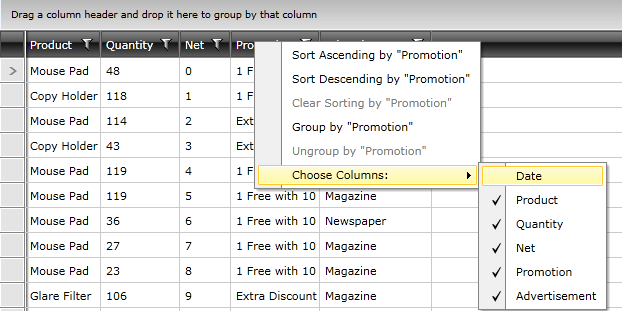

# Use a RadContextMenu in MVVM

This tutorial will show you how use a RadContextMenu with a RadGridView

## Define a RadContextMenu with MenuItems

First you need to define the context menu with menu items.

<snippet id='radgridview-columns-how-to-use-radcontextmenu-mvvm-block_1-xaml' />

## Create a style for the column headers

You need to attach the defined context menu to the column headers. 

<snippet id='radgridview-columns-how-to-use-radcontextmenu-mvvm-block_2-xaml' />

## Define the RadGridView

The style targeting GridViewHeaderCell will be automatically applied for the RadGridView

<snippet id='radgridview-columns-how-to-use-radcontextmenu-mvvm-block_3-xaml' />

## Implementaions in code behind

The RadContextMenuXamlHolder class is defined in code behind like so:

<snippet id='radgridview-columns-how-to-use-radcontextmenu-mvvm-block_4-cs' />

The RadContextMenuXamlHolder class is defined as follows:
   
<snippet id='radgridview-columns-how-to-use-radcontextmenu-mvvm-block_5-cs' />

The implementation of the ViewModel is below:

<snippet id='radgridview-columns-how-to-use-radcontextmenu-mvvm-block_6-cs' />

## The defined ContextMenu works

You can also check __Header Context Menu__ and __Row Context Menu__ [WPF Demos](https://demos.telerik.com/wpf/).

