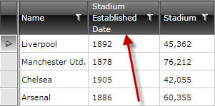

# Wrap the Text in the Column Header

This article shows how you can wrap the text of the column header, i.e. to have a multi-line text in the header. The end result will look like this:



### Solution 1

As of __R2 2016__, the columns expose a **HeaderTextWrapping** property which can be used to set the wrapping of the column header cells.


```XAML

	<telerik:GridViewDataColumn DataMemberBinding="{Binding Established}" 
								DataFormatString="{}{0:yyyy}"
								Width="100"
								Header="Stadium Established Date"
								HeaderTextWrapping="Wrap" />
```

>More information about the headers' text properties which can be set on the columns can be found [here](#text-properties).

### Solution 2

We will take advantage of the fact that the __Header__ property of the GridView column is of type Object so we can put everything in it. In this case this would be a TextBlock which has a convenient property __TextWrapping__


```XAML

	<telerik:GridViewDataColumn DataMemberBinding="{Binding Established}" 
	                            DataFormatString="{}{0:yyyy}"
	                            Width="100" >
	    <telerik:GridViewDataColumn.Header>
	        <TextBlock Text="Stadium Established Date" TextWrapping="Wrap" />
	    </telerik:GridViewDataColumn.Header>
	</telerik:GridViewDataColumn>
```

>importantPlease note that this approach can cause issues if you're binding the header to another control's content, for example, the Content of the CheckBoxes from the example in the [Control Panel]() article. In this case, you need to make sure that you're creating a copy of the TextBlock or use a converter to only access its Text property.

## See also
 * [Column Headers]()
 * [Foreground color does not change in a custom header]()