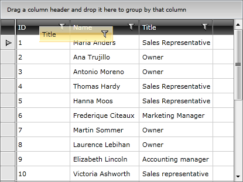

# Reordering Columns

__RadGridView__ supports column reordering and it can be done by the user in run-time. The user can drag the desired column's header at the desired position among the other headers and drop it there.



## Reordering modes 

RadGridView suggests different modes when reordering a column. You can control it through the __ReorderColumnsMode__ property.
        
You can find the possible values you can assign for it bellow:
        
* __DropIndicator__ - Displays only drop mark indicating the destination drop location
            
* __None__ - Does not display any indicators
            
* __ReorderColumns__ - Reorder columns while dragging cells
            
* __Interactive__ - Reorder columns and show drop indicator
            
## Disabling Reordering

There are two ways to disable reordering. 

**1**. The first one is to disable it on __RadGridView__ level by setting the __CanUserReorderColumns__ property to __False__, which means that none of the columns will be re-orderable.

__Example 1: Disable Reordering__

```XAML
	<telerik:RadGridView x:Name="radGridView"
	                 CanUserReorderColumns="False">
	    <!-- ... -->
	</telerik:RadGridView>
```

__Example 2: Disable Reordering in code__

```C#
	this.radGridView.CanUserReorderColumns = false;
```
```VB.NET
	Me.radGridView.CanUserReorderColumns = False
```

The headers will be still draggable, but when you drop them nothing will happen.

**2**. You can also disable the reordering for a particular column by setting its __IsReorderable__ property.

__Example 3: Disable Reordering for a particular column__

```XAML
	<telerik:GridViewDataColumn DataMemberBinding="{Binding Name}"
	                Header="Name"
	                IsReorderable="False" />
```

__Example 4: Disable Reordering for a particular column in code__
```C#
	this.radGridView.Columns[0].IsReorderable = false;
```
```VB.NET
	Me.radGridView.Columns(0).IsReorderable = False
```

## Reordering programmatically 

The order of the columns may also be configured by setting the __DisplayIndex__ property of each of them:

__Example 5: Reorder using DisplayIndex__
```XAML
	<telerik:RadGridView.Columns>
	    <telerik:GridViewDataColumn DataMemberBinding="{Binding Name}" DisplayIndex="0"/>
	    <telerik:GridViewDataColumn DataMemberBinding="{Binding Number}" DisplayIndex="2"/>
	    <telerik:GridViewDataColumn DataMemberBinding="{Binding Country}" DisplayIndex="1"/>
	</telerik:RadGridView.Columns>
```

__Example 6: Reorder using DisplayIndex in code__
```C#
	this.radGridView.Columns[0].DisplayIndex = 0;
	this.radGridView.Columns[1].DisplayIndex = 2;
	this.radGridView.Columns[2].DisplayIndex = 1;
```
```VB.NET
	Me.radGridView.Columns(0).DisplayIndex = 0
    Me.radGridView.Columns(1).DisplayIndex = 2
    Me.radGridView.Columns(2).DisplayIndex = 1
```

In this case the columns will be visualized in the following order - Name, Country and Number.

## Scrolling Behavior while Reordering

The default scrolling behavior of __RadGridView__ while dragging its columns can be modified by configuring the __ScrollingSettingsBehavior__.

__Example 7: Using the ScrollingSettingsBehavior__
```XAML
	<telerik:RadGridView x:Name="radGridView" 
                     ScrollViewer.HorizontalScrollBarVisibility="Visible"
                     telerik:ScrollingSettingsBehavior.IsEnabled="True"
                     telerik:ScrollingSettingsBehavior.ScrollAreaPadding="5 20 5 20"
                     telerik:ScrollingSettingsBehavior.ScrollStep="1.5"
                     telerik:ScrollingSettingsBehavior.ScrollStepTime="00:00:00.5"/>
```

__Example 8: Using the ScrollingSettingsBehavior in code__
```C#
	ScrollViewer.SetHorizontalScrollBarVisibility(this.radGridView, ScrollBarVisibility.Visible);
	ScrollingSettingsBehavior.SetIsEnabled(this.radGridView, true);
	ScrollingSettingsBehavior.SetScrollAreaPadding(this.radGridView, new Thickness(5, 20, 5, 20));
	ScrollingSettingsBehavior.SetScrollStep(this.radGridView, 1.5);
	ScrollingSettingsBehavior.SetScrollStepTime(this.radGridView, new TimeSpan(0, 0, 0, 5));
```
```VB.NET
	ScrollViewer.SetHorizontalScrollBarVisibility(Me.radGridView, ScrollBarVisibility.Visible)
    ScrollingSettingsBehavior.SetIsEnabled(Me.radGridView, True)
    ScrollingSettingsBehavior.SetScrollAreaPadding(Me.radGridView, New Thickness(5, 20, 5, 20))
    ScrollingSettingsBehavior.SetScrollStep(Me.radGridView, 1.5)
    ScrollingSettingsBehavior.SetScrollStepTime(Me.radGridView, New TimeSpan(0, 0, 0, 5))
```

To learn more read the [Scrolling]() topic.

## See Also
 * [Frozen Columns]()
 * [Bound/Unbound Columns]()
