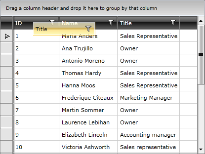

# Reordering Columns

__RadGridView__ supports column reordering and it can be done by the user in run-time. The user can drag the desired column's header at the desired position among the other headers and drop it there.

## Reordering modes 

RadGridView suggests different modes when reordering a column. You can control it through the __ReorderColumnsMode__ property.
        
You can find the possible values you can assign for it bellow:
        
* __DropIndicator__ - Displays only drop mark indicating the destination drop location
            
* __None__ - Does not display any indicators
            
* __ReorderColumns__ - Reorder columns while dragging cells
            
* __Interactive__ - Reorder columns and show drop indicator
            
## Disabling Reordering

There are two ways to disable reordering. 

**1**. The first one is to disable it on __RadGridView__ level by setting the __CanUserReorderColumns__ property to __False__, which means that none of the columns will be re-orderable.

__Example 1: Disable Reordering__

<snippet id='radgridview-columns-reordering-columns-example_1_disable_reordering-xaml' />

__Example 2: Disable Reordering in code__

<snippet id='radgridview-columns-reordering-columns-example_2_disable_reordering_in_code-cs' />

<snippet id='radgridview-columns-reordering-columns-example_2_disable_reordering_in_code-vb' />

The headers will be still draggable, but when you drop them nothing will happen.

**2**. You can also disable the reordering for a particular column by setting its __IsReorderable__ property.

__Example 3: Disable Reordering for a particular column__

<snippet id='radgridview-columns-reordering-columns-example_3_disable_reordering_for_a_particular_column-xaml' />

__Example 4: Disable Reordering for a particular column in code__
<snippet id='radgridview-columns-reordering-columns-example_4_disable_reordering_for_a_particular_column_in_code-cs' />

<snippet id='radgridview-columns-reordering-columns-example_4_disable_reordering_for_a_particular_column_in_code-vb' />

## Reordering programmatically 

The order of the columns may also be configured by setting the __DisplayIndex__ property of each of them:

__Example 5: Reorder using DisplayIndex__
<snippet id='radgridview-columns-reordering-columns-example_5_reorder_using_displayindex-xaml' />

__Example 6: Reorder using DisplayIndex in code__
<snippet id='radgridview-columns-reordering-columns-example_6_reorder_using_displayindex_in_code-cs' />

<snippet id='radgridview-columns-reordering-columns-example_6_reorder_using_displayindex_in_code-vb' />

In this case the columns will be visualized in the following order - Name, Country and Number.

## Scrolling Behavior while Reordering

The default scrolling behavior of __RadGridView__ while dragging its columns can be modified by configuring the __ScrollingSettingsBehavior__.

__Example 7: Using the ScrollingSettingsBehavior__
<snippet id='radgridview-columns-reordering-columns-example_7_using_the_scrollingsettingsbehavior-xaml' />

__Example 8: Using the ScrollingSettingsBehavior in code__
<snippet id='radgridview-columns-reordering-columns-example_8_using_the_scrollingsettingsbehavior_in_code-cs' />

<snippet id='radgridview-columns-reordering-columns-example_8_using_the_scrollingsettingsbehavior_in_code-vb' />

To learn more read the [Scrolling]() topic.

## See Also
 * [Frozen Columns]()
 * [Bound/Unbound Columns]()
