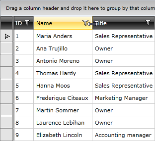

# Resizing Columns

Columns inside the __RadGridView__ are resizable by default. The user is able to easily change the column width by positioning the mouse over the columns vertical grid line and dragging it until the desired size is achieved.



To resize a column in code, you can use its __Width__ property. For example:

__Example 1: Setting a column with fixed width__

```XAML
	<telerik:GridViewDataColumn DataMemberBinding="{Binding Name}"
	                Header="Name"
	                Width="100" />
```

## Disabling Resizing

There are two ways to disable the resizing.  
__1.__ The first one is by setting the __CanUserResizeColumns__ property to __False__.

__Example 2: Disable resizing for all columns within a RadGridView__

```XAML
	<telerik:RadGridView x:Name="radGridView"
	                 CanUserResizeColumns="False">
	    <!-- ... -->
	</telerik:RadGridView>
```

This will disable resizing on __RadGridView__ level, which means that all of the columns won't be resizable. 

__2.__ If you want to disable resizing only for a particular column, use the __IsResizable__ property of the column.

__Example 3: Disable resizing for a specific column__

```XAML
	<telerik:GridViewDataColumn Header="ID"
	                DataMemberBinding="{Binding EmployeeID}"
	                UniqueName="ID" 
	                IsResizable="False" />
```

## Resizing Events

When the user resizes a column, the __ColumnWidthChanging__ event is fired and if it is not canceled the __ColumnWidthChanged__ event fires after the resize is completed. Read more [here]().

>The user can resize columns only if __CanUserResizeColumns__ is set to __True__ (this is its default value).

## See Also

 * [Reordering Columns]()

 * [Frozen Columns]()

 * [Bound/Unbound Columns]()
