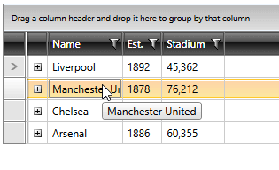

# Trimmed Text Tooltips

As of **R1 2017** through the new **ShowToolTipOnTrimmedText** property you can specify whether or not a tooltip should be shown when the text of a given cell exceeds its parent column's width. It can be set on both **RadGridView** and **column** level.

## Setting ShowToolTipOnTrimmedText

The ShowToolTipOnTrimmedText is applied to RadGridView's **GridViewHeaderCell**, **GridViewCell** and **GridViewFooterCell** elements. Setting it to **True** will result in a tooltip being showed if the cell's text is trimmed.

__Example 1: Setting RadGridView's ShowToolTipOnTrimmedText__  
```XAML
	<telerik:RadGridView ShowToolTipOnTrimmedText="True" />
```

__Example 2: Setting a column's ShowToolTipOnTrimmedText__  
```XAML
	<telerik:GridViewDataColumn DataMemberBinding="{Binding Name}" ShowToolTipOnTrimmedText="True" />
```

#### __Figure 1: Tooltips for trimmed text__ 


The default duration of the trimmed text tooltip is 5000 milliseconds. This can be changed using the __ToolTipOnTrimmedTextShowDuration__ property of RadGridView.

__Example 3: Setting RadGridView's ToolTipOnTrimmedTextShowDuration to 8 seconds__  
```XAML
	<telerik:RadGridView ShowToolTipOnTrimmedText="True" ToolTipOnTrimmedTextShowDuration="8000" />
```

Setting the ShowToolTipOnTrimmedText of a column will show tooltips for trimmed text only for the given column. Setting the same property of a RadGridView instance will set the ShowToolTipOnTrimmedText for all of its columns.

>Additionally, when using the ShowToolTipOnTrimmedText property, the following scenarios should be taken into account:

>* If you set the ShowToolTipOnTrimmedText on both column and RadGridView level, the value set for the **column** will take precedence.
>* If you've specified [custom cell templates]() for your columns, no tooltips will be displayed unless you **explicitly define them**.
>* Tooltips will be displayed in RadGridView's **footer** row only if the content of the footer is either a **string** or a **TextBlock**.
>* You should set **IsLightweightModeEnabled** for your [GridViewComboBoxColumns]() in order to benefit from the tooltip functionality.
>* Tooltips for [merged cells]() are not supported.

## See Also

 * [Column Headers]()

 * [Column Footers]()
 
 * [Column Groups]()

 * [Aggregate Functions]()

 * [Resizing Columns]()
