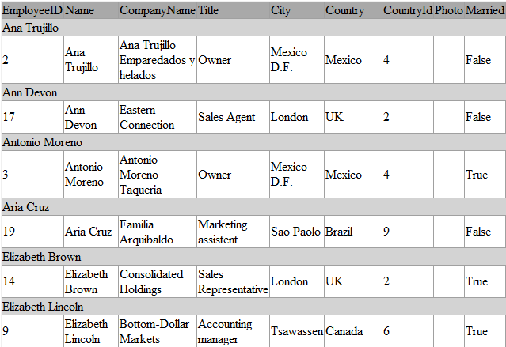

# Export

As of __Q1 2010 SP2__, __RadGridView__ provides two new events which fire when you export data from the gridview - __ElementExporting__ and __ElementExported__. __ElementExporting__ is a direct replacement of the __Exporting__ event which is used before __Q1 2010 SP2__. The __Exporting__ event will be obsoleted in __Q2 2010__.

* [Export events lifecycle](#export-events-life-cycle)

* [ElementExporting event](#elementexporting-event)

* [InitializingExcelMLStyles event (ExcelML only)](#events-initializingexcelmlstyles-excelml-only)

* [ElementExported event](#elementexported-event)

## Export events life-cycle

The exporting events fire when you call the __Export__ method of RadGridView. They fire for each exported element (row, header cell, cell, etc.). The purpose of the events is to provide the developer with a mechanism to style or modify the exported data. The __ElementExporting__ event is __cancelable__ - you can omit exporting a particular row or cell by canceling the event for those elements. If the __ElementExporting__ is not canceled - the respective __ElementExported__ event is fired for the element.

You can subscribe to the events either declaratively or runtime like this:

#### __XAML__

{{region gridview-export-events_0}}

	<telerik:RadGridView x:Name="RadGridView1"
	                     ElementExporting="RadGridView1_ElementExporting"
	                     ElementExported="RadGridView1_ElementExported">
{{endregion}}

#### __C#__

{{region gridview-export-events_1}}

	RadGridView1.ElementExporting += new EventHandler<GridViewElementExportingEventArgs>(RadGridView1_ElementExporting);
	RadGridView1.ElementExported += new EventHandler<GridViewElementExportedEventArgs>(RadGridView1_ElementExported);
{{endregion}}

#### __VB.NET__

{{region gridview-export-events_2}}

	AddHandler RadGridView1.ElementExporting, AddressOf RadGridView1_ElementExporting
	AddHandler RadGridView1.ElementExported, AddressOf RadGridView1_ElementExported
{{endregion}}

## ElementExporting event

As of __Q3 2013 GridViewElementExportingEventArgs__ exposes a new argument __VisualParameters__. The value of the property depends on the export format. Please note that it is only valid when exporting with [ExportFormat.ExcelML]() and [ExportFormat.Html]().
        

On the snapshot below you can see that the event arguments passed to the ElementExporting event handler are of type __GridViewElementExportingEventArgs__ and allow you to customize different setting of the exported data. 

To illustrate the idea better, check out the code snippet below and see how to change the font size and the background of the table header row and the group header rows.

#### __C#__

{{region gridview-export-events_3}}

	private void RadGridView1_ElementExporting( object sender, GridViewElementExportingEventArgs e )
	{
	   //Change the font size and the background color of the table header only
	   if ( e.Element == ExportElement.HeaderRow ||
	       e.Element == ExportElement.HeaderCell )
	   {
	       e.FontSize = e.FontSize + 4;
	       e.Background = Colors.DarkGray;
	   }
	   //Change the font size and the background color of the group headers only
	   else if ( e.Element == ExportElement.GroupHeaderCell ||
	       e.Element == ExportElement.GroupHeaderRow )
	   {
	       e.FontSize = e.FontSize + 2;
	       e.Background = Colors.LightGray;
	   }
	}
{{endregion}}

#### __VB.NET__

{{region gridview-export-events_4}}

	Private Sub RadGridView1_ElementExporting(ByVal sender As Object, ByVal e As GridViewElementExportingEventArgs)
	    'Change the font size and the background color of the table header only'
	    If e.Element = ExportElement.HeaderRow OrElse e.Element = ExportElement.HeaderCell Then
	        e.FontSize = e.FontSize + 4
	        e.Background = Colors.DarkGray
	    'Change the font size and the background color of the group headers only'
	    ElseIf e.Element = ExportElement.GroupHeaderCell OrElse e.Element = ExportElement.GroupHeaderRow Then
	        e.FontSize = e.FontSize + 2
	        e.Background = Colors.LightGray
	    End If
	End Sub
{{endregion}}

Here is how the exported Html looks like:

As you can see the event arguments' property __Element__ identifies the type of the currently exported element. The possible element types are defined in the __ExportElement__ enumeration:

* __Cell__

* __GroupHeaderCell__

* __GroupHeaderRow__

* __HeaderCell__

* __HeaderRow__

* __Row__

* __Table__

## Events: InitializingExcelMLStyles (ExcelML only)

>tipThis event will be only raised when exporting with __ExportFormat.ExcelML__

You can define a Style when __InitializingExcelMLStyles__ event is raised.
For example:
        

#### __C#__

{{region gridview-export-events_7}}

	ExcelMLStyle style = new ExcelMLStyle("0");            
	style.Alignment.Horizontal = ExcelMLHorizontalAlignment.Automatic;
	e.Styles.Add(style);
{{endregion}}

You can find a list of the properties that be set for __ExcelMLStyle__:
        

__Alignment:__

1. Horizontal - you can choose a specific alignment through ExcelMLHorizontalAlignment enumeration.
              

1. Vertical - you can choose a specific alignment through ExcelMLVerticalAlignment enumeration.
              

1. Indent
              

1. Rotate
              

1. ShrinkToFit
              

1. VerticalText
              

1. WrapText
              

__Font:__

1. Bold
              

1. Color
              

1. FontName
              

1. Italic
              

1. Outline (only for Mac)
              

1. Size
              

1. StrikeThrough
              

1. Underline - you can choose a specific underline through ExcelMLUnderline
              

__Interior:__

1. Color - You must also set Pattern in order to be applied Interior.Color
              

1. Pattern - you can choose a specific pattern through ExcelMLPattern
              

1. PatternColor - You must also set Pattern in order to be applied Interior.PatternColor
              

__NumberFormat:__

1. Format
              

For example:

#### __C#__

{{region gridview-export-events_9}}

 	private void clubsGrid_InitializingExcelMLStyles_1(object sender, ExcelMLStylesEventArgs e)
	{
		ExcelMLStyle style = new ExcelMLStyle("0");
	
		// Alignment
		style.Alignment.Horizontal = ExcelMLHorizontalAlignment.Automatic;
		style.Alignment.Vertical = ExcelMLVerticalAlignment.Top;
		style.Alignment.Indent = 5;
		style.Alignment.Rotate = 0;
		style.Alignment.ShrinkToFit = true;
	 	style.Alignment.VerticalText = true;
		style.Alignment.WrapText = true;
	
		// Font
		style.Font.Bold = true;
		style.Font.Color = "Beige";
		style.Font.FontName = "Calibri";
		style.Font.Italic = true;
		style.Font.Outline = true;
		style.Font.Shadow = true;
		style.Font.Size = 10;
		style.Font.StrikeThrough = true;
		style.Font.Underline = ExcelMLUnderline.Double;
	
		// Interior
		style.Interior.Color = "Green";
		style.Interior.Pattern = ExcelMLPattern.Solid;
		style.Interior.PatternColor = "#FF0000";
	
		// NumberFormat
	 	style.NumberFormat.Format = "00.00";
	
	    e.Styles.Add(style);
	}    		
{{endregion}}

## ElementExported event

Use this event if you want to write additional data to the stream. A common scenario is to export [Row Details]() - you can subscribe to the __ElementExported__ event and add the row details to the exported data:

#### __C#__

{{region gridview-export-events_5}}

	private void RadGridView1_ElementExported(object sender, GridViewElementExportedEventArgs e)
	{
	    if (e.Element == ExportElement.Row)
	    {
	        Employees obj = e.Context as Employees;
	        if (obj != null)
	        {
	            e.Writer.Write(String.Format(@"<tr><td style=""background-color:#CCC;"" colspan=""{0}"">",
	                ((IEnumerable<Telerik.Windows.Controls.GridViewColumn>)RadGridView1.Columns).Count()));
	            e.Writer.Write(String.Format(@"<b>Birth date:</b> {0}  ", obj.BirthDate));
	            e.Writer.Write(String.Format(@"<b>Hire date:</b> {0}  ", obj.HireDate));
	            e.Writer.Write(String.Format(@"<b>Address:</b> {0}  ", obj.Address));
	            e.Writer.Write(String.Format(@"<b>City:</b> {0}  ", obj.City));
	            e.Writer.Write(String.Format(@"<b>Notes:</b> {0}  ", obj.Notes));
	            e.Writer.Write("</td></tr>");
	        }
	    }
	}
{{endregion}}

#### __VB.NET__

{{region gridview-export-events_6}}

	Private Sub RadGridView1_ElementExported(sender As Object, e As GridViewElementExportedEventArgs)
	 If e.Element = ExportElement.Row Then
	  Dim obj As Employees = TryCast(e.Context, Employees)
	  If obj IsNot Nothing Then
	   e.Writer.Write([String].Format("<tr><td style=""background-color:#CCC;"" colspan=""{0}"">", DirectCast(RadGridView1.Columns, IEnumerable(Of Telerik.Windows.Controls.GridViewColumn)).Count()))
	   e.Writer.Write([String].Format("<b>Birth date:</b> {0}  ", obj.BirthDate))
	   e.Writer.Write([String].Format("<b>Hire date:</b> {0}  ", obj.HireDate))
	   e.Writer.Write([String].Format("<b>Address:</b> {0}  ", obj.Address))
	   e.Writer.Write([String].Format("<b>City:</b> {0}  ", obj.City))
	   e.Writer.Write([String].Format("<b>Notes:</b> {0}  ", obj.Notes))
	   e.Writer.Write("</td></tr>")
	  End If
	 End If
	End Sub
{{endregion}}

The result is:

# See Also

 * [GridViewElementExportingEventArgs](http://docs.telerik.com/devtools/wpf/api/html/Properties_T_Telerik_Windows_Controls_GridViewElementExportingEventArgs.htm)
 
 * [GridViewElementExportedEventArgs](http://docs.telerik.com/devtools/wpf/api/html/Properties_T_Telerik_Windows_Controls_GridViewElementExportedEventArgs.htm)
 
 * [RadGridView Overview]()

 * [Export Overview]()

 * [Grid Async Export]()
 
 * [Online Demo - Exporting to various formats](http://demos.telerik.com/silverlight/#GridView/Exporting)
 
 * [Online Demo - Exporting Row Details](http://demos.telerik.com/silverlight/#GridView/ExportingRowDetails)
