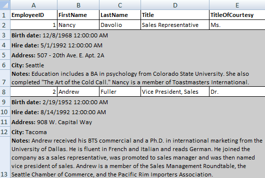

# Export Events

You have more control over the exportation by utilizing the export events which are fired when you export data from RadGridView:

* [ElementExporting](#elementexporting)

* [ElementExported](#elementexported)

* [ElementExportingToDocument](#elementexportingtodocument)

* [ElementExportedToDocument](#elementexportedtodocument)

* [InitializingExcelMLStyles](#initializingexcelmlstyles-excelml-only)

## Export Events Life Cycle

The purpose of the events is to provide you with a mechanism to style or modify the exported data.

When you call the __Export__ method of RadGridView, the __ElementExporting__ and __ElementExported__ events are fired. 

If you are using the more recently introduced __ExportToXlsx__ and __ExportToPdf__ methods, you should take advantage of the __ElementExportingToDocument__ and __ElementExportedToDocument__ events.

The __ElementExporting__ and __ElementExportingToDocument__ events can be cancelled for a particular row or cell. If they are not cancelled - the  __ElementExported__ or __ElementExportedToDocument__ event is fired for the associated RadGridView.

You can subscribe to the events either declaratively or from the code-behind, as shown in the next three examples.

__Example 1: Subscribe to events declaratively__
<snippet id='radgridview-events-export-events-example_1_subscribe_to_events_declaratively-xaml' />

__Example 2: Subscribe to events from the code-behind__
<snippet id='radgridview-events-export-events-example_2_subscribe_to_events_from_the_code_behind-cs' />

<snippet id='radgridview-events-export-events-example_2_subscribe_to_events_from_the_code_behind-vb' />

## ElementExporting

Telerik introduced the __ElementExporting__ event in __Q1 2010 SP2__ as a direct replacement of the obsolete __Exporting__ event.
The __ElementExporting__ event takes argument of type __GridViewElementExportingEventArgs__, which expose the following properties:

- __Cancel__: Gets or sets a boolean value that indicates whether the event should be canceled or not.
- __Context__: Gets the current context.
- __Element__: Gets the current element that is about to be exported.
- __Format__: Gets the current export format.
- __Value__: Gets or sets the value to be exported.
- __ShouldEncodeValue__: Gets or sets a value indicating whether special characters in the cell value will be escaped.
- __VisualParameters__: Gets the visual export parameters. (Introduced in __Q3 2013__.)

The event argument's property __Element__ identifies the currently exported element. The possible element types are defined in the __ExportElement__ enumeration:

- *Cell*
- *GroupHeaderCell*
- *GroupHeaderRow*
- *GroupHeaderRow*
- *HeaderRow*
- *Row*
- *Table*

You can use the Element property in combination with the __Cancel__ property to omit the export of a certain element.
	
## ElementExported

The __ElementExported__ event takes argument of type __GridViewElementExportedEventArgs__, which expose the following properties:

- __Context__: Gets the current context.
- __Element__: Gets the current element.
- __Format__: Gets the current export format.
- __Writer__: Gets the StreamWriter.

You can use the __ElementExported__ event if you want to write additional data to the stream. A common scenario is to add [Row Details]() to the exported data, as shown in __Example 3__.

__Example 3: Add row details to the exported data__

<snippet id='radgridview-events-export-events-example_3_add_row_details_to_the_exported_data-cs' />

<snippet id='radgridview-events-export-events-example_3_add_row_details_to_the_exported_data-vb' />

You can see the result in **Figure 1**.

#### __Figure 1: Exporting Row Details__

## ElementExportingToDocument

The __ElementExportingToDocument__ event is fired when exporting with *ExportToXlsx* or *ExportToPdf* methods.
The event handler expects a __GridViewElementExportingToDocumentEventArgs__ argument that has the following properties:

 - __Element__: The export element.
 - __Cancel__: The event is cancelable.
 - __DataContext__: The DataContext of the corresponding visual element. For example, the DataContext of a row is its corresponding data item.
 - __Value__: The value to be exported.
 - __VisualParameters__: They are of type __GridViewDocumentVisualExportParameters__ and have a __Style__ property that is of type CellSelectionStyle. It provides the ability to set the FontSize, Fill, etc., for the exported document.

## ElementExportedToDocument

The __ElementExportedToDocument__ event is fired when exporting with the *ExportToXlsx* or *ExportToPdf* methods.
The event handler expects a __GridViewElementExportedToDocumentEventArgs__ argument that has the following properties:

 - __Element__: The export Element.
 - __DataContext__: The DataContext of the corresponding visual element.

## InitializingExcelMLStyles (ExcelML only)

>tip This event will be only raised when exporting with __ExportFormat.ExcelML__.

You can define a style when the __InitializingExcelMLStyles__ event is raised, as shown in __Example 4__.

        
__Example 4: Define a style__

<snippet id='radgridview-events-export-events-example_4_define_a_style-cs' />

<snippet id='radgridview-events-export-events-example_4_define_a_style-vb' />

Here is a list of the properties that could be set for __ExcelMLStyle__:
        
__Alignment__:
- Horizontal: You can choose a specific alignment through the ExcelMLHorizontalAlignment enumeration.
- Vertical: You can choose a specific alignment through the ExcelMLVerticalAlignment enumeration.
- Indent   
- Rotate   
- ShrinkToFit
- VerticalText
- WrapText
              
__Font__:

- Bold    
- Color 
- FontName
- Italic
- Outline (only for Mac)
- Size
- StrikeThrough
- Underline: You can choose a specific underline through ExcelMLUnderline.
              

__Interior__:

- Color: You must also set a pattern in order to be applied in Interior.Color.
- Pattern: You can choose a specific pattern through ExcelMLPattern.
- PatternColor: You must also set a pattern in order to be applied in Interior.PatternColor.
              

__NumberFormat__:

- Format

__Example 5__ shows how to use __ExcelMLStyle__.

__Example 5: Modify the style before exporting__

<snippet id='radgridview-events-export-events-example_5_modify_the_style_before_exporting-cs' />

<snippet id='radgridview-events-export-events-example_5_modify_the_style_before_exporting-vb' />

        
## See Also

 * [Grid Async Export]()

 * [ExportFormat.ExcelML]()

 * [ExportFormat.Html]()
 
 * [ExportFormat.Xlsx]()
 
 * [ExportFormat.Pdf]()
 
 * [Online Demo - Exporting to various formats](https://demos.telerik.com/silverlight/#GridView/Exporting)
 
 * [Online Demo - Exporting Row Details](https://demos.telerik.com/silverlight/#GridView/ExportingRowDetails)

