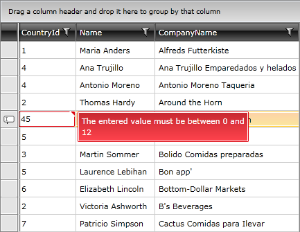

# Validation

The validation events are meant to support the data validation of the user input. They occur when the new content entered by the user is about to be committed.

Currently the validation occurs on row and cell level. To get notified, you can use the following events exposed by the __RadGridView__ control:
      

* [Validation Events Lifecycle](#validation-events-lifecycle)

* [CellValidating](#cellvalidating-event)

* [CellValidated](#cellvalidated-event)

* [RowValidating](#rowvalidating-event)

* [RowValidated](#rowvalidated-event)

## Validation Events Lifecycle

It is important to know that each one of the validation events is fired only when the user is trying to commit new data in the __RadGridView__ control. They do not occur when the __RadGridView__ loads data.
        

The __CellValidating__ event occurs always before the __CellValidated__ event when the edited cell is about to lose its focus. If the focus is moved to a cell in the same row, then no other events occur. If the focus is moved to a cell in another row, then both __RowValidating__ and __RowValidated__ are fired, containing the whole row data, including the new and the old values of the edited cells.
        

Both __CellValidating__ and __RowValidating__ events allow you to stop the commit process by setting the boolean property __IsValid__ to __False__.
        

## CellValidating Event

The __CellValidating__ event occurs when a cell is about to commit new content. It is always raised before the __CellValidated__ event, which is described in the next section. __CellValidating__ gives you the power to stop the commit process on a cell level obeying some internal rules of your application. For example, a cell might contain only values between 0 and 12, and all other values are considered invalid.
        

The parameters passed to the validating event handler are two:

* The __sender__ argument contains the __RadGridView__. This argument is of type object, but can be cast to the __RadGridView__ type.
            

* The event arguments of type __Telerik.Windows.Controls.GridViewCellValidatingEventArgs__. Some of its important properties are:
            

* __Cell__ - the committed cell.
            

* __Row__ - the committed row to which the cell belongs.
            

* __IsValid__ - you can use this property to control the commit process. If you set it to __False__ the process will stop, the data will not be committed and __CellValidated__ will not be raised.
            

* __NewValue__ - the new value that is about to be committed.
            

* __OldValue__ - the old value that will be replaced.
            

* __ErrorMessage__ - custom text message used to hint the user about the type of validation error. For example '*The entered value must be between 0 and 12*'.
            

You can subscribe to the __CellValidating__ event declaratively or in code-behind like this:
        

#### __XAML__

{{region gridview-events-validation_0}}

	<telerik:RadGridView Name="radGridView" CellValidating="radGridView_CellValidating"/>
{{endregion}}

#### __C#__

{{region gridview-events-validation_1}}

	this.radGridView.CellValidating += new EventHandler<GridViewCellValidatingEventArgs>(radGridView_CellValidating);
{{endregion}}

#### __VB.NET__

{{region gridview-events-validation_2}}

	AddHandler Me.radGridView.CellValidating, AddressOf radGridView_CellValidating
{{endregion}}

>tipTo stop the commit process of a cell just set the __IsValid__ property of the __GridViewCellValidatingEventArgs__ to __False__.
          

The code snippet below checks whether the value entered in the "CountryId" column falls between 0 and 12. If the rule is not satisfied then the commit process is cancelled.

#### __C#__

{{region gridview-events-validation_3}}

	private void radGridView_CellValidating( object sender, GridViewCellValidatingEventArgs e )
	{
	    if ( e.Cell.Column.UniqueName == "CountryId" )
	    {
	        int newValue = Int32.Parse( e.NewValue.ToString() );
	        if ( newValue < 0 || newValue > 12 )
	        {
	            e.IsValid = false;
	            e.ErrorMessage = "The entered value must be between 0 and 12";
	        }
	    }
	}
{{endregion}}

#### __VB.NET__

{{region gridview-events-validation_4}}

	Private Sub radGridView_CellValidating(ByVal sender As Object, ByVal e As GridViewCellValidatingEventArgs)
	    If e.Cell.Column.UniqueName = "CountryId" Then
	        Dim newValue As Integer = Int32.Parse(e.NewValue.ToString())
	        If newValue < 0 OrElse newValue > 12 Then
	            e.IsValid = False
	            e.ErrorMessage = "The entered value must be between 0 and 12"
	        End If
	    End If
	End Sub
{{endregion}}

And here is how the error message is displayed:

## CellValidated Event

The __CellValidated__ event occurs when the cell has validated the new content. It is raised after the __CellValidating__ event (when the __IsValid__ is not set to False), described in the previous section.
        

The parameters passed to the validated event handler are two:

* The __sender__ argument contains the __RadGridView__. This argument is of type object, but can be cast to the __RadGridView__ type.
            

* The event arguments of type __Telerik.Windows.Controls.GridViewCellValidatedEventArgs__.
            

You can subscribe to the __CellValidated__ event declaratively or in code-behind like this:
        

#### __XAML__

{{region gridview-events-validation_5}}

	<telerik:RadGridView Name="radGridView" CellValidated="radGridView_CellValidated"/>
{{endregion}}

#### __C#__

{{region gridview-events-validation_6}}

	this.radGridView.CellValidated += new EventHandler<GridViewCellValidatedEventArgs>(radGridView_CellValidated);
{{endregion}}

#### __VB.NET__

{{region gridview-events-validation_7}}

	AddHandler Me.radGridView.CellValidated, AddressOf radGridView_CellValidated
{{endregion}}

## RowValidating Event

The __RowValidating__ event occurs when a row is about to commit new content. It is always raised before the __RowValidated__ event, which is described in the next section. __RowValidating__ gives you the power to stop the commit process on a row level obeying some internal rules of your application. For example, it might not be allowed for a row to contain equal values in two specific columns as well as any other kind of relations between the values of a single row.
        

The parameters passed to the validating event handler are two:

* The __sender__ argument contains the __RadGridView__. This argument is of type object, but can be cast to the __RadGridView__ type.
            

* The event arguments of type __Telerik.Windows.Controls.GridViewRowValidatingEventArgs__. Some of its important properties are:
            

* __Row -__ the committed row. You may use the Item property of the row to work with the new values.
                

* __IsValid__ - you can use this property to control the commit process. If you set it to __False__ the process will stop, the data will not be committed and __RowValidated__ will not be raised.
                

* __OldValues__ - the old values that will be replaced.
                

You can subscribe to the __RowValidating__ event declaratively or in code-behind like this:
        

#### __XAML__

{{region gridview-events-validation_8}}

	<telerik:RadGridView Name="radGridView" RowValidating="radGridView_RowValidating"/>
{{endregion}}

#### __C#__

{{region gridview-events-validation_9}}

	this.radGridView.RowValidating += new EventHandler<GridViewRowValidatingEventArgs>(radGridView_RowValidating);
{{endregion}}

#### __VB.NET__

{{region gridview-events-validation_10}}

	AddHandler Me.radGridView.RowValidating, AddressOf radGridView_RowValidating
{{endregion}}

To stop the commit process just set the __IsValid__ property of the __GridViewRowValidatingEventArgs__ to __False__, like this:
        
#### __C#__

{{region gridview-events-validation_15}}

	private void radGridView_RowValidating( object sender, GridViewRowValidatingEventArgs e )
	{
	    e.IsValid = false;
	}
{{endregion}}

#### __VB.NET__

{{region gridview-events-validation_16}}

	Private Sub radGridView_RowValidating(ByVal sender As Object, ByVal e As GridViewRowValidatingEventArgs)
	    e.IsValid = False
	End Sub
{{endregion}}

## RowValidated Event

The __RowValidated__ event occurs when the row has validated the new content. It is raised after the __RowValidating__ event (when the __IsValid__ is not set to False), described in the previous section.
        

The parameters passed to the validated event handler are two:

* The __sender__ argument contains the __RadGridView__. This argument is of type object, but can be cast to the __RadGridView__ type.
            

* The event arguments of type __Telerik.Windows.Controls.GridViewRowValidatedEventArgs__.
            

You can subscribe to the __RowValidated__ event declaratively or in code-behind like this:
        

#### __XAML__

{{region gridview-events-validation_11}}

	<telerik:RadGridView Name="radGridView" RowValidated="radGridView_RowValidated"/>
{{endregion}}

#### __C#__

{{region gridview-events-validation_12}}

	this.radGridView.RowValidated += new EventHandler<GridViewRowValidatedEventArgs>(radGridView_RowValidated);
{{endregion}}

#### __VB.NET__

{{region gridview-events-validation_13}}

	AddHandler Me.radGridView.RowValidated, AddressOf radGridView_RowValidated
{{endregion}}

# See Also

 * [Validating]()

 * [Editing Events]()

 * [RadGridView Events Overview]()
