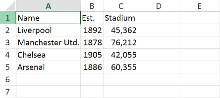
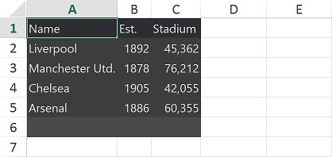
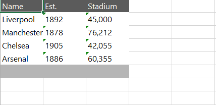

# ExportToXlsx

The __ExportToXlsx__ extension method allows exporting the RadGridView to the XLSX format. As the mechanism uses **RadSpreadProcessing** internally, there is no need for the user to make the integration manually. The method was introduced in __Q1 2015__.

## Assembly References

The __ExportToXlsx__ method uses additional libraries so you need to add references to the following assemblies:

* Telerik.Windows.Documents.Core.dll
* Telerik.Windows.Documents.Spreadsheet.dll 
* Telerik.Windows.Documents.Spreadsheet.FormatProviders.OpenXml.dll
* Telerik.Windows.Controls.GridView.Export.dll

>  __Telerik.Windows.Controls.GridView.Export.dll__ is a new binary introduced in __Q1 SP of 2015__. It delimits the exporting to __Xlsx__ functionality from __Telerik.Windows.Controls.GridView.dll__, so in order to use __ExportToXlsx__ method, the new dll should also be added.

## Method Overloads

1. __ExportToXlsx(Stream stream)__ - Expects the specified stream to which you are exporting data to.

2. __ExportToXlsx(Stream stream, GridViewDocumentExportOptions options)__ - Expects the specified stream to which you are exporting data to and parameter of type GridViewDocumentExportOptions. The latter is used to set the following export options:

- **Culture**: Sets a specific Culture.
- **Items**: The collection of items to be exported.
- **ShowColumnFooters**: Specifies whether column footers should be included on export.
- **ShowGroupFooters**: Specifies whether group footers should be included on export.
- **ShowColumnHeaders**: Specifies whether column headers should be included on export.
- **ExportDefaultStyles**: Specifies whether the GridViewDataControl will be exported with its default styles.  
- **ExcludedColumns**: Allows you to choose which columns are excluded from export.
- **ShowGroupRows**: Specifies whether the group rows should be included on export (this property was introduced in **R3 2019**).

The following example shows how to use the method on a button click:

__Example 1: Use of ExportToXlsx Method__
```C#
	private void btnExport_Click(object sender, RoutedEventArgs e)
	{
	    string extension = "xlsx";
	
	    Microsoft.Win32.SaveFileDialog dialog = new Microsoft.Win32.SaveFileDialog()
	    {
	        DefaultExt = extension,
	        Filter = String.Format("{1} files (*.{0})|*.{0}|All files (*.*)|*.*", extension, "Excel"),
	        FilterIndex = 1
	    };
	
	    if (dialog.ShowDialog() == true)
	    {
	        using (Stream stream = dialog.OpenFile())
	        {
	            gridViewExport.ExportToXlsx(stream,
	                new GridViewDocumentExportOptions()
	                {
	                    ShowColumnFooters = true,
	                    ShowColumnHeaders = true,
	                    ShowGroupFooters = true
	                });
	        }
	    }
	}
```

## Export Default Styles

>To export the Default Styles of RadGridView in grouped state, at least one row must be expanded, so that the exporting engine can get the styles.

>importantExporting the Default Styles will take into account the styling applied to the __first element__ of each type(cell, column header, etc.). This is due to performance optimizations. Exporting a separate style for the needed element is discussed in details here:[Style Exported XLSX & PDF Documents]().

RadGridView can be exported with its default styles by setting the __ExportDefaultStyles__ property to __True__

By default the ExportDefaultStyles property is set to false. You can see the result (Figure 1).

#### __Figure 1: Exporting with ExportDefaultStyles set to “false” (default)__


You can set the __ExportDefaultStyles__ value to __“true”__ and see the result (Figure 2).

__Example 2: Configuring ExportDefaultStyles Setting__
```C#
	gridViewExport.ExportToXlsx(stream,
	    new GridViewDocumentExportOptions()
			{
			    ShowColumnHeaders = true,
			    ShowColumnFooters = true,
			    ShowGroupFooters = true,
			    ExportDefaultStyles = true
			});   
```

#### __Figure 2: Exporting with ExportDefaultStyles set to True__


## Disable Column Width Auto Fit

__GridViewDocumentExportOptions__ expose the boolean __AutoFitColumnsWidth__ property. Its default value is __True__, meaning that the column's width will be automatically fit based on its content. To disable this behavior, its value can be set to __False__.

__Example 3: Setting the AutoFitColumnsWidth Property to False__
```C#
	if (dialog.ShowDialog() == true)
	{
	    using (Stream stream = dialog.OpenFile())
	    {
	        gridViewExport.ExportToXlsx(stream,
	            new GridViewDocumentExportOptions()
	            {
	                ShowColumnHeaders = true,
	                ShowColumnFooters = true,
	                ShowGroupFooters = true,
	                ExportDefaultStyles = true,
	                AutoFitColumnsWidth = false
	            });
	    }
	}
```
	
#### __Figure 3: Exporting with AutoFitColumnsWidth set to False__


## Disable GroupHeaderRow Aggregates

By default, the Aggregate results of the __GroupHeaderRow__ will be exported. Note, that this is an operation performed on data level. Hiding the GroupHeaderRow Aggregates in the UI through a Style targeting the __GroupHeaderRow__ element does not affect it. In order to disable the exporting of the GroupHeaderRow Aggregates, you can set the __ShowGroupHeaderColumnAggregates__ of the __GridViewDocumentExportOptions__ to __False__.


__Example 4: Setting ShowGroupHeaderRowAggregates__

```C#
	if (dialog.ShowDialog() == true)
            {
                using (Stream stream = dialog.OpenFile())
                {
                    gridViewExport.ExportToXlsx(stream,
                        new GridViewDocumentExportOptions()
                        {
                            ShowColumnFooters = true,
                            ShowColumnHeaders = true,
                            ShowGroupFooters = true,
                            ShowGroupHeaderRowAggregates = false
                        });
                }
            }
```

## Events

There are two events related to the exporting of RadGridView with the ExportToXlsx method: *ElementExportingToDocument* and *ElementExportedToDocument*. You can find more information regarding them in the [Export Events]() section.

## How to

* __[Get the Column of the Corresponding Cell]()__

* __[Disable the Export of a Particular Column]()__

* **[Style Exported XLSX & PDF Documents]()**

## See Also
 * [RadGridView Overview]()
 * [Export]()
 * [Export Async]()
 * [Export Events]()
