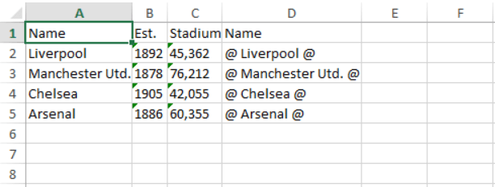

# Exporting Custom Column

>important As of __R1 2018__ the __GetCellContent__ method is __no longer__ used for exporting a custom column content. Instead, the __GetExportCellContent__ one of GridViewBoundColumnBase needs to be overriden. Check __Example 2__.

In order to automatically export a custom column, without handling some of the exporting events, it should implement the **IExportableColumn** interface. The interface exposes the following methods and properties:

* **GetCellContent**: Gets the content of the cell. You can override it to return custom value.
* **DataFormatString**:  Gets or sets the string format applied to the column.
* **ExportedElementWidth**:  Gets the actual width of the column.

> The GridViewBoundColumnBase class implements the interface so you can directly override the method.

#### **[C#]Example 1: Overriden GetCellContent method**
 
```C#
 	protected override object GetCellContent(object item)
	{
		var columnProperty = item.GetType().GetProperty(this.DataMemberBinding.Path.Path);
		return string.Format("@ {0} @", columnProperty.GetValue(item, null) as string);
	}
```

#### **[C#]Example 2: Overriden GetExportCellContent method**

```C#
	protected override object GetExportCellContent(object item)
	{
		var columnProperty = item.GetType().GetProperty(this.DataMemberBinding.Path.Path);
		return string.Format("@ {0} @", columnProperty.GetValue(item, null) as string);
	}
```

The values from the exported column will appear in Excel as shown in **Figure 1**.

#### **Figure 1: Exported Custom Column to Excel**



## See Also

* [Export Events]()
* [Export to Excel]()
* [Export to Pdf]()
