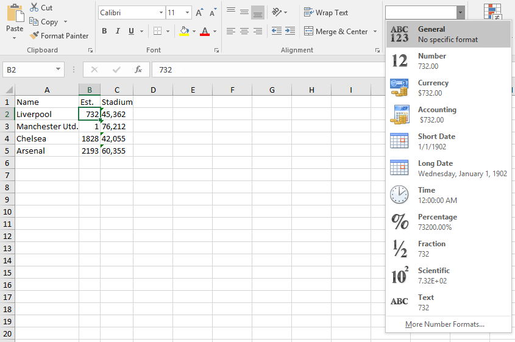
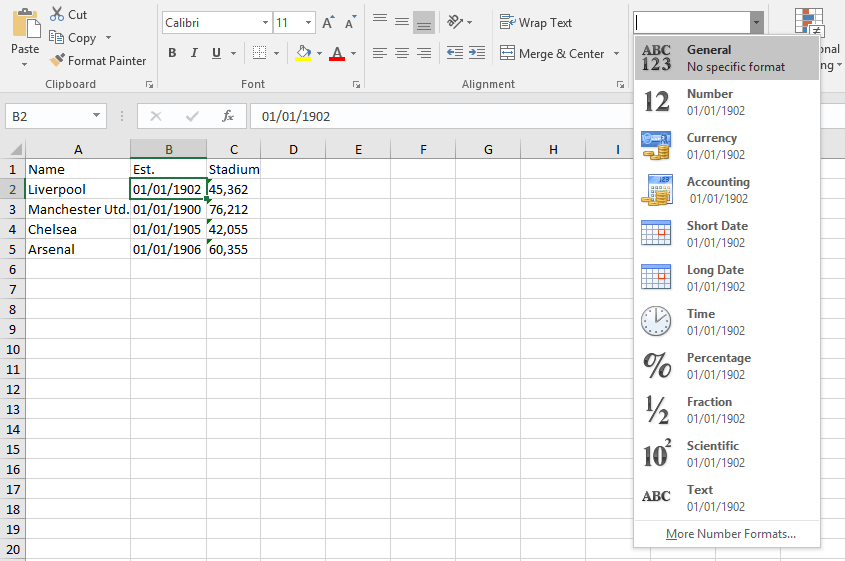
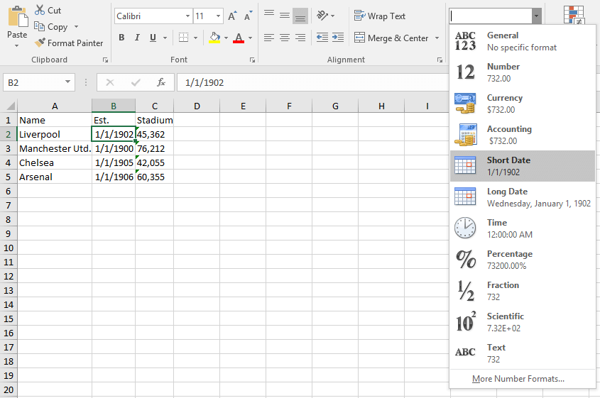

# Export DateTime Value

__PROBLEM__

1) When exporting DateTime values without a specified __DataFormatString__ to Excel, the values appear as numbers as shown in the below image:

__Exporting DateTime values without specified DataFormatString__



2) When exporting DateTime values with specified __DataFormatString__ to Excel, the values appear as strings as shown in the next image:

__Exporting DateTime values with specified DataFormatString__



__CAUSE__

1) In most modern programming environments, dates are stored as real numbers. The integer part of the number is the number of days since some agreed-upon date in the past, called the epoch. In Excel, June 16, 2006, for example, is stored as 38884, counting days where January 1st, 1900 is 1.

2) When a DataFormatString has been specified for a given column, RadGridView exports the string representation of the values in that column.

__SOLUTIONs__

## Export via the Built-In RadGridView Export Methods

When an element is exported through the [ExportToXlsx](), [ExportToPdf]() or [ExportToWorkbook]() or methods, the arguments of the [ElementExportingToDocument]() event can be used to modify the visual appearance of the exported values and specify how they should be [formatted](https://docs.telerik.com/devtools/document-processing/libraries/radspreadprocessing/features/format-codes#date-and-time-formatting) in Excel. This is achieved through the  `VisualParameters` property of the `GridViewCellExportingEventArgs`.

__Exporting DateTime Values to Excel__
```C#
	this.radGridView.ElementExportingToDocument += (s, e) =>
	{
	    if (e.Element == ExportElement.Cell)
	    {
	        var cellExportingArgs = e as GridViewCellExportingEventArgs;
	        if ((cellExportingArgs.Column as GridViewDataColumn) == this.radGridView.Columns[1])
	        {
	            var parameters = cellExportingArgs.VisualParameters as GridViewDocumentVisualExportParameters;
	            parameters.Style = new CellSelectionStyle()
	            {
	                Format = new CellValueFormat("m/d/yyyy")
	            };
	        }
	    }
	};
```
```VB.NET
	AddHandler Me.radGridView.ElementExportingToDocument, Sub(s, e)
	                                                          If e.Element = ExportElement.Cell Then
	                                                              Dim cellExportingArgs = TryCast(e, GridViewCellExportingEventArgs)
	                                                              If (TryCast(cellExportingArgs.Column, GridViewDataColumn)) Is Me.radGridView.Columns(1) Then
	                                                                  Dim parameters = TryCast(cellExportingArgs.VisualParameters, GridViewDocumentVisualExportParameters)
	                                                                  parameters.Style = New CellSelectionStyle() With {.Format = New CellValueFormat("m/d/yyyy")}
	                                                              End If
	                                                          End If
	                                                      End Sub 
```

__Exporting DateTime values with ElementExportingToDocument__



## Export via the GridViewSpreadStreamExport Class

When exporting the RadGridView with the [GridViewSpreadStreamExport class](), the event arguments of `ElementExportingToDocument` event will be of the type of `GridViewSpreadStreamElementExportingEventArgs`. To format the number value, create a new `SpreadCellFormat` instance and set the `NumberFormat` property. To apply the formatting, create a new SpreadStreamCellStyle instance, set the created `SpreadCellFormat` to its `CellFormat` property, and apply it to the `e.Style` property of the event arguments. 

__Specify a format when exporting with the GridViewSpreadStreamExport class__
```C#
	private static void SpreadStreamExport_ElementExportingToDocument(object sender, GridViewSpreadStreamElementExportingEventArgs e)
	{
		if (e.Element == SpreadStreamExportElement.Cell && e.Value is DateTime)
		{
			e.Style = new SpreadStreamCellStyle()
			{
				CellFormat = new SpreadCellFormat()
				{
					NumberFormat = BuiltInNumberFormats.GetDayMonthLongYear() + " " + BuiltInNumberFormats.GetHourMinuteSecondAMPM()
				}
			};
		}
	}
```
```VB.NET
	Private Shared Sub SpreadStreamExport_ElementExportingToDocument(ByVal sender As Object, ByVal e As GridViewSpreadStreamElementExportingEventArgs)
	    If e.Element = SpreadStreamExportElement.Cell AndAlso TypeOf e.Value Is DateTime Then
	        e.Style = New SpreadStreamCellStyle() With {
	            .CellFormat = New SpreadCellFormat() With {
	                .NumberFormat = BuiltInNumberFormats.GetDayMonthLongYear() & " " + BuiltInNumberFormats.GetHourMinuteSecondAMPM()
	            }
	        }
	    End If
	End Sub
```

## See Also

* [Export String Value]()

* [Export Numeric Value]()

* [Format Codes](https://docs.telerik.com/devtools/document-processing/libraries/radspreadprocessing/features/format-codes)

* [Number Formatting](https://docs.telerik.com/devtools/document-processing/libraries/radspreadprocessing/features/number-formats)
