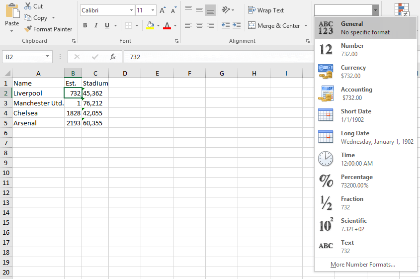
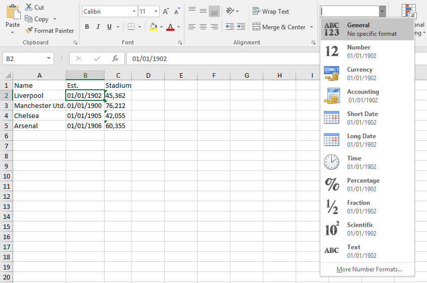
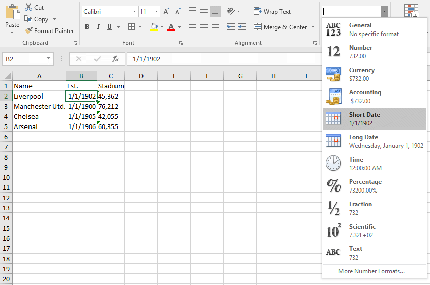

# Export DateTime Value

__PROBLEM__

1) When exporting DateTime values without a specified __DataFormatString__ to Excel, the values appear as numbers as shown in the below image:

__Exporting DateTime values without specified DataFormatString__

2) When exporting DateTime values with specified __DataFormatString__ to Excel, the values appear as strings as shown in the next image:

__Exporting DateTime values with specified DataFormatString__

__CAUSE__

1) In most modern programming environments, dates are stored as real numbers. The integer part of the number is the number of days since some agreed-upon date in the past, called the epoch. In Excel, June 16, 2006, for example, is stored as 38884, counting days where January 1st, 1900 is 1.

2) When a DataFormatString has been specified for a given column, RadGridView exports the string representation of the values in that column.

__SOLUTIONs__

## Export via the Built-In RadGridView Export Methods

When an element is exported through the [ExportToXlsx](), [ExportToPdf]() or [ExportToWorkbook]() or methods, the arguments of the [ElementExportingToDocument]() event can be used to modify the visual appearance of the exported values and specify how they should be [formatted](https://docs.telerik.com/devtools/document-processing/libraries/radspreadprocessing/features/format-codes#date-and-time-formatting) in Excel. This is achieved through the  `VisualParameters` property of the `GridViewCellExportingEventArgs`.

__Exporting DateTime Values to Excel__
<snippet id='radgridview-export-how-to-export-datetime-exporting_datetime_values_to_excel-cs' />

<snippet id='radgridview-export-how-to-export-datetime-exporting_datetime_values_to_excel-vb' />

__Exporting DateTime values with ElementExportingToDocument__

## Export via the GridViewSpreadStreamExport Class

When exporting the RadGridView with the [GridViewSpreadStreamExport class](), the event arguments of `ElementExportingToDocument` event will be of the type of `GridViewSpreadStreamElementExportingEventArgs`. To format the number value, create a new `SpreadCellFormat` instance and set the `NumberFormat` property. To apply the formatting, create a new SpreadStreamCellStyle instance, set the created `SpreadCellFormat` to its `CellFormat` property, and apply it to the `e.Style` property of the event arguments. 

__Specify a format when exporting with the GridViewSpreadStreamExport class__
<snippet id='radgridview-export-how-to-export-datetime-specify_a_format_when_exporting_with_the_gridviewspreadstreamexport_class-cs' />

<snippet id='radgridview-export-how-to-export-datetime-specify_a_format_when_exporting_with_the_gridviewspreadstreamexport_class-vb' />

## See Also

* [Export String Value]()

* [Export Numeric Value]()

* [Format Codes](https://docs.telerik.com/devtools/document-processing/libraries/radspreadprocessing/features/format-codes)

* [Number Formatting](https://docs.telerik.com/devtools/document-processing/libraries/radspreadprocessing/features/number-formats)
