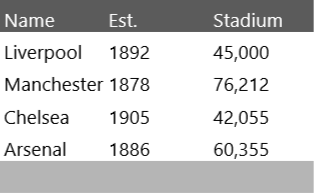

# ExportToPdf

The __ExportToPdf__ method allows exporting to "Pdf" format. As the mechanism uses **RadSpreadProcessing** internally, there is no need for the user to make the integration manually. The method was introduced in __Q1 2015__.

## Assembly References

The __ExportToPdf__ method uses additional libraries so you need to add references to the following assemblies:

* Telerik.Windows.Documents.Core.dll
* Telerik.Windows.Documents.Spreadsheet.dll 
* Telerik.Windows.Documents.Spreadsheet.FormatProviders.Pdf.dll
* Telerik.Windows.Documents.Fixed.dll
* Telerik.Windows.Controls.GridView.Export.dll

>  __Telerik.Windows.Controls.GridView.Export.dll__ is a new binary introduced in __Q1 SP of 2015__. It delimits the exporting to __Pdf__ functionality from __Telerik.Windows.Controls.GridView.dll__, so in order to use __ExportToPdf__ method, the new dll should also be added.

## Method Overloads

1. __ExportToPdf(Stream stream)__ - Expects the specified stream to which you are exporting data to.

2. __ExportToPdf (Stream stream, GridViewPdfExportOptions options)__ - Expects the specified stream to which you are exporting data to and parameter of type GridViewPdfExportOptions. The latter is used to set the following export options:

* Culture
* Items
* ShowColumnFooters
* ShowGroupFooters
* ShowColumnHeaders
* ExportDefaultStyles  

The following example shows how to use the method on a button click:

__Example 1: Usage of Method ExportToPdf__
```C#
	private void btnExport_Click(object sender, RoutedEventArgs e)
	{
	    string extension = "pdf";
	
	    SaveFileDialog dialog = new SaveFileDialog()
	    {
	        DefaultExt = extension,
	        Filter = String.Format("{1} files (*.{0})|*.{0}|All files (*.*)|*.*", extension, "Pdf"),
	        FilterIndex = 1
	    };
	
	    if (dialog.ShowDialog() == true)
	    {
	        using (Stream stream = dialog.OpenFile())
	        {
	            gridViewExport.ExportToPdf(stream,
	                new GridViewPdfExportOptions()
	                {
	                    ShowColumnFooters = true,
	                    ShowColumnHeaders = true,
	                    ShowGroupFooters = true,
			      PageOrientation = PageOrientation.Landscape
	                });
	        }
	    }
	}
```

## Export Default Styles

>To export the default styles of RadGridView in grouped state, at least one row must be expanded, so that the exporting engine can get the styles.

>important Exporting the Default Styles will take into account the styling applied to the __first element__ of each type(cell, column header, etc.). This is due to performance optimizations. Exporting a separate style for the needed element is discussed in details here:[Style Exported XLSX & PDF Documents]().

RadGridView can be exported with its default styles by setting the ExportDefaultStyles property to “true”

By default the ExportDefaultStyles property is set to false. You can see the result (Figure 1)

#### __Figure 1: Exporting with ExportDefaultStyles set to “false” (default)__


You can set the __ExportDefaultStyles__ value to __“true”__ and see the result (Figure 2)

__Example 2: Configuring ExportDefaultStyles property__
```C#
	gridViewExport.ExportToPdf(stream,
    	new GridViewPdfExportOptions()
		{
		    ShowColumnHeaders = true,
		    ShowColumnFooters = true,
		    ShowGroupFooters = true,
		    ExportDefaultStyles = true
		});   
```

#### __Figure 2: Exporting with ExportDefaultStyles set to True__


## Disable Column Width Auto Fit

__GridViewDocumentExportOptions__ expose the boolean __AutoFitColumnsWidth__ property. Its default value is __True__, meaning that the column's width will be automatically fit based on its content. To disable this behavior, its value can be set to __False__.

__Example 3: Setting the AutoFitColumnsWidth Property to False__
```C#
	this.gridViewExport.ExportToPdf(stream,
    	new GridViewDocumentExportOptions()
		{
		    ShowColumnHeaders = true,
		    ShowColumnFooters = true,
		    ShowGroupFooters = true,
		    ExportDefaultStyles = true,
		    AutoFitColumnsWidth = false
		});
```

#### __Figure 3: Exporting with AutoFitColumnsWidth set to False__


## Disable GroupHeaderRow Aggregates

By default, the Aggregate results of the __GroupHeaderRow__ will be exported. Note, that this is an operation performed on data level. Hiding the GroupHeaderRow Aggregates in the UI through a Style targeting the __GroupHeaderRow__ element does not affect it. In order to disable the exporting of the GroupHeaderRow Aggregates, you can set the __ShowGroupHeaderColumnAggregates__ of the __GridViewDocumentExportOptions__ to __False__.

__Example 4: Setting ShowGroupHeaderRowAggregates__

```C#
	if (dialog.ShowDialog() == true)
            {
                using (Stream stream = dialog.OpenFile())
                {
                    gridViewExport.ExportToPdf(stream,
                        new GridViewDocumentExportOptions()
                        {
                            ShowColumnFooters = true,
                            ShowColumnHeaders = true,
                            ShowGroupFooters = true,
                            ShowGroupHeaderRowAggregates = false
                        });
                }
            }
```

## Events

There are two events related to the exporting of RadGridView with the ExportToPdf() method: *ElementExportingToDocument* and *ElementExportedToDocument*. You can find more information regarding them in the [Export Events]() section.

## How to

* __[Get the Column of the Corresponding Cell]()__

* __[Disable the Export of a Particular Column]()__

* **[Style Exported XLSX & PDF Documents]()**

## See Also ##
 * [RadGridView Overview]()
 * [Export]()
 * [Export Async]()
 * [Export Events]()
