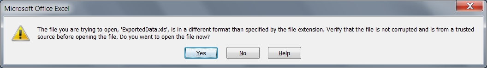

# Warning message when opening the excel file

## 

__PROBLEM__

You [export]() the data from RadGridView to Excel file and when you try to open the file you get the following warning message:

*The file you are trying to open, 'Filename.xls', is in a different format than specified by the file extension. Verify that the file is not corrupted and is from a trusted source before opening this file. Do you want to open the file now?*

         
      

__CAUSE__

When RadGridView exports data to Excel format - it actually exports it as an HTML structure (which Excel can successfully parse). 

The alert is a new security feature in Excel 2007 called Extension Hardening, which ensures that the file content being opened matches the extension type specified in the shell command that is attempting to open the file. The file must be in XLS (BIFF8) or XLSX (Open XML) file format to open without this warning prompt. If the file type is a different format (such as HTML, XML, CSV, etc.) the prompt is expected since the file content is different that the extension or MIME type.

__SOLUTION__

You can [ export to ExcelML format]() with XML extension. In this way you will not get such warning.

