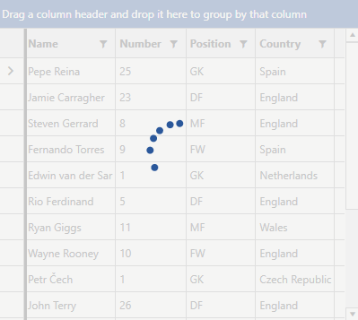
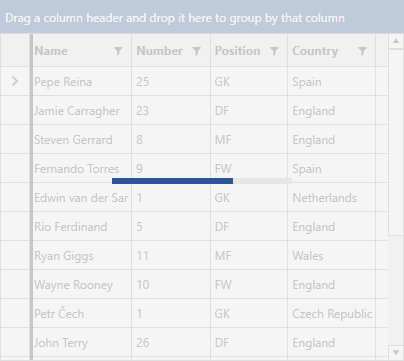
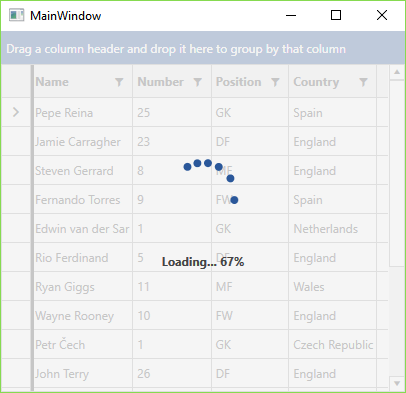

# Busy Indicator

RadGridView enables you to display a notification whenever a longer-running process is being handled by the control by incorporating a [RadBusyIndicator]() inside its control template. This makes the UI more informative and the user experience smoother.

## Enabling the Indicator

To activate the indicator you have to set RadGridView's __IsBusy__ boolean property to __True__. 

__Example 1: Setting the IsBusy property__

<snippet id='radgridview-features-busy-indicator-example_1_setting_the_isbusy_property-xaml' />

You can data bind this property in any way that suits your custom logic. Note that the indicator will be visible only when the __IsBusy__ property is set to __True__.

__RadGridView with busy indicator__

## Progress Determination

The indicator itself can be either determined or indetermined. These correspond to the following scenarios: 

* a specific period of time

* an indetermined amount of time

The default the indicator is indetermined. If you need a determined __RadBusyIndicator__ you have to set the value of the __BusyIndicatorIsIndeterminate__ property of the RadGridView control to __False__.

In this case you also need to specify the __BusyIndicatorProgressValue__ property, which will indicate how much of the predefined time has already elapsed. You can set its value through XAML or code-behind. However, to get the most out of it, you have to bind it to a percentage value (between 0 and 100) indicating the state of the ongoing process. If it is less or equal to 0 the donut will be empty and when it is grater or equal to 100 the donut will be filled.

__Example 2: Defining a determined indicator__

<snippet id='radgridview-features-busy-indicator-example_2_defining_a_determined_indicator-xaml' />

__RadGridView with determined busy indicator__

>A good example of how to define and update a determined busy indicator has been demonstrated in the [following article]().

## Custom Busy Content

RadGridView also provides the option to customize what's shown as the indicator's content while it is active through the __BusyIndicatorContent__ and __BusyIndicatorContentTemplate__ properties.

__Example 3: Setting BusyIndicatorContent__

<snippet id='radgridview-features-busy-indicator-example_3_setting_busyindicatorcontent-xaml' />

__Example 4: Setting BusyIndicatorContentTemplate__

<snippet id='radgridview-features-busy-indicator-example_4_setting_busyindicatorcontenttemplate-xaml' />

__RadGridView with busy indicator with custom content template__

## See Also

* [RadBusyIndicator]()
