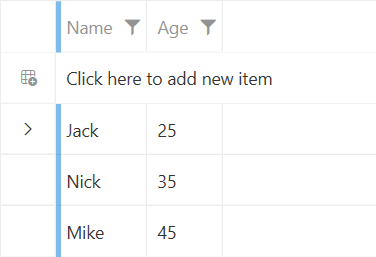
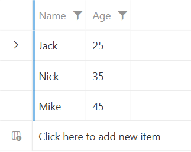
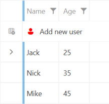

# New Row

`RadGridView` allows you to display an additional row that will allow you to insert new entries in the bound collection. To display it, set the `NewRowPosition` property to either __Top__ or __Bottom__ and expose an empty constructor in the underlying object.

>important The Bottom option works only when the `GroupRenderMode` property of `RadGridView` is set to `Flat`.

The following example shows how to display the new row:

#### __[C#] Defining the underlying object and view model__
{{region gridview-new-row-0}}
    public class Person
    {
        public Person()
        { 
        }

        public string Name { get; set; }
        public int Age { get; set; }
    }

    public class MainViewModel
    {
        public MainViewModel()
        {
            this.People = new ObservableCollection<Person>()
            {
                new Person() { Name = "Jack", Age = 25 },
                new Person() { Name = "Nick", Age = 35 },
                new Person() { Name = "Mike", Age = 45 },
            };
        }

        public ObservableCollection<Person> People { get; set; }
    }
{{endregion}}

#### __[VB.NET] Defining the underlying object and view model__
{{region gridview-new-row-1}}
    Public Class Person
        Public Sub New()
        End Sub

        Public Property Name As String
        Public Property Age As Integer
    End Class

    Public Class MainViewModel
        Public Sub New()
            Me.People = New ObservableCollection(Of Person)() From {
                New Person() With {
                    .Name = "Jack",
                    .Age = 25
                },
                New Person() With {
                    .Name = "Nick",
                    .Age = 35
                },
                New Person() With {
                    .Name = "Mike",
                    .Age = 45
                }
            }
        End Sub

        Public Property People As ObservableCollection(Of Person)
    End Class
{{endregion}}

#### __[XAML] Defining the RadGridView to show the new row__
{{region gridview-new-row-2}}
    <Grid>
        <Grid.DataContext>
            <local:MainViewModel/>
        </Grid.DataContext>
        <telerik:RadGridView x:Name="radGridView"
                             ItemsSource="{Binding People}"
                             NewRowPosition="Top"/>
    </Grid>
{{endregion}}

__The new row of RadGridView for inserting data__

## New Row Position

The `NewRowPosition` property allows you to specify whether the new row will be visible on the top or on the bottom of the items, or not be displayed at all. The property is of the type of `GridViewNewRowPosition` and it exposes the following options:

* `None`&mdash;With this option, the new row will not be displayed. This is the default value of the NewRowPosition property.
* `Top`&mdash;Displays the new row on top of the displayed items.
* `Bottom`&mdash;Displays the new row on the bottom of the items in the current view port. For this option, the `GroupRenderMode` property of RadGridView has to be set to `Flat`.

#### __[XAML] Setting the new row position to be on the bottom__
{{region gridview-new-row-3}}
    <Grid>
        <Grid.DataContext>
            <local:MainViewModel/>
        </Grid.DataContext>
        <telerik:RadGridView x:Name="radGridView"
                             ItemsSource="{Binding People}"
                             GroupRenderMode="Flat"
                             NewRowPosition="Bottom"/>
    </Grid>
{{endregion}}

__RadGridView's new row positioned on the bottom__

## Customizing the New Row's Content

RadGridView provides the ability to customize the content of the new row. To do so, you can utilize the `GridViewNewRowContent` and `GridViewNewRowContentTemplate` properties. 

#### __[XAML] Using the GridViewNewRowContent and GridViewNewRowContentTemplate__
{{region gridview-new-row-4}}
    <Grid>
        <Grid.DataContext>
            <local:MainViewModel/>
        </Grid.DataContext>
        <telerik:RadGridView x:Name="radGridView"
                             ItemsSource="{Binding People}"
                             GroupRenderMode="Flat"
                             GridViewNewRowContent="Add new user"
                             NewRowPosition="Top">
            <telerik:RadGridView.GridViewNewRowContentTemplate>
                <DataTemplate>
                    <StackPanel Orientation="Horizontal">
                        <telerik:RadGlyph Glyph="{StaticResource GlyphUser}" Margin="0 0 10 0" Foreground="Red"/>
                        <TextBlock Text="{Binding}" VerticalAlignment="Center"/>
                    </StackPanel>
                </DataTemplate>
            </telerik:RadGridView.GridViewNewRowContentTemplate>
        </telerik:RadGridView>
    </Grid>
{{endregion}}

__RadGridView's new row with customized content__

## Styling the New Row Element

The new row of RadGridView is represented by the `GridViewNewRow` element. You can style it either implicitly (via a global Style) or utilize the NewRowStyle property of RadGridView. To learn how to style the GridViewNewRow element, check the [Styling the GridViewNewRow]() article.