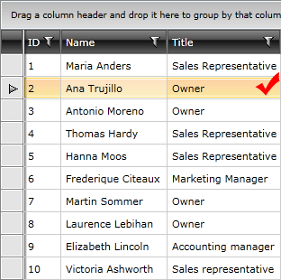

# Data Selection

## 

The __RadGridview__ provides you with a selection functionality, which allows the user to select one or more items from the data displayed by the control.

____

Check out the chapters entirely dedicated to the selection functionality of __RadGridView__ and find the answers to the following questions:

* How does the [basic selection]() work. 

* How to use the exposed [selection events](). 

* How to get the [current item](FF215C19-F399-4BDD-8E79-802D282DD583#CurrentItem). 

* How to get the [selected item](FF215C19-F399-4BDD-8E79-802D282DD583#SelectedItem). 

* How to use [multiple selection]() and to [select all items](FF215C19-F399-4BDD-8E79-802D282DD583#Selecting_All_Items).

# See Also

 * [UI Virtualization]()

 * [Mouse Support]()

 * [Keyboard Support]()
