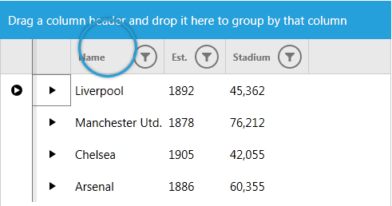
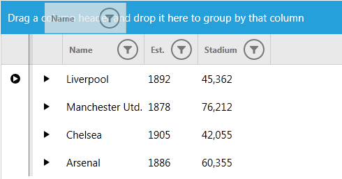

# Touch Support

This article describes the touch support implemented in RadGridView

RadGridView  for WPFSilverlight now provide touch support. To learn more about Touch Support of RadControls please read the common topic about [Touch Support]().
      

## Supported Touch Gestures
<table><th><tr><td>

Gesture</td><td>

RadGridView Action</td></tr></th><tr><td>

Swipe</td><td>

Scroll</td></tr><tr><td>

Pinch</td><td>

-</td></tr><tr><td>

Tap</td><td>

Click</td></tr><tr><td>

Tap and Move</td><td>

-</td></tr><tr><td>

Tap and Hold</td><td>

Shows a circle to be dragged</td></tr></table>

Using these gestures you will be able to perform the following actions:

* Grouping

* Sorting 

* Filtering 

* Reordering a column

* Resizing a column/row

* Freezing a column

## Grouping

In order to group RadGridView you can press and hold on Column's header and then you can drag and drop it over the GridViewGroupPanel.

This is shown on the following images:

