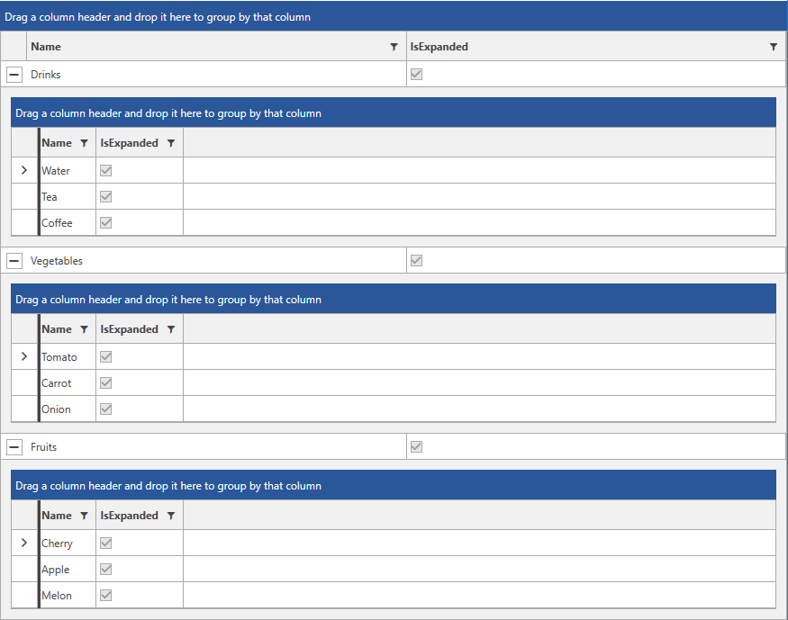
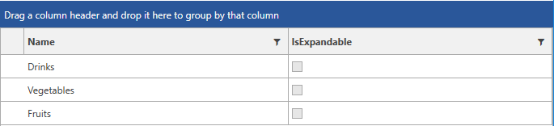

# IsExpandedBinding and IsExpandableBinding

> This functionality is available only when  [Hierarchical RadGridView]() is used.

As of __R1 2018 SP2 RadGridView__ exposes the __IsExpandedBinding__ and __IsExpandableBinding__ properties. Through it the expanded and expandable states of the rows can be synchronized with the view model. For the purpose of demonstrating this functionality, the following business model will be defined.

__Example 1: Defining the business model__
<snippet id='radgridview-features-isexpandedbinding-and-isexpandablebinding-example_1_defining_the_business_model-cs' />

__Example 2: Create sample data__
<snippet id='radgridview-features-isexpandedbinding-and-isexpandablebinding-example_2_create_sample_data-cs' />

## IsExpandedBinding

This property controls whether the hierarchy should be expanded or not. Setting the bound property to __true__ will result in expanding the given hierarchy.

#### [XAML] Example 3: Binding the IsExpandedBinding to the business model
<snippet id='radgridview-features-isexpandedbinding-and-isexpandablebinding-example_2_create_sample_data-xaml' />

#### Figure 1: Expanding hierarchy through the IsExpandedBinding property

## IsExpandableBinding

The visibility of the __GridViewToggleButton__ can be controlled through setting the property value. For example, if there are no items present in the hierarchical collection, the bound property can be set to __false__ thus, the toggle button will be hidden.

#### [XAML] Example 4: Binding the IsExpandableBinding to the business model
<snippet id='radgridview-features-isexpandedbinding-and-isexpandablebinding-example_2_create_sample_data-xaml' />

#### Figure 2: Hiding the GridViewToggleButton through the IsExpandableBinding

## See Also

* [Defining Columns]()
