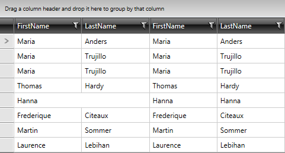

# Merged Cells


As of __Q3 2014 we have introduced support for merged cells in RadGridView__ control. As a result consecutive/serial cells with equal values can be merged vertically or horizontally.
    
>Merging the cells is only available with __GridViewDataColumn__.

> The only condition for two or more cells to be merged is for them to have equal values. You cannot enforce cells that do not have equal values to be merged.

For the purpose of this article, the data in RadGridView is populated similarly to as explained in [Getting Started with RadGridView]() article.  

## MergedCellsDirection

When the RadGridView is setup, you can configure it to display the merged cells by specifying a proper value for the __MergedCellsDirection__ property. It accepts the following values: 

* __None__      

* __Vertical__       

* __Horizontal__      

>important Merged Cells are only supported with __GroupRenderMode=”Flat”__. You can check the [Rendering Modes]() article for further details on it.
          
>Currently, frozen columns are not supported while having merged cells enabled. An exception will be thrown: "Cell merging is not supported when frozen columns are enabled.”.
      
__Example 1: Configure RadGridView to merge cells vertically__

```XAML
	<telerik:RadGridView ColumnWidth="*"
	                    MergedCellsDirection="Vertical"
	                    CanUserFreezeColumns="False"
	                    GroupRenderMode="Flat"/>
```

__Figure 1: RadGridView with vertically merged cells__


Similarly, you can set the cells to be merged horizontally configuring RadGridView with __MergedCellsDirection.Horizontal__.

__Example 2: Configure RadGridView to merge cells horizontally__

```XAML
	<telerik:RadGridView ColumnWidth="*"
	                    MergedCellsDirection="Horizontal"
	                    CanUserFreezeColumns="False"
	                    GroupRenderMode="Flat"/>
```


__Figure 2: RadGridView with horizontally merged cells__


## IsCellMergingEnabled

You can also configure merging for GridViewDataColumn through setting its __IsCellMergingEnabled__ property. For example:
        
__Example 3: Configure cell merging per column__

```XAML
	<telerik:RadGridView ColumnWidth="*"
	                      MergedCellsDirection="Vertical"
	                      CanUserFreezeColumns="False"
	                      GroupRenderMode="Flat">
	    <telerik:RadGridView.Columns>
	        <telerik:GridViewDataColumn IsCellMergingEnabled="False"/>
	    </telerik:RadGridView.Columns>
	</telerik:RadGridView>
```

>Please note RadGridView's definition in __Example 3__ is specific to illustrate it

__Figure 3: RadGridView with configured cell merging per column__



## Merged Cells and RowDetails

Merged cells are also supported when there are [RowDetails]()/[Hierarchy]() defined for RadGridView.
   
__Example 4: Define RowDetailsTemplate__

```XAML

	<DataTemplate x:Key="RowDetailsTemplate">
	  <StackPanel>
	    <TextBlock Text="First Name: " FontWeight="Bold"/>
	    <TextBlock Text="{Binding FirstName}" />
	    <TextBlock Text="Last Name: " FontWeight="Bold"/>
	    <TextBlock Text="{Binding LastName}" />
	  </StackPanel>
	</DataTemplate>
```

__Example 5: Specify RowDetailsTemplate for RadGridView__

```XAML

	<telerik:RadGridView
	  Name="radGridView"
	  ColumnWidth="100"
	  MergedCellsDirection="Vertical"
	  GroupRenderMode="Flat"
	  CanUserFreezeColumns="False"
	  RowDetailsTemplate="{StaticResource RowDetailsTemplate}">
	  <telerik:RadGridView.Columns>
	    <telerik:GridViewToggleRowDetailsColumn/>
	  </telerik:RadGridView.Columns>
	</telerik:RadGridView>
```

__Figure 4: RadGridView with merged cells and RowDetails defined__


__Figure 5: RadGridView with merged cells and RowDetails expanded__


>Once the row details are expanded, the merged cell will be separated into two different subsets. The particular cell that is part of the expanded row will be considered as a single one instead.
          
## Known Limitations

* Validation is currently not fully supported. Some scenarios are covered when RadGridView is configured with __ValidatesOnDataErrors="InEditMode"__.

* Selection is currently not supported for the merged cells. When selecting a row, all the cells except for the merged one will show as selected.

* Frozen columns are not supported while having merged cells enabled. "Cell merging is not supported when frozen columns are enabled.” is to be thrown.

## See Also

* [Styling Merged Cells]()

* [Styles and Templates]()
