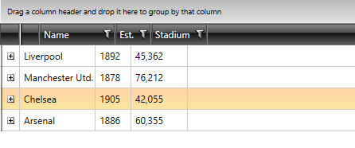
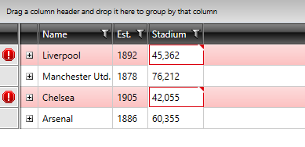

# Lightweight Templates


With __2013 Q2 SP__ we have introduced lightweight templates for __RadGridView and RadTreeListView__. This article will walk you through the following sections:

* [Core Styles](#core-styles)
* [Core Styles Including Validation](#core-styles-with-validation) 
* [Remove the Border of the Current Cell](#remove-the-border-of-the-current-cell)
* [Remove the Border of the Current Cell With Validation](#remove-the-border-of-the-current-cell-with-validation)

They are represented by several additional __simplified styles, which you can merge in your project__. The main idea of simplifying templates of different parts of RadGridView is to limit the number of visual elements within the templates in order to __speed up the performance__ of __RadGridView/RadTreeListView__.   

>importantThe Lightweight Templates can only be applied with NoXaml binaries and Implicit Themes. You can find more information on them [here]().
     
   
>tip The performance on loading the visual elements will be increased __up to 50%__ when the lightweight templates are applied.

>The performance on loading the visual elements will be increased __up to 25%__ when the lightweight templates are applied.


>Please note that the **row details** and **hierarchy** features are not supported for rows which use lightweight templates as the **PART_HierarchyChildPresenter** and **PART_DetailsPresenter** elements which are responsible for displaying the hierarchcal data are not defined in these templates. They can, however, still be used for the bottom-level RadGridView instances of the hierarchy (those which do not have any children).

## Core Styles

The CoreStyles are a basic alternative of the standard __GridViewCell, GridViewRow, TreeListViewRow__ including basic еffects and funcionalities such as __hover, selection, currency, grouping__ for these elements. These core styles are included within the themes of RadGridView and you may reference them in your project as shown below:        

__Example 1: Applying the Lightweight Templates__
```XAML
	<Grid.Resources>
	    <ResourceDictionary>
	        <ResourceDictionary.MergedDictionaries>
	            <ResourceDictionary Source="/Telerik.Windows.Themes.Office_Black;component/Themes/System.Windows.xaml"/>
	            <ResourceDictionary Source="/Telerik.Windows.Themes.Office_Black;component/Themes/Telerik.Windows.Controls.xaml"/>
	            <ResourceDictionary Source="/Telerik.Windows.Themes.Office_Black;component/Themes/Telerik.Windows.Controls.Input.xaml"/>
	            <ResourceDictionary Source="/Telerik.Windows.Themes.Office_Black;component/Themes/Telerik.Windows.Controls.GridView.xaml"/>
	        </ResourceDictionary.MergedDictionaries>
	        <Style TargetType="telerik:GridViewRow" BasedOn="{StaticResource GridViewRowCoreStyle}"/>
	        <Style TargetType="telerik:GridViewCell" BasedOn="{StaticResource GridViewCellCoreStyle}"/>
	        <Style TargetType="telerik:TreeListViewRow" BasedOn="{StaticResource TreeListViewRowCoreStyle}"/>
	    </ResourceDictionary>
	</Grid.Resources>
```

#### __Figure 1: RadGridView with Lightweight templates applied__


>tip For __RadGridView__ you need to merge only the CoreStyles for __GridViewCell and GridViewRow__. For __RadTreeListView__ you need to merge the styles for __GridViewCell and TreeListViewRow__.

>__GridViewRowCoreStyle__ does not contain a row indicator. Please set the __RowIndicatorVisibility__ property of the RadGridView to __Collapsed__ to avoid any visual differences between the row's headers and cells.          

## Core Styles with Validation

The CoreValidationStyles are an alternative of the standard __GridViewCell, GridViewRow, TreeListViewRow__. They include basic еffects and funcionalities such as __hover, selection, currency, grouping, validation__ for these elements. These core styles are included within the themes of RadGridView and you may reference it in your project as shown below.        

__Example 2: Applying Lightweight Templates with Validation__
```XAML
	<Grid.Resources>
	    <ResourceDictionary>
	        <ResourceDictionary.MergedDictionaries>
	            <ResourceDictionary Source="/Telerik.Windows.Themes.Office_Black;component/Themes/System.Windows.xaml"/>
	            <ResourceDictionary Source="/Telerik.Windows.Themes.Office_Black;component/Themes/Telerik.Windows.Controls.xaml"/>
	            <ResourceDictionary Source="/Telerik.Windows.Themes.Office_Black;component/Themes/Telerik.Windows.Controls.Input.xaml"/>
	            <ResourceDictionary Source="/Telerik.Windows.Themes.Office_Black;component/Themes/Telerik.Windows.Controls.GridView.xaml"/>
	        </ResourceDictionary.MergedDictionaries>
	        <Style TargetType="telerik:GridViewRow" BasedOn="{StaticResource GridViewRowCoreValidationStyle}"/>
	        <Style TargetType="telerik:GridViewCell" BasedOn="{StaticResource GridViewCellCoreValidationStyle}"/>
	        <Style TargetType="telerik:TreeListViewRow" BasedOn="{StaticResource TreeListViewRowCoreValidationStyle}"/>
	    </ResourceDictionary>
	</Grid.Resources>
```

#### __Figure 2: RadGridView with Lightweight templates with validation applied__


>__GridViewRowCoreValidationStyle__ contains a row indicator, which you can use to perform validation.
          

>tipFor __RadGridView__ you need to merge only the CoreStyles for __GridViewCell and GridViewRow__. For __RadTreeListView__ you need to merge the styles for __GridViewCell and TreeListViewRow__.

## Remove the Border of the Current Cell

For such requirement, you need to predefine the __ControlTemplate__ applied to __GridViewCell__ when __Lightweight templates__ are used. Within the __ControlTemplate__ you need to search for the __IsCurrent Property Trigger__ and delete it.

__Example 3: Deleting the IsCurrent Property Trigger__
```XAML
	<ControlTemplate x:Key="GridViewCellCoreTemplate" TargetType="grid:GridViewCell">
        <Grid>
            ...
        </Grid>
        <ControlTemplate.Triggers>
            ...
            <Trigger Property="IsCurrent" Value="True">
                <Setter TargetName="PART_CellBorder" Property="BorderBrush" Value="{StaticResource GridViewCell_CurrentBorder}"/>
                <Setter TargetName="PART_CellBorder" Property="BorderThickness" Value="1"/>
            </Trigger>
        </ControlTemplate.Triggers>
    </ControlTemplate>
```

#### __Figure 3: RadGridView with Lightweight templates and removed Current Cell Border__



## Remove the Border of the Current Cell With Validation

A similar approach as from the previous section needs to be used. The difference is that the same __Property Trigger__ has to be __deleted__ from the __ControlTemplate__ applied to __GridViewCell__ when __Lightweight templates with validation__ are used.

__Example 4: Deleting the IsCurrent Property Trigger when Lightweight Templates with Validation are applied__
```XAML
	<ControlTemplate x:Key="GridViewCellCoreValidationTemplate" TargetType="grid:GridViewCell">
        <Grid>
            ...
        </Grid>
        <ControlTemplate.Triggers>
           ...
            <Trigger Property="IsCurrent" Value="True">
                <Setter TargetName="PART_CellBorder" Property="BorderBrush" Value="{StaticResource GridViewCell_CurrentBorder}"/>
                <Setter TargetName="PART_CellBorder" Property="BorderThickness" Value="1"/>
                <Setter TargetName="PART_CellBorder" Property="Margin" Value="0,0,1,1"/>
            </Trigger>
            ...
        </ControlTemplate.Triggers>
    </ControlTemplate>
```

#### __Figure 4: RadGridView with Lightweight templates including validation and removed Current Cell Border__



>You can download a __runnable solution__ from our online SDK repository [here](https://github.com/telerik/xaml-sdk/tree/master/GridView/LightweightTemplates).       
>You can also find the blog post on [How To Boost RadGridView Performance for WPF and Silverlight Using Lightweight templates](http://www.telerik.com/blogs/how-to-boost-radgridview-performance-for-wpf-and-silverlight-using-lightweight-templates).
