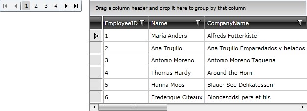

# Paging

__RadGridView__ offers an excellent integration with Silverlight __DataPager__.

To connect the __RadGridView__ with a __DataPager__ you need to perform a few simple steps:

* Add __RadGridView__ and __DataPager__ declarations. 

#### __XAML__

{{region xaml-gridview-overview-paging_0}}
	<telerik:RadGridView x:Name="radGridView"/>
	<data:DataPager x:Name="dataPager"/>
{{endregion}}

>Do not forget that in order to create __DataPager__ in the XAML, you first have to declare the following namespace:

#### __XAML__

{{region xaml-gridview-overview-paging_1}}
	  xmlns:data="clr-namespace:System.Windows.Controls;assembly=System.Windows.Controls.Data"
{{endregion}}

* Initialize a new instance of the __Telerik.Windows.Data.QueryableCollectionView__ class. Set the source for the collection. 

#### __C#__

{{region cs-gridview-overview-paging_2}}
	QueryableCollectionView qcv = new QueryableCollectionView(RadGridViewSampleData.GetEmployees());
{{endregion}}

#### __VB.NET__

{{region vb-gridview-overview-paging_3}}
	Dim qcv As New QueryableCollectionView(RadGridViewSampleData.GetEmployees())
{{endregion}}

* Set the newly created __QueryableCollectionView__ instance as an __ItemsSource/Source__ of the __RadGridView/DataPager__. 

#### __C#__

{{region cs-gridview-overview-paging_4}}
	QueryableCollectionView qcv = new QueryableCollectionView(RadGridViewSampleData.GetEmployees());
	dataPager.Source = qcv;
	radGridView.ItemsSource = qcv;
{{endregion}}

#### __VB.NET__

{{region vb-gridview-overview-paging_5}}
	Dim qcv As New QueryableCollectionView(RadGridViewSampleData.GetEmployees())
	dataPager.Source = qcv
	radGridView.ItemsSource = qcv
{{endregion}}

Take a look at the following topics which are entirely dedicated to the __Paging__ functionality.

* Using Silverlight [DataPager](). 

* Using [RadDataPager](). 

Take a look at the following topics which explain in great details the various features of the __RadGridView__.

* Using [Data Binding]() mechanism to display data in __RadGridView__. 

* [Managing Data]()

* Using built-in [Sorting]() functionality. 

* Using built-in [Grouping]() functionality. 

* Using built-int [Filtering]() functionality. 

* [Data Selection]() functionality. 

## See Also

 * [Grouping]()

 * [Filtering]()

 * [Data Selection]()
