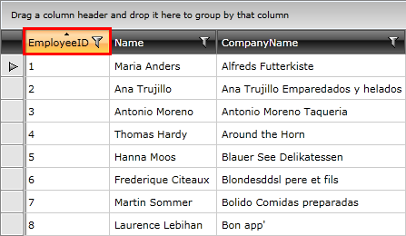

# Sorting

__RadGridView__ provides you with a built-in sorting functionality, which allows the user to easily sort the data by one of the columns.



You can define sorting criteria either in the XAML or in the code-behind.

#### __XAML__

```XAML
	<telerik:RadGridView x:Name="radGridView"
	                 AutoGenerateColumns="False">
	    <telerik:RadGridView.SortDescriptors>
	        <telerik:SortDescriptor Member="EmployeeID"
	                            SortDirection="Ascending" />
	    </telerik:RadGridView.SortDescriptors>
	    <!--...-->
	</telerik:RadGridView>
```


You can achieve the same result if you define your sorting criteria in the code-behind like this:

#### __C#__

```C#
	SortDescriptor descriptor = new SortDescriptor();
	descriptor.Member = "EmployeeID";
	descriptor.SortDirection = ListSortDirection.Ascending;
	this.radGridView.SortDescriptors.Add(descriptor);
```


#### __VB.NET__

```VB.NET
	Dim descriptor As New SortDescriptor()
	descriptor.Member = "EmployeeID"
	descriptor.SortDirection = ListSortDirection.Ascending
	Me.radGridView.SortDescriptors.Add(descriptor)
```


>Note that since __SortDescriptors__ property is a __collection__, you can add more than one __SortDescriptor__ to a __RadGridView__.

>tipConsider using the code-behind approach only when changing the sorting criteria __run-time__.

>importantIf the RadGridView is bound to a collection that inherits __ICollectionView__ that has a __CanSort__ property set to __true__, the RadGridView`s sorting is disabled and the sorting mechanism of the collection is used instead.


Check out the chapters entirely dedicated to the sorting functionality of __RadGridView__ and find the answers to the following questions:

* What are the available [types of sorting]().

* How does the [basic sorting]() work.

* How to [define sorting]() using __SortDescriptors__ in both XAML and code-behind.

* How to use the exposed [sort events]().

* How to [disable]() the default sorting per column or for the whole __RadGridView__ control.

* How to define [custom sorting]() based on the __Sorting__ event.

* How to sort your data by [multiple-columns]().

* How to [style the column header]() of the sorted column.

## See Also

 * [Grouping]()

 * [Filtering]()

 * [Data Selection]()
