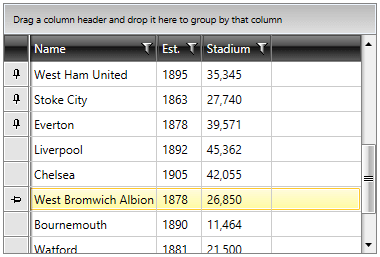
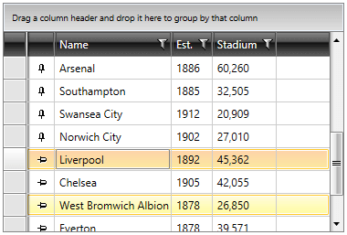

# Pinned Rows

Since **R2 2016**, RadGridView supports **Pinned Rows**. By using Pinned Rows, you can pin particular rows to the top or bottom of your **RadGridView** so that they do not participate in the vertical scrolling.

>importantCurrently, [RowDetails](), [Merged Cells]() and [Extended selection]() are not supported when pinning rows.

In this article, we will discuss the following topics:

* [PinnedRowsPosition property](#pinnedrowsposition)

* [Grouping](#grouping)

* [Sorting](#sorting)

* [Paging](#paging)

* [Filtering](#filtering)

* [Commands](#commands)

## PinnedRowsPosition

RadGridView's **PinnedRowsPosition** property lets you determine where the pinned rows will appear. It has three possible values:

* **Top**: Display the pinned rows on top.

* **Bottom**: Display the pinned rows at the bottom after the last standard row.

* **None**: Do not display the pinned rows.

**Example 1** shows that you can set the property either declaratively or at runtime, like this:

__Example 1: Setting the PinnedRowsPosition property__
```XAML
	<telerik:RadGridView PinnedRowsPosition="Top" />
```

__Example 1: Setting the PinnedRowsPosition property__
```C#
	this.RadGridView.PinnedRowsPosition = GridViewPinnedRowsPosition.Top;
```
```VB.NET
	Me.RadGridView.PinnedRowsPosition = GridViewPinnedRowsPosition.Top
```

If the PinnedRowsPosition property is set to either Top or Bottom, a pin button will appear on hovering over the [row indicator]().

>important Pinned rows are only supported when [GroupRenderMode]() is set to **Flat**.

Pressing the button will pin the respective row. Clicking on it again will remove it from the collection of the pinned rows.

#### __Figure 1: Pinning rows from the row indicator__



Another way to allow your users to pin rows with the click of a button is to define a **GridViewPinRowColumn**, which enables pinning and unpinning of the rows.

__Example 2: Defining a GridViewPinRowColumn__
```XAML
	<telerik:RadGridView.Columns>
    	<telerik:GridViewPinRowColumn />
	</telerik:RadGridView.Columns>
```

#### __Figure 2: Pinning rows from the GridViewPinRowColumn__



## Grouping

Pinned items do not participate in grouping. Once the user applies grouping to RadGridView, either by [dragging a column header]() to the **GridViewGroupPanel**, or [programmatically](), the pinned items are placed back to the **Items** collection. On ungrouping, they reappear as pinned.

## Sorting

Sorting a column results in sorting the items in the pinned panel as well - only compared to each other.

## Paging

When the user pins rows in a page and moves to another page, the pinned rows are removed, as they are not a part of the source of the second page. Navigating back to the previous page would bring back the pinned rows for that page.

## Filtering 

Filtering RadGridView displays all items (along with the pinned ones) in the filter descriptor. 

## Commands

The **TogglePinnedRowState Command** toggles a row's **IsPinned** property. It takes as parameters the item to pin and the target RadGridView to pin that item to.

__Example 3: Using the TogglePinnedRowState Command__
```C#
	var togglePinnedStateCommand = RadGridViewCommands.TogglePinnedRowState as RoutedUICommand;
    togglePinnedStateCommand.Execute(this.RadGridView.Items[0], this.RadGridView); 
```
```VB.NET
	Dim togglePinnedStateCommand = TryCast(RadGridViewCommands.TogglePinnedRowState, RoutedUICommand)
    togglePinnedStateCommand.Execute(Me.RadGridView.Items(0), Me.RadGridView)
```
	
## See Also
* [Defining Columns]()
* [Frozen Columns]()
