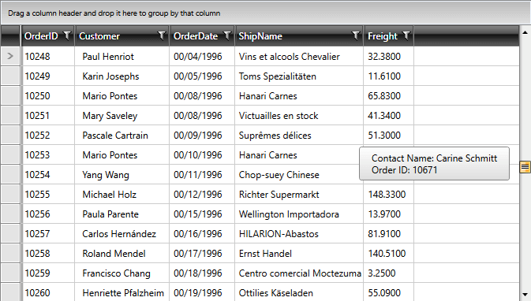

# Scrolling 

__RadGridView__ has inbuilt default scrolling mechanism. There are also options provided to additionally configure it for a better user experience.

## Scroll Modes

__RadGridView__ provides two built-in scrolling modes, which allow you to manipulate the type of scrolling. 
This is controlled by the __ScrollMode__ enumeration property which has the following entries:

- __RealTime__: Updates the content in view in real time as the user scrolls.
- __Deferred__: Keeps the content in view static until scrolling is complete.

By default the __ScrollMode__ property is set to the __RealTime__ mode.

There is also an option to implement programmatic scrolling. To learn more read the [Scroll to a particular row or column article]().

## ScrollPositionIndicator

When RadGridView's **ScrollMode** is set to **Deffered**, a small tooltip appears when scrolling which previews the current scroll position. This is an element of type **ScrollPositionIndicator** and by default its content will be that of the first column's cells. You can define a custom **DataTemplate** for it by setting RadGridView's **ScrollPositionIndicatorTemplate** property in order to display content of your choice.

> If you want to prevent the ScrollPositionIndicator from showing, you can set the __ShowScrollPositionIndicator__ property of the RadGridView to __False__. This property is available since the __2018.3.1029__ version. Setting the ShowScrollPositionIndicator property will only have an effect when the **ScrollMode** is set to **Deffered**.

#### __[XAML] Example 1: Defining ScrollPositionIndicatorTemplate__  
{{region xaml-gridview-scrolling_0}}
    <telerik:RadGridView.ScrollPositionIndicatorTemplate>
        <DataTemplate>
            <StackPanel>
                <StackPanel Orientation="Horizontal">
                    <TextBlock Text="Contact Name: " />
                    <TextBlock Text="{Binding Customer.ContactName}" />
                </StackPanel>
                <StackPanel Orientation="Horizontal">
                    <TextBlock Text="Order ID: " />
                    <TextBlock Text="{Binding OrderID}" />
                </StackPanel>
            </StackPanel>
        </DataTemplate>
    </telerik:RadGridView.ScrollPositionIndicatorTemplate>
{{endregion}}

#### __Figure 1: Custom ScrollPositionIndicator__  

Additionally, you can style the element by creating the appropriate style and setting the **TargetType** property to **telerik:ScrollPositionIndicator** as demonstrated in **Example 2**:

#### __[XAML] Example 2: Styling ScrollPositionIndicator__  
{{region xaml-gridview-scrolling_1}}
	
{{endregion}}

>If you're using [Implicit Styles](), you should base your style on the **ScrollPositionIndicatorStyle**.

## ScrollingSettingsBehavior

This feature enables customizing the scrolling behavior of __RadGridView__ while dragging items. It uses the __ScrollingSettingsBehavior__ class.


>You can refer to the [ScrollingSettingsBehavior API Reference](https://docs.telerik.com/devtools/silverlight/api/telerik.windows.controls.scrollingsettingsbehavior)



>You can refer to the [ScrollingSettingsBehavior API Reference](https://docs.telerik.com/devtools/wpf/api/telerik.windows.controls.scrollingsettingsbehavior)


The following behavior settings are exposed for customization:

* [Enabling and disabling the Scrolling behavior](#enabling-and-disabling-the-scrolling-behavior)
* [ScrollAreaPadding](#scrollareapadding)
* [ScrollStep](#scrollstep)
* [ScrollStepTime](#scrollsteptime)

### Enabling and disabling the Scrolling behavior

You can enable and disable the behavior by setting a value to the Boolean property __IsEnabled__.

#### **[XAML] Example 3: Setting the IsEnabled property**  
{{region xaml-gridview-scrolling_2}}
	<telerik:RadGridView telerik:ScrollingSettingsBehavior.IsEnabled="False"/>
{{endregion}}

### ScrollAreaPadding

By setting this property you can customize at which point the scrolling begins. Its default value is 0px. You need to set a value bigger than the default one in order to be able to use the __ScrollStep__ and __ScrollStepTime__ properties.

#### **[XAML] Example 4: Setting the ScrollAreaPadding property**  
{{region xaml-gridview-scrolling_3}}
	<telerik:RadGridView telerik:ScrollingSettingsBehavior.ScrollAreaPadding="5 20"/>
{{endregion}}

### ScrollStep

You can manipulate how many pixels will be skipped while scrolling by setting this property. It expects double values and its default one is 0.0

#### **[XAML] Example 5: Setting the ScrollStep property**  
{{region xaml-gridview-scrolling_4}}
	<telerik:RadGridView telerik:ScrollingSettingsBehavior.ScrollStep="1.5"/>
{{endregion}}

### ScrollStepTime

This property determines the time between each scroll step. It has no default value.

#### **[XAML] Example 6: Setting the ScrollStepTime property**  
{{region xaml-gridview-scrolling_5}}
	<telerik:RadGridView telerik:ScrollingSettingsBehavior.ScrollStepTime="00:00:00.5"/>
{{endregion}}

## Number of Scrolled Rows

RadGridView scrolls 3 rows with each scroll step of the mouse wheel. To change the number of rows that are scrolled, set the __MouseWheelScrollDelta__ property.

#### __[XAML] Example 7: Setting MouseWheelScrollDelta__
{{region xaml-gridview-scrolling_6}}
	<telerik:RadGridView MouseWheelScrollDelta="20" />
{{endregion}}
