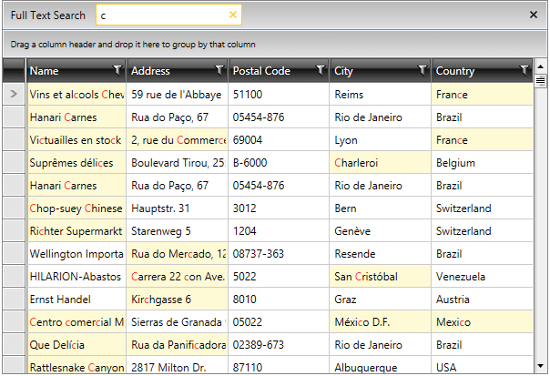
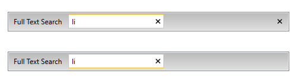
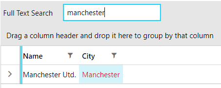

# Search as You Type

`RadGridView` control allows you to perform search operations on the displayed data.

## Show the Search Panel

Through the new boolean `ShowSearchPanel` property of the control, the user can show/hide the search panel. Its default value is `false`. If hidden, the search panel can be shown with the __Ctrl__+__F__ shortcut.

>important The default searching behavior has two ways of setting the operator of the filtering criteria, depending on the value type of the property over which the search is performed. For a `string` and `Enum` type the operator is set to `Contains`. For all other types the operator is set to `IsEqualTo`.

#### __[XAML] Showing the Search Panel__
{{region xaml-radgridview-search-as-you-type-0}}
	<telerik:RadGridView x:Name="orderItemsDataGrid"
					     ItemsSource="{Binding Orders}"     
			     		 ShowSearchPanel="True"
                    	 Margin="5" 
			     		 AutoGenerateColumns="False" 
			     		 ColumnWidth="*"/>
{{endregion}}

__Showing the Search Panel__

>important In case highlighting in a custom column or CellTemplate is needed, the `HightlightTextBlock` can be used. Its constructor needs to have the `SearchStateManager` passed as a parameter. It is exposed through the SearchStateManager property of RadGridView. The usage of the HighlightTextBlock is demonstrated in the [Custom Highlight Column](https://github.com/telerik/xaml-sdk/tree/master/GridView/HighlightCustomColumn).

## Disable Showing the Search Panel

You can control whether the users can use the search panel through the `CanUserSearch` boolean property of RadGridView. Its default value is `true`. Setting it to `false` would permanently disable the functionality, meaning that the __Ctrl__+__F__ combination would not show the panel as well.   

#### __[XAML] Disabling the Search Panel__
{{region xaml-radgridview-search-as-you-type-1}}
	<telerik:RadGridView x:Name="orderItemsDataGrid"
						 ItemsSource="{Binding Orders}"     
						 CanUserSearch="False"
						 Margin="5" 
						 AutoGenerateColumns="False" 
						 ColumnWidth="*"/>
{{endregion}}

## Search Panel's Close Button's Visibility

The visibility of the search panel's close button can be controlled via the `SearchPanelCloseButtonVisibility` property. The default value is `Visible` meaning that the search panel can originally be closed via this button.

#### __[XAML] Collapse the close button in XAML__
{{region xaml-radgridview-search-as-you-type-2}}
	<telerik:RadGridView SearchPanelCloseButtonVisibility="Collapsed" />
{{endregion}}

#### __[C#] Collapse the close button in code-behind__
{{region cs-radgridview-search-as-you-type-3}}
    this.GridView.SearchPanelCloseButtonVisibility = Visibility.Collapsed;
{{endregion}}

#### __[VB.NET] Collapse the close button in code-behind__
{{region vb-radgridview-search-as-you-type-3}}
    Me.GridView.SearchPanelCloseButtonVisibility = Visibility.Collapsed
{{endregion}}

__Collapsed Close Button__

## Deferred Searching

The deferred searching functionality can be controlled through the `IsSearchingDeferred` property. Its default value is `false` and it determines whether the filtering through the search text box will be performed dynamically. 

When `IsSearchingDeferred` is set to `true`, the filtering will be executed when the value is being committed on __lost focus__ or when the __Enter__ or __Tab__ key is pressed. 

#### __[XAML] Setting the IsSearchingDeferred to True__
{{region xaml-radgridview-search-as-you-type-2}}
	<telerik:RadGridView x:Name="orderItemsDataGrid" 
						 ItemsSource="{Binding Orders}"
			             IsSearchingDeferred="True"
                     	 Margin="5" 
                     	 AutoGenerateColumns="False"/>
{{endregion}}

## Commands

Three new commands have been exposed for the text search functionality, via the `RadGridViewCommands` class. 

- `Search`&mdash;Executed in order to show the search panel.
- `SearchByText`&mdash;Executed in order to perform an actual search. It takes a `string` as a parameter - the text to search by.
- `CloseSearchPanel`&mdash;Executed in order to hide the search panel.

#### __[C#] Executing the search commands in code__
{{region cs-radgridview-search-as-you-type-7}}
	// search by text
	string searchText = "search text";
 	var searchByTextCommand = (RoutedUICommand)RadGridViewCommands.SearchByText;
 	searchByTextCommand.Execute(searchText, this.gridView);

	// open the search panel
   	var searchCommand = (RoutedUICommand) RadGridViewCommands.Search;
 	searchCommand.Execute(null, this.gridView);

  	// close the search panel
   	var closeSearchPanelCommand = (RoutedUICommand)RadGridViewCommands.CloseSearchPanel;
 	closeSearchPanelCommand.Execute(null, this.gridView);
{{endregion}}

## Events

RadGridView provides several events related to the search-as-you-type functionality:

The `SearchPanelVisibilityChanged` event will be raised on changing  the `ShowSearchPanel` property. Its arguments are of type `VisibilityChangedEventArgs` and contain the value of the new visibility - `NewVisibility`.

A common scenario where you can use this event is when you want to clear the search criteria on collapsing the panel:

#### __[C#] Clearing search criteria on SearchPanelVisibilityChanged__
{{region cs-radgridview-search-as-you-type-3}}
    private void RadGridView_SearchPanelVisibilityChanged(object sender, VisibilityChangedEventArgs e)
    {
        if (e.NewVisibility == Visibility.Collapsed)
        {
            var clearSearchValue = GridViewSearchPanelCommands.ClearSearchValue as RoutedUICommand;
            clearSearchValue.Execute(null, this.RadGridView.ChildrenOfType<GridViewSearchPanel>().FirstOrDefault());
        }
    }
{{endregion}}

#### __[VB.NET] Clearing search criteria on SearchPanelVisibilityChanged__
{{region vb-radgridview-search-as-you-type-4}}
	Private Sub RadGridView_SearchPanelVisibilityChanged(sender As Object, e As VisibilityChangedEventArgs)
		If e.NewVisibility = Visibility.Collapsed Then
			Dim clearSearchValue = TryCast(GridViewSearchPanelCommands.ClearSearchValue, RoutedUICommand)
			clearSearchValue.Execute(Nothing, Me.RadGridView.ChildrenOfType(Of GridViewSearchPanel)().FirstOrDefault())
		End If
	End Sub
{{endregion}}

The `Searching` event will be raised when the grid data is about to be searched. It's arguments are of type `GridViewSearchingEventsArgs` and contain the value of the text which was entered in the search panel `TextBox` - `SearchText`. They also contain a boolean property which indicates whether the event should be canceled - `Cancel`.

A common scenario for the use of this event is when you want to cancel the search based on a condition:

#### __[C#] Stop the searching based on a condition__
{{region cs-radgridview-search-as-you-type-5}}
    private void RadGridView_Searching(object sender, Telerik.Windows.Controls.GridView.GridViewSearchingEventArgs e)
    {
        if (e.SearchText.ToString() == "SomeText")
        {
            e.Cancel = true;
        }
    }
{{endregion}}

The `Searched` event will be raised when the grid data has been searched. It's arguments are of type `GridViewSearchedEventArgs` and contain the value of the text which was entered in the search panel `TextBox` - `SearchText`.

>tipFor more information, refer to the [Overview]() article.

## Modify the Searching Criteria

In order to modify the search behavior, you can benefit from the following three search operators:

- __+__&mdash;The items that will pass the filtering operation will have to __contain__ both the value __before__ the operator and the one __after__ it.

	__Using the `+` search operator__
	
	

- __-__&mdash;All items that will pass the filtering operation will have to  __contain__ the value __before__ the operator, but __not__ the one __after__ it.

	__Using the `-` search operator__
	
	

- __""__&mdash;When a word or a phrase is put in quotes, the filtered objects will contain only the exact same value.
	
	__Using the `""` search operator__
	
	

## SearchMode

The RadGridView control exposes the `SearchMode` property which allows you to control how items are matched when search is executed. It has the following two possible values:

* `MatchAnyTerm`: Items match the search operation when they fulfill any of the search terms. For example, if `John Terry` is inputted in the search panel, items containing __any__ of the terms "John" and "Terry" in any of their properties will be matched. This is the default value.

* `MatchAllTerms`: Items match the search operation only when they fulfill all of the search terms. Continuing with the previous example, if `John Terry` is entered as the search text, only items which contain __both__ terms ("John" and "Terry") in any of their properties will be matched.

* `MatchExact`: Items match the search operation only when they exactly match the search text.

## Change the Label Text of the Search Panel

By default, the value of the `TextBlock` appearing before the search `TextBox` in the search panel is __"Full Text Search"__. It can be altered through the localization mechanism of `RadGridView`. The resource key that needs to be modified is __GridViewSearchPanelTopText__. More information can be found in the [Localization]() topic.

## Add Search Criteria Programmatically 

RadGridView's search mechanism supports defining a search criteria programmatically. This can be done through the `SearchByText` command. More information can be found in the [Commands Overview]() topic. 

## Search Over Dynamic Data

RadGridView provides full support for searching over dynamic data. This includes `IDynamicMetaObjectProvider`(`DynamicObject` and `ExpandoObject`), `ICustomTypeProvider`, and `ICustomTypeDescriptor` implementations.

## Search in Hidden Columns

RadGridView's text search mechanism supports searching in hidden columns. This behavior can be enabled by setting the `CanUserSearchInHiddenColumns` property of the RadGridView control to `true`.

#### __[XAML] Setting CanUserSearchInHiddenColumns property in XAML__
{{region xaml-radgridview-search-as-you-type-6}}
	<telerik:RadGridView CanUserSearchInHiddenColumns="True"/>
{{endregion}}

## Search With Accent Insensitive

The `SearchStateManager` property of RadGridView exposes the `IsSearchWithAccentEnabled` property, which allows you to search with accent insensitive. This behavior is turned off by default. To enable this functionality you can subscribe to the Loaded event of the RadGridView. In the event handler, you can set this property to `true`. 

#### __[C#] Setting IsSearchWithAccentEnabled property__
{{region xaml-radgridview-search-as-you-type-6}}
	private void GridView_Loaded(object sender, RoutedEventArgs e)
	{
		var radGridView = (RadGridView)sender;

		radGridView.SearchStateManager.IsSearchWithAccentEnabled = true;
	}
{{endregion}}

__Using Search With Accent Insensitive__

## Exclude Column from Search

The `GridViewBoundColumnBase` provides an option to exclude it from the search mechanism. To achieve this, you can use its `IsSearchable` property. The default value of this property is __True__, which means that the column will be included in the search operation. To exclude a column from this operation, set the IsSearchable property to __False__.

#### __[XAML] Excluding a column from the search mechanism__
{{region radgridview-search-as-you-type-7}}
	<telerik:RadGridView ItemsSource="{Binding Clubs}" 
	                     ShowSearchPanel="True" 
	                     AutoGenerateColumns="False" 
	                     GroupRenderMode="Flat">
	    <telerik:RadGridView.Columns>
	        <telerik:GridViewDataColumn DataMemberBinding="{Binding Name}"  
	                                    IsSearchable="False"/>
	        <telerik:GridViewDataColumn DataMemberBinding="{Binding City}"/>
	    </telerik:RadGridView.Columns>
	</telerik:RadGridView>
{{endregion}}

__RadGridView with an excluded column from the search mechanism__

## Disable the Data Filtering when Searching

The RadGridView control exposes the `IsSearchFilteringEnabled` option. It will allow you to control whether the data will be filtered when a search operation is performed. The default value of the IsSeachFilteringEnabled property is set to __True__, which will filter the data. When the data filtering is disabled, search operations will only highlight the cells that match the search criteria.	

#### __[C#] Disabling the data filtering when performing search__
{{region radgridView-search-as-you-type-8}}
	<telerik:RadGridView IsSearchFilteringEnabled="False"/>
{{endregion}}

## See Also
* [Basic Filtering]()
* [Programmatic Filtering]()
* [Commands]()
