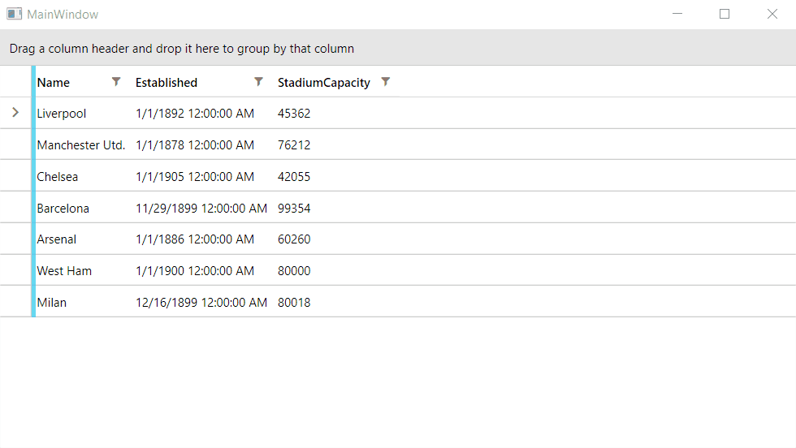
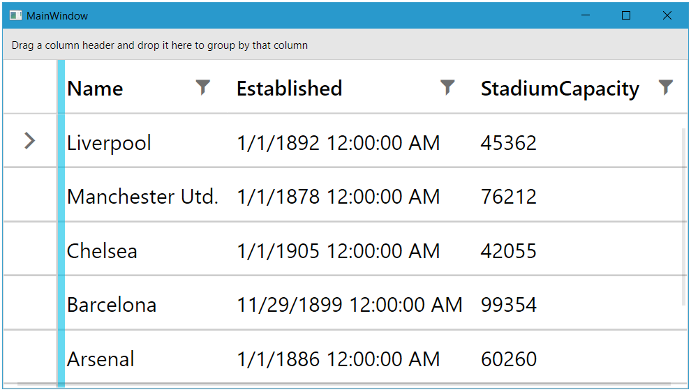

# Zooming

The `RadGridView` control provides support for zooming its content through the `EnableMouseWheelScaling` and `ScaleFactor` properties. These properties are exposed by the `GridViewDataControl` class and are fully supported by the `RadTreeListView` control as well.

## EnableMouseWheelScaling

The `EnableMouseWheelScaling` property allows you to control whether the zoom feature should be turned on or off. The default value of this property is `False`. When the property's value is `True`, the zoom on the RadGridView control can be performed by holding the `CTRL` key and by scrolling the `MouseWheel`.

__Enabling zooming__
<snippet id='radgridview-features-zooming-enabling_zooming-xaml' />

This property can also be set in the code-behind.

__Enabling zooming in code-behind__
<snippet id='radgridview-features-zooming-enabling_zooming_in_code_behind-cs' />

<snippet id='radgridview-features-zooming-enabling_zooming_in_code_behind-vb' />

__Zooming RadGridView control__

 

## ScaleFactor

The `ScaleFactor` property allows you to control the zoom scaling of the `RadGridView` element. The values that are going to be taken into account are in the range of `0.1` to `4.0`. The default value of this property is `1`. Setting `0.1` or `4.0` as a value for the ScaleFactor property will also be considered valid.

>important The `ScaleFactor` value will be respected even if the zooming feature is disabled.

__Setting the ScaleFactor property__
<snippet id='radgridview-features-zooming-setting_the_scalefactor_property-xaml' />

__Setting the ScaleFactor property in code-behind__
<snippet id='radgridview-features-zooming-setting_the_scalefactor_property_in_code_behind-cs' />

<snippet id='radgridview-features-zooming-setting_the_scalefactor_property_in_code_behind-vb' />

__Custom value for ScaleFactor property__

