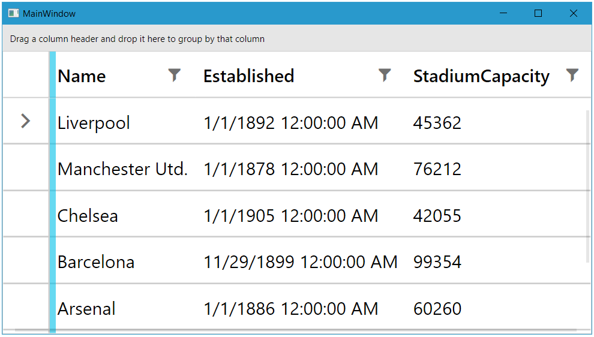

# {{ site.framework_name }} RadGridView Zooming

The `RadGridView` control provides support for zooming its content through the `EnableMouseWheelScaling` and `ScaleFactor` properties. These properties are exposed by the `GridViewDataControl` class and are fully supported by the `RadTreeListView` control as well.

## EnableMouseWheelScaling

The `EnableMouseWheelScaling` property allows you to control whether the zoom feature should be turned on or off. The default value of this property is `False`. When the property's value is `True`, the zoom on the RadGridView control can be performed by holding the `CTRL` key and by scrolling the `MouseWheel`.

#### __[XAML] Enabling zooming__
{{region radgridview-zooming-0}}
    <Grid>
        <telerik:RadGridView x:Name="radGridView" EnableMouseWheelScaling="True"/>
    </Grid>
{{endregion}}

This property can also be set in the code-behind.

#### __[C#] Enabling zooming in code-behind__
{{region radgridview-zooming-1}}
    this.radGridView.EnableMouseWheelScaling = true;
{{endregion}}

#### __[VB.NET] Enabling zooming in code-behind__
{{region radgridview-zooming-2}}
    Me.radGridView.EnableMouseWheelScaling = True
{{endregion}}

__Zooming RadGridView control__

 

## ScaleFactor

The `ScaleFactor` property allows you to control the zoom scaling of the `RadGridView` element. The values that are going to be taken into account are in the range of `0.1` to `4.0`. The default value of this property is `1`. Setting `0.1` or `4.0` as a value for the ScaleFactor property will also be considered valid.

>important The `ScaleFactor` value will be respected even if the zooming feature is disabled.

#### __[XAML] Setting the ScaleFactor property__
{{region radgridview-zooming-3}}
    <Grid>
        <telerik:RadGridView x:Name="radGridView" ScaleFactor="2.0" />
    </Grid>
{{endregion}}

#### __[C#] Setting the ScaleFactor property in code-behind__
{{region radgridview-zooming-4}}
    this.radGridView.ScaleFactor = 2;
{{endregion}}

#### __[VB.NET] Setting the ScaleFactor property in code-behind__
{{region radgridview-zooming-5}}
    Me.radGridView.ScaleFactor = 2
{{endregion}}

__Custom value for ScaleFactor property__

