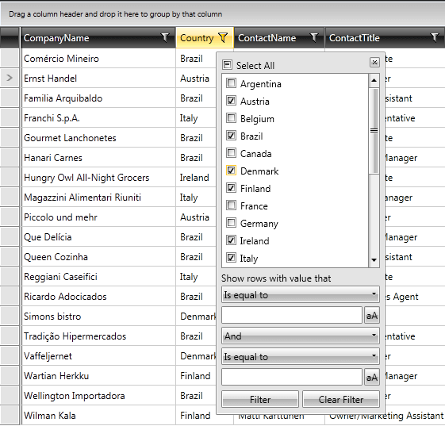
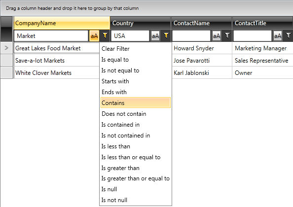
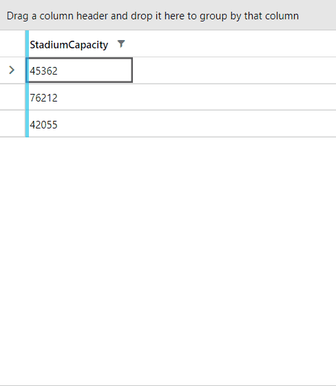

# Basic Filtering

This article will go through the following topics:

* [Filter Modes](#filter-modes)

* [FilterMemberPath](#filtermemberpath)

* [OptimizeDistinctFilterQuery](#optimizedistinctfilterquery)

RadGridView provides built-in filtering functionality, which allows the user to easily filter data by one or more columns. Filtering will be enabled out-of-the-box for most .NET primitive types such as strings, numeric types, DateTimes and so on.

> If you want to filter a column which is bound to a custom type, the type will have to meet some requirements which are described [here](). 

You can use the [IsFilteringAllowed]() property of RadGridView to disable filtering altogether. To disable the filtering of a specific column you can use the [IsFilterable]() property of the column.

## Filter Modes

There are three built-in filtering modes which you can choose from by setting the `FilteringMode` property of `RadGridView`.

* [Popup Filtering](#popup-filtering)

* [Filter Row](#filter-row)

* [Filter Editor](#filter-editor)

## Popup Filtering

Popup filtering is the default filtering mode offered by RadGridView. It is activated by clicking the funnel icon located in the column header.

__The filtering popup__

### Distinct Values

The filtering control that the user is presented with has two parts. The upper part of the control displays distinct values found in the respective column. The values that you see at any moment are the ones that are left after all other column filters have been applied. In other words, these values are collected from the visible rows only. This behavior can easily be configured as described in [this article]().

The string representations that are displayed to the user are produced by taking the raw distinct value from the source collection and then applying the column’s `DataMemberBinding` `IValueConverter` or `DataFormatString` if any are defined. For example, if you have specified a *currency* DataFormatString for your column, the user will see a nicely formatted *$2.22* in the distinct values list. However, underneath this nicely formatted string the original *Float* value will be preserved and will be used for performing the actual filtering inside the data engine. 

>importantUsing an IValueConverter or DataFormatstring will not affect the data operations in any way. They are used for UI purposes only and do not play any role in the data engine. Filtering is always performed with the raw data values.

By default, only the first 1000 distinct values will be shown. The amount of distinct values displayed can easily be configured as described in [this article]().

If you don’t need the distinct values part of the filtering control you can hide it by using the `ShowDistinctFilters` property of the column. This property only makes sense when the filtering mode is `Popup`.

### Field Filters

The lower part of the control represents the two field filters. These are two filtering criteria joined by a logical operator. The field filters allow the user to create filtering criteria like "*age is greater than 18 and is less than 60*". Each field filters consists of two parts. The upper part is a combo box that allows the user to specify the type of comparison to be made, i.e. `Is Equal To`, `Is Less Than`, and so on. These are called filter operators. The available filter operators depend on the data type of the column. For example, for string columns you will see string-specific operators such as `Contains` and `Is Contained In`, whereas for numeric and date columns you will see the comparison operators `Is Greater Than`, `Is Less Than`, etc. [Here](#filterdescriptor)you can find a table describing the available filter operators based on the column data type. If you want to remove some of the available filter operators that the user is presented with or change the operator that is selected by default you can use the `FilterOperatorsLoading` event of RadGridView as described [here]().

The lower part of the field filter is called the field filter editor. Again, the editor that the user will see depends on the column data type. For example, if you have a date column the user will be able to enter the filtering criteria through a date time picker control. Depending on the column data type the most suitable editor is selected and used. Of course, you can always plug-in your very own field filter editor as described in this [article](). If you want to modify the appearance or behavior of the stock field filter editor that we have selected for you, you can easily do that by attaching to the `FieldFilterEditorCreated` event of RadGridView as demonstrated [here]().

If you don’t need the field filter part of the filtering control you can hide it by using the `ShowFieldFilters` property of the column. This property only makes sense when the filtering mode is Popup. For boolean columns, it is `False` by default.

You can also control the creation of field filters in both `Popup` and `FilterRow` mode via the new `ShouldGenerateFieldFilterEditors` property. Its default value is `null` in which case field filters will be generated for all non-boolean columns. Setting it to `False` will stop the generation of field filter editors and consequently the `FilterOperatorsLoading` event will not be raised. Setting the property to `True` will have an effect only on boolean columns which will then display a checkbox as their filter editor along with the `IsEqualTo` and `IsNotEqualTo` filter operators rather than the fake `True` and `False` operators.

> Please note that both `ShowFieldFilters` and `ShouldGenerateFieldFilterEditors` are taken into account when using the `Popup` filtering mode. If any of them is set to `False`, no field filter editors will be created.

### Deferred Filtering

The default behavior of the filtering control is to apply the filter as soon as the user selects a distinct value or types something in one of the two field filter editors. In other words, as soon as anything in the filtering criteria represented in the filtering control changes the data engine will be asked to perform the filtering. Having this in mind, you can hide the `Filter` button by setting the `ShowFilterButton` property of the respective column to false.

This behavior can be controlled by adjusting the `IsFilteringDeferred` property of the respective column. This property makes sense and is used only when the FiltertingMode of the grid is Popup. When IsFilteringDeferred is set to `True` no filtering will occur until the user explicitly clicks the Filter button. This mode is very useful when filtering is performed on a remote server and each trip to the server is costly. Clicking the `Clear` button will always clear all of the column’s filters immediately in one batch operation. This operation cannot be deferred and will always be executed immediately.

### Keep Filter Popup Open

Through the `FilteringDropDownStaysOpen` property of `RadGridView`, you can control whether the filtering dropdown should stay open when a click outside of the popup occurs. It has a default value of `False`. If set to `True`, the popup will only close on a click on either the `Close` button or the `Filter` icon.

## Filter Row

The `FilterRow` filtering mode offers a filter built in the header cell of each filterable column. This mode is simpler and does not support the notion of distinct values. In fact, the field filter editor that is displayed in the header cell is exactly the same as either of the two field filter editors from the Popup filtering control. You can think of this as an oversimplified version of the Popup mode where the user sees only one of the two field filter editors of the Popup filtering control and the editor is always visible.

__The filter rows__

Initially all filters start as empty. Once a value has been entered in the editor, an operator has to be selected by clicking the funnel icon. The drop-down will list all available operators that are applicable to the column’s type. If you want to remove some of the available filter operators you can use the `FilterOperatorsLoading` event of RadGridView. Have in mind though that when in filter row mode, you cannot pre-define a default selected operator through the event arguments. When the mode is filter row it is the end user’s job to select the filter operator. There is one special operator in this list called `Clear Filter`. This is not a real filter operator. Instead it will clear and reset the column filter when selected.

Boolean columns do not have an editor on the left side. Instead, they have two additional fake operators called `Is True` and `Is False`. Selecting Is True from the filter operator list is much more intuitive than checking a check-box and then selecting the Is Equal To operator.

Once a value has been entered and a filter operator has been selected the filter becomes active. This is indicated by the filtering funnel filling up. Once a filter is active any change in either the value or the operator will immediately be applied to the data below. When the user clears the filter by selecting the `Clear Filter` option the filter will be deactivated and will not be activated again until the user selects another filter operator. The `IsFilteringDeferred` property of the column is not applicable and is disregarded when the mode is filter row.

Just like with the Popup filtering mode, you can always plug-in your very own field filter editor as described in [this article](). If you want to modify the appearance or behavior of the default field filter editor that we have selected for you, you can easily do that by attaching to the `FieldFilterEditorCreated` event of RadGridView as demonstrated [here]().

>A custom filtering control can only be used when the FilteringMode is Popup. The FilterRow cannot use custom filtering controls.

## Filter Editor 

The filter editor mode displays a data filter view panel at the bottom of RadGridView which allows you to create complex filtering criterias using the RadDataFilter control. Read more about this in the [Filter Editor]() article.

## FilterMemberPath

Each `GridViewColumn` has a property called `FilterMemberPath`. This property can be used to tell the column to filter on a property different from the one it displays in its cells. In case the `Type` of this property cannot be automatically discovered by the data engine, you can "help" the column by setting the `FilterMemberType` property.

The following example shows how to specify the `FilterMemberPath` for the column to filter it based on the `NameToFilterOn` property of the bound business object.
        

#### __[XAML] Specifying the FilterMemberPath for a column__
{{region xaml-gridview-filtering-basic_0}}
	  <telerik:GridViewDataColumn DataMemberBinding="{Binding Name}" FilterMemberPath="PropertyToFilterOn"/>
{{endregion}}

## OptimizeDistinctFilterQuery

By default, a condition of the form `'Member IsEqualTo Value'` is generated for each distinct value selected. Then, all such conditions are combined with the `OR` operator. When the amount of distinct values checked grows, the query might become very slow. Setting the `OptimizeDistinctFilterQuery` property of `GridViewColumn` to `True` will check the amount of distinct values checked. If this amount is less than or equal to half of all distinct values, the original query will be generated. If, however, the amount of distinct values checked is more than half of all distinct values, an inverted statement like this will be generated: (Member IsNotEqualTo uncheckedDistinctValue_0) ... AND ... (Member IsNotEqualTo uncheckedDistinctValue_N). If absolutely all distinct values are checked, then no statement will be generated at all, because this effectively means that there is no filter applied. Setting this property to `True` will try to generate the shortest possible LINQ `Where` clause. 

## Distinct Values Filtering

The `GridViewColumn` base class exposes the `EnableDistinctValuesFiltering` and `DistinctValuesSearchMode` properties, which allow you to filter the column's distinct values.

By setting the EnableDistinctValuesFiltering property to `True`, a `RadWatermarkTextBox` element will appear inside the FilteringControl. Through this element, the user can filter the distinct values of the column.

The DistinctValuesSearchMode property allows you to change the criteria, by which the user input will filter the values. The exposed values of this property are `Contains`, `ContainsCaseSensitive`, `StartsWith`, and `StartsWithCaseSensitive`.

>tip The `EnableDistinctValuesFiltering` and `DistinctValuesSearchMode` properties are meant to be used when the `FilteringMode` property of the RadGridView is set to `Popup`.

The following example shows how to utilize these properties.

#### __[XAML] Setting EnableDistinctValuesFiltering and DistinctValuesSearchMode properties__
{{region xaml-gridview-filtering-basic_1}}
	<telerik:RadGridView DataContext="{StaticResource MyViewModel}"
	                     ItemsSource="{Binding Clubs}" AutoGenerateColumns="False">
	    <telerik:RadGridView.Columns>
	        <telerik:GridViewDataColumn Header="StadiumCapacity"
										DataMemberBinding="{Binding StadiumCapacity}"
	                                    EnableDistinctValuesFiltering="True"
	                                    DistinctValuesSearchMode="StartsWith"/>
	    </telerik:RadGridView.Columns>
	</telerik:RadGridView>
{{endregion}}

__Filtering the StadiumCapacity column's distinct values__

## See Also

 * [Visual Structure]()

 * [Programmatic Filtering]()

 * [Reevaluation of data operations]()
