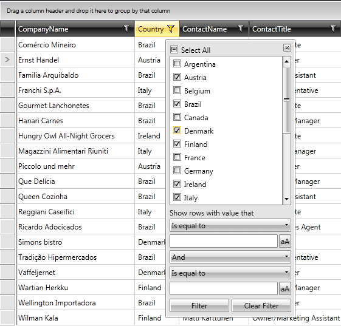
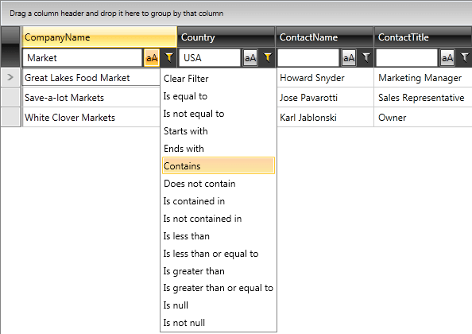
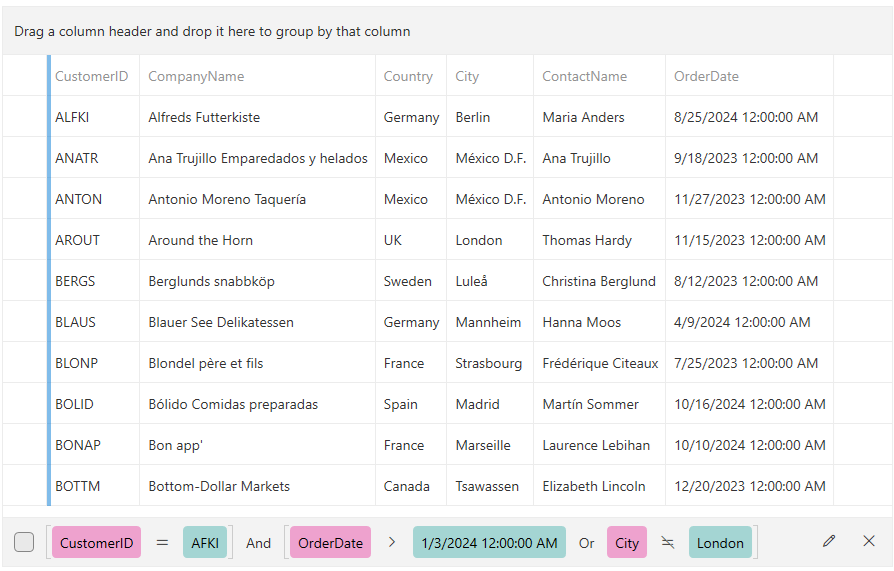
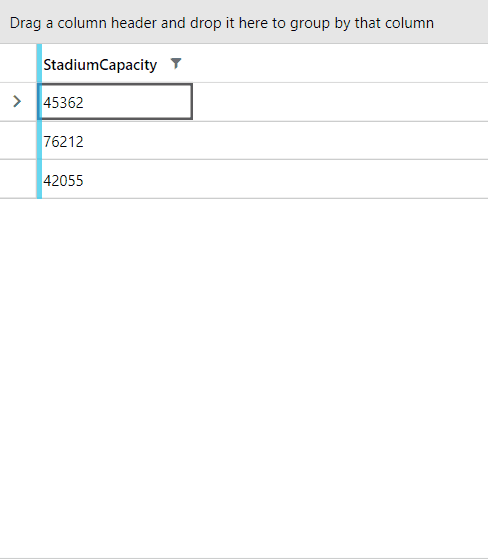

# Basic Filtering in RadGridView

Use `RadGridView` filtering to help users narrow data by one or more columns. The control enables filtering out of the box for most primitive .NET types, including strings, numbers, and `DateTime` values.

If you want to filter a column that is bound to a custom type, see [Filter a Custom Type]().

Use this article to:

* Choose the right filtering mode.
* Understand how popup and filter-row filtering behave.
* Configure column-level filtering settings such as `FilterMemberPath`.
* Improve performance for distinct-value filters.

Use the [IsFilteringAllowed]() property of `RadGridView` to disable filtering for the entire grid. To disable filtering for a single column, use the [IsFilterable]() property of that column.

## Filtering Mode

`RadGridView` provides three built-in filtering modes through the `FilteringMode` property. Use one of the following filtering modes depending on the filtering experience you want to provide.

| Mode | Best for | Notes |
|---|---|---|
| [Popup Filtering](#popup-filtering) | Most common interactive filtering scenarios | Default mode. Supports distinct values and field filters. |
| [Filter Row](#filter-row) | Always-visible per-column filters | Simpler UI. Does not show distinct values. |
| [Filter Editor](#filter-editor) | Complex filtering expressions | Uses `RadDataFilter` in a panel below the grid. |

## Popup Filtering

`Popup` filtering is the default mode in `RadGridView`. Users open the filtering UI by selecting the funnel icon in a column header.

__The filtering popup__



### Distinct Values

The upper part of the popup shows the distinct values for the current column. By default, those values are collected from the currently visible rows after other column filters have already been applied. To change that behavior, see [Display All Distinct Values]().

The values shown to the user are display values. `RadGridView` applies the column `DataMemberBinding` `IValueConverter` or `DataFormatString`, if one is defined, before showing the value in the popup. The data engine still filters by the original raw value.

>important `IValueConverter` and `DataFormatString` affect only the UI text. Filtering always uses the raw data values.

By default, the popup shows only the first 1000 distinct values. To change that limit, see [Display All Distinct Values]().

If you do not need the distinct-values section, set the column `ShowDistinctFilters` property to `False`. This property applies only when `FilteringMode` is `Popup`.

### Field Filters

The lower part of the popup contains two field filters joined by a logical operator. This allows criteria such as "age is greater than 18 and less than 60".

Each field filter has:

* An operator selector such as `Is Equal To`, `Contains`, or `Is Less Than`.
* An editor for the filter value.

The available operators depend on the column data type. For example, string columns expose operators such as `Contains`, while numeric and date columns expose comparison operators. For the complete operator list by type, see [FilterDescriptor](#filterdescriptor).

To remove operators or change the default operator, handle the `FilterOperatorsLoading` event as shown in [Change the Default Selected Filter Operator]().

The field filter editor also depends on the column data type. For example, date columns use a date editor. To replace the default editor, see [Create a Custom Field Filter Editor](). To customize the default editor, use the `FieldFilterEditorCreated` event as shown in [Customize the Default Field Filter Editor]().

If you do not need field filters, set the column `ShowFieldFilters` property to `False`. This property applies only when the filtering mode is `Popup`. For Boolean columns, its default value is `False`.

You can also control field filter generation in both `Popup` and `FilterRow` modes through the `ShouldGenerateFieldFilterEditors` property.

* `null` generates field filter editors for all non-Boolean columns.
* `False` prevents field filter editor generation and suppresses the `FilterOperatorsLoading` event.
* `True` affects Boolean columns only. It shows a checkbox editor together with the `IsEqualTo` and `IsNotEqualTo` operators instead of the synthetic `True` and `False` operators.

>note In `Popup` mode, both `ShowFieldFilters` and `ShouldGenerateFieldFilterEditors` affect field-filter creation. If either property is `False`, no field filter editors are created.

### Deferred Filtering

By default, the popup applies filtering immediately when the user selects a distinct value or changes a field filter. When you use that immediate mode, you can hide the `Filter` button by setting the column `ShowFilterButton` property to `False`.

Use the column `IsFilteringDeferred` property to change that behavior. This property applies only when `FilteringMode` is `Popup`.

When `IsFilteringDeferred` is `True`, the grid waits until the user selects the `Filter` button. This mode is useful when filtering sends requests to a remote server. The `Clear` button always clears the column filters immediately and cannot be deferred.

### Keep Filter Popup Open

Use the `FilteringDropDownStaysOpen` property of `RadGridView` to control whether the popup remains open after a click outside it. The default value is `False`. When set to `True`, the popup closes only when the user selects the `Close` button or the filter icon.

## Filter Row

`FilterRow` places a filter editor directly in each filterable column header. This mode is simpler than `Popup` and does not support distinct values.

The editor shown in the header is equivalent to one of the two field filters from the popup UI, but it is always visible.

__The filter rows__



All filter-row filters start empty. After the user enters a value, they choose an operator from the funnel menu. The menu shows the operators that apply to the current column type.

Use the `FilterOperatorsLoading` event to remove operators from that list. In `FilterRow` mode, you cannot preselect a default operator through the event arguments. The user must choose it.

The operator list also includes `Clear Filter`, which resets the column filter.

Boolean columns do not show a value editor on the left side. Instead, they expose `Is True` and `Is False` operators, which provide a more direct filtering experience.

After the user enters a value and selects an operator, the filter becomes active. The funnel icon fills to indicate that the filter is active. Any later change to the value or operator is applied immediately.

When the user selects `Clear Filter`, the filter is removed and stays inactive until another operator is selected.

The column `IsFilteringDeferred` property does not apply in `FilterRow` mode.

As with `Popup` mode, you can provide your own field filter editor as described in [Create a Custom Field Filter Editor](). To customize the default field filter editor, use `FieldFilterEditorCreated` as shown in [Customize the Default Field Filter Editor]().

>note Custom filtering controls work only when `FilteringMode` is `Popup`. `FilterRow` cannot use custom filtering controls.

## Filter Editor

`FilterEditor` displays a filtering panel below `RadGridView`. It uses `RadDataFilter` to build more complex filtering criteria than the other modes. For more detail, see [Filter Editor]().



## FilterMemberPath

Each `GridViewColumn` exposes a `FilterMemberPath` property. Use it when the column must filter by a property other than the one displayed in the cell.

If the data engine cannot determine the type of the member automatically, set the `FilterMemberType` property as well.

The following example filters the column by the `PropertyToFilterOn` member instead of the displayed `Name` member.

__Specifying the FilterMemberPath for a column__
```xaml
<telerik:GridViewDataColumn DataMemberBinding="{Binding Name}" FilterMemberPath="PropertyToFilterOn"/>
```

## OptimizeDistinctFilterQuery

By default, `RadGridView` generates an `OR` condition for every selected distinct value. When the number of selected distinct values becomes large, that query can grow expensive.

Set the `OptimizeDistinctFilterQuery` property of `GridViewColumn` to `True` to let the grid generate the shortest possible LINQ `Where` clause.

The optimization works as follows:

* If the selected values are less than or equal to half of all distinct values, the grid keeps the original `IsEqualTo` query.
* If the selected values are more than half of all distinct values, the grid generates an inverted `IsNotEqualTo` query for the unchecked values.
* If all distinct values are selected, no filter statement is generated because the column is effectively unfiltered.

## Distinct Values Filtering

The `GridViewColumn` base class exposes `EnableDistinctValuesFiltering` and `DistinctValuesSearchMode`, which allow users to search within the distinct-values list of a column.

When `EnableDistinctValuesFiltering` is `True`, the filtering control shows a `RadWatermarkTextBox` that filters the list of distinct values.

Use `DistinctValuesSearchMode` to control how the user input is matched. The available values are `Contains`, `ContainsCaseSensitive`, `StartsWith`, and `StartsWithCaseSensitive`.

>tip `EnableDistinctValuesFiltering` and `DistinctValuesSearchMode` are intended for use when the `FilteringMode` of `RadGridView` is `Popup`.

The following example enables distinct-value filtering and uses a `StartsWith` search.

__Setting EnableDistinctValuesFiltering and DistinctValuesSearchMode properties__
```xaml
<telerik:RadGridView DataContext="{StaticResource MyViewModel}"
                     ItemsSource="{Binding Clubs}"
                     AutoGenerateColumns="False">
    <telerik:RadGridView.Columns>
        <telerik:GridViewDataColumn Header="StadiumCapacity"
                                    DataMemberBinding="{Binding StadiumCapacity}"
                                    EnableDistinctValuesFiltering="True"
                                    DistinctValuesSearchMode="StartsWith"/>
    </telerik:RadGridView.Columns>
</telerik:RadGridView>
```

__Filtering the StadiumCapacity column's distinct values__



## See Also

 * [Visual Structure]()

 * [Programmatic Filtering]()

 * [Reevaluation of data operations]()
