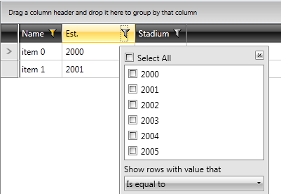

# Cascading Distinct Values

The distinct values that you see at any moment in the filtering control, are the ones that are left after all other filters have been applied. If this is not the behavior that you want, then this can be turned off.
        

You need to subscribe to the __DistinctValuesLoading__ event of the __RadGridView__ and set the __e.ItemsSource__ to the items you want to show.
        
Here is a small example:


```C#
	private void radGridView_DistinctValuesLoading(object sender, Telerik.Windows.Controls.GridView.GridViewDistinctValuesLoadingEventArgs e)
	{
	    e.ItemsSource = ((RadGridView)sender).GetDistinctValues(e.Column, false);
	}
```


```VB.NET
	Private Sub radGridView_DistinctValuesLoading(sender As Object, e As Telerik.Windows.Controls.GridView.GridViewDistinctValuesLoadingEventArgs)
	    e.ItemsSource = DirectCast(sender, RadGridView).GetDistinctValues(e.Column, False)
	End Sub
```

Now the listbox in the filtering control will be populated with all the distinct items for the filtered column. 




