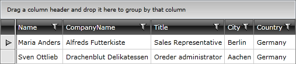

# Composite Filter Descriptors


>Note that when programmatically filtering the __RadGridView__ via the __CompositeFilterDescriptor__ and the __FilterDescriptor__ classes, the UI filtering mechanism won't be affected. This means that the UI filtering will be applied only to the already filtered data, not to the entire data source of the __RadGridView__. In order to combine the both of them, you have to use __IColumnFilterDescriptor__ instead of __FilterDescriptor__ or __CompositeFilterDescritpor__. Learn more by reading [this article]().

To filter a single data field by multiple values, you have to use the __CompositeFilterDescriptor__ object. It contains a collection of filter descriptors objects and the logical operator for that filters. Check out the code snippets below to see how to use and declare this filter descriptor in XAML and code-behind.


```XAML
	<telerik:CompositeFilterDescriptor LogicalOperator="Or">
	    <telerik:CompositeFilterDescriptor.FilterDescriptors>
	        <telerik:FilterDescriptor Member="City"
	              Operator="IsEqualTo"
	              Value="Berlin"
	              IsCaseSensitive="False" />
	        <telerik:FilterDescriptor Member="City"
	              Operator="IsEqualTo"
	              Value="Aachen"
	              IsCaseSensitive="False" />
	    </telerik:CompositeFilterDescriptor.FilterDescriptors>
	</telerik:CompositeFilterDescriptor>
```


```C#
	CompositeFilterDescriptor compositeDescriptor = new CompositeFilterDescriptor();
	compositeDescriptor.LogicalOperator = FilterCompositionLogicalOperator.Or;
	compositeDescriptor.FilterDescriptors.Add(new FilterDescriptor("City", FilterOperator.IsEqualTo, "Berlin", false));
	compositeDescriptor.FilterDescriptors.Add(new FilterDescriptor("City", FilterOperator.IsEqualTo, "Aachen", false));
	this.radGridView.FilterDescriptors.Add(compositeDescriptor);
```


```VB.NET
	Dim compositeDescriptor As New CompositeFilterDescriptor()
	compositeDescriptor.LogicalOperator = FilterCompositionLogicalOperator.[Or]
	compositeDescriptor.FilterDescriptors.Add(New FilterDescriptor("City", FilterOperator.IsEqualTo, "Berlin", False))
	compositeDescriptor.FilterDescriptors.Add(New FilterDescriptor("City", FilterOperator.IsEqualTo, "Aachen", False))
	Me.radGridView.FilterDescriptors.Add(compositeDescriptor)
```

And here is the result:



As you can see, this filter returns all records that have their City field set either to "Berlin" or "Aachen".

>Note that the filter descriptors that belong to a single __CompositeFilterDescriptor__ are combined using the specified logical operator, like __(City = "Berlin" OR City = "Aachen")__

## More Complex Composite Filters

>tipIn case you need to create more complex filters, consider nesting multiple __CompositeFilterDescriptors__ and combine them with different logical operators as it is shown in the example below.

The composite filters allow you to create more complex filtering expressions. Such a complex filtering expression might include filters for multiple fields combined with different logical operators, like __(Country = "Germany" AND (City = "Berlin" OR City = "Aachen"))__. Check out the code snippets below to see how to declare such complex filter descriptors in XAML and code-behind.


```XAML
	<telerik:CompositeFilterDescriptor LogicalOperator="And">
	    <telerik:CompositeFilterDescriptor.FilterDescriptors>
	        <telerik:CompositeFilterDescriptor LogicalOperator="Or">
	            <telerik:CompositeFilterDescriptor.FilterDescriptors>
	                <telerik:FilterDescriptor Member="City"
	              Operator="IsEqualTo"
	              Value="Berlin"
	              IsCaseSensitive="False" />
	                <telerik:FilterDescriptor Member="City"
	              Operator="IsEqualTo"
	              Value="Aachen"
	              IsCaseSensitive="False" />
	            </telerik:CompositeFilterDescriptor.FilterDescriptors>
	        </telerik:CompositeFilterDescriptor>
	        <telerik:FilterDescriptor Member="Country"
	              Operator="IsEqualTo"
	              Value="Germany"/>
	    </telerik:CompositeFilterDescriptor.FilterDescriptors>
	</telerik:CompositeFilterDescriptor>
```


```C#
	CompositeFilterDescriptor compositeDescriptor2 = new CompositeFilterDescriptor();
	compositeDescriptor2.LogicalOperator = FilterCompositionLogicalOperator.And;
	CompositeFilterDescriptor citiesDescriptor = new CompositeFilterDescriptor();
	citiesDescriptor.LogicalOperator = FilterCompositionLogicalOperator.Or;
	citiesDescriptor.FilterDescriptors.Add(new FilterDescriptor("City", FilterOperator.IsEqualTo, "Berlin", false));
	citiesDescriptor.FilterDescriptors.Add(new FilterDescriptor("City", FilterOperator.IsEqualTo, "Aachen", false));
	FilterDescriptor descriptor = new FilterDescriptor();
	descriptor.Member = "Country";
	descriptor.Operator = FilterOperator.IsEqualTo;
	descriptor.Value = "Germany";
	compositeDescriptor2.FilterDescriptors.Add(citiesDescriptor);
	compositeDescriptor2.FilterDescriptors.Add(descriptor);
	this.radGridView.FilterDescriptors.Add(compositeDescriptor2);
```


```VB.NET
	Dim compositeDescriptor2 As New CompositeFilterDescriptor()
	compositeDescriptor2.LogicalOperator = FilterCompositionLogicalOperator.[And]
	Dim citiesDescriptor As New CompositeFilterDescriptor()
	citiesDescriptor.LogicalOperator = FilterCompositionLogicalOperator.[Or]
	citiesDescriptor.FilterDescriptors.Add(New FilterDescriptor("City", FilterOperator.IsEqualTo, "Berlin", False))
	citiesDescriptor.FilterDescriptors.Add(New FilterDescriptor("City", FilterOperator.IsEqualTo, "Aachen", False))
	Dim descriptor As New FilterDescriptor()
	descriptor.Member = "Country"
	descriptor.[Operator] = FilterOperator.IsEqualTo
	descriptor.Value = "Germany"
	compositeDescriptor2.FilterDescriptors.Add(citiesDescriptor)
	compositeDescriptor2.FilterDescriptors.Add(descriptor)
	Me.radGridView.FilterDescriptors.Add(compositeDescriptor2)
```

And here is the result:


As you can see, this filter returns all records that have their City field set to "Berlin" or "Aachen" and Country set to "Germany". 

## See Also

 * [Basic Filtering]()

 * [Simple Filter Descriptors]()

 * [Column Filter Descriptors]()
