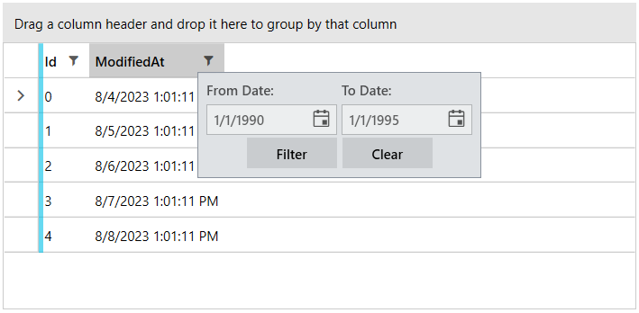

# Custom Filtering Controls

As a developer, __you are not limited to the default filtering user interface provided by RadGridView when in Popup filtering mode__. After the introduction of the Custom Filtering Controls feature, you can easily craft any filtering control that you like.

__The example in this article produces the following result__  



## Building a Custom Filtering Control

In order to be able to communicate with RadGridView, your custom filtering control will have to implement the IFilteringControl interface. This interface allows RadGridView to communicate with your control.  Let’s take a look at the interface:


```C#
	/// <summary>
	/// Provides functionality required by all filtering components.
	/// </summary>
	public interface IFilteringControl
	{
	    /// <summary>
	    /// Prepares the component for the column it will service.
	    /// </summary>
	    /// <param name="column">The column to prepare for.</param>
	    void Prepare(GridViewColumn column);
	
	    /// <summary>
	    /// Gets a value indicating whether the filtering is active.
	    /// </summary>
	    bool IsActive { get; set; }
	}
```
```VB.NET
	''' <summary>
	''' Provides functionality required by all filtering components.
	''' </summary>
	Public Interface IFilteringControl
	    ''' <summary>
	    ''' Prepares the component for the column it will service.
	    ''' </summary>
	    ''' <param name="column">The column to prepare for.</param>
	    Sub Prepare(ByVal column As GridViewColumn)
	
	    ''' <summary>
	    ''' Gets a value indicating whether the filtering is active.
	    ''' </summary>
	    Property IsActive() As Boolean
	End Interface
```


The Prepare method is called each time the control is about to be shown (when the user clicks the funnel in the header cell). If you do not need to change anything between two consecutive times when the filtering UI is shown, there wouldn’t be much inside this method’s body. The IsActive property provides means of “filling up” the funnel when the column is filtered. Along with the IsActive CLR property that is part of the interface, you will need to add an IsActive DependencyProperty to back the CLR property.

Next, you will have to decide what UI elements your custom filtering control will display and define them in its XAML file. When the user interacts with these UI elements you will have to react and perfrom the actual filtering. Whether you will use event handlers or the MVVM pattern is up to you and is a decision which is beyond the scope if this article. Once you have reacted to an user action you will need to filter RadGridView programmatically. Basically, to filter RadGridView you need to add an IFilterDescriptor to its FilterDescriptors collection. To clear this filter, you need to remove the IFilterDescriptor from the FilterDescriptors collection. Filtering RadGridView programmactically is explained in great detail in this [article]().

Here is an example of a custom filtering control that displays two date time pickers:


```XAML
	<Border x:Name="LayoutRoot" BorderThickness="1" BorderBrush="#FF8A929E" Padding="5" Background="#FFDFE2E5">
	  <Grid>
	    <Grid.ColumnDefinitions>
	      <ColumnDefinition Width="120"/>
	      <ColumnDefinition Width="120"/>
	    </Grid.ColumnDefinitions>
	    <Grid.RowDefinitions>
	      <RowDefinition Height="Auto"/>
	      <RowDefinition Height="Auto" />
	      <RowDefinition Height="Auto" />
	    </Grid.RowDefinitions>
	    <TextBlock Grid.Column="0" Grid.Row="0" Margin="2">From Date:</TextBlock>
	    <TextBlock Grid.Column="1" Grid.Row="0" Margin="2">To Date:</TextBlock>
	    <telerik:RadDatePicker Name="fromDatePicker" Grid.Column="0" Grid.Row="1" Margin="2"/>
	    <telerik:RadDatePicker Name="toDatePicker" Grid.Column="1" Grid.Row="1" Margin="2"/>
	    <StackPanel Grid.Column="0" Grid.ColumnSpan="2" Grid.Row="2" Orientation="Horizontal" HorizontalAlignment="Center">
	      <telerik:RadButton Name="filterButton" Content="Filter" Click="OnFilter" Margin="2" Width="80"/>
	      <telerik:RadButton Name="clearButton" Content="Clear" Click="OnClear" Margin="2" Width="80"/>
	    </StackPanel>
	  </Grid>
	</Border>
```


```C#
	/// <summary>
	/// FromDateToDateFilterControl
	/// </summary>
	public partial class FromDateToDateFilterControl : System.Windows.Controls.UserControl, IFilteringControl
	{
	    private GridViewBoundColumnBase column;
	    private CompositeFilterDescriptor compositeFilter;
	    private Telerik.Windows.Data.FilterDescriptor fromFilter;
	    private Telerik.Windows.Data.FilterDescriptor toFilter;
	
	    /// <summary>
	    /// Gets or sets a value indicating whether the filtering is active.
	    /// </summary>
	    public bool IsActive
	    {
	        get { return (bool)GetValue(IsActiveProperty); }
	        set { SetValue(IsActiveProperty, value); }
	    }
	
	    /// <summary>
	    /// Identifies the <see cref="IsActive"/> dependency property.
	    /// </summary>
	    public static readonly DependencyProperty IsActiveProperty =
	        DependencyProperty.Register(
	            "IsActive",
	            typeof(bool),
	            typeof(FromDateToDateFilterControl),
	            new System.Windows.PropertyMetadata(false));
	
	    [TypeConverter(typeof(DateTimeTypeConverter))]
	    public DateTime FromDate
	    {
	        get { return this.fromDatePicker.SelectedDate.GetValueOrDefault(DateTime.MinValue); }
	        set { this.fromDatePicker.SelectedDate = value; }
	    }
	
	    [TypeConverter(typeof(DateTimeTypeConverter))]
	    public DateTime ToDate
	    {
	        get { return this.toDatePicker.SelectedDate.GetValueOrDefault(DateTime.MaxValue); }
	        set { this.toDatePicker.SelectedDate = value; }
	    }
	
	    public RadDatePicker FromPicker
	    {
	        get { return this.fromDatePicker; }
	    }
	
	    public RadDatePicker ToPicker
	    {
	        get { return this.toDatePicker; }
	    }
	
	    public FromDateToDateFilterControl()
	    {
	        InitializeComponent();
	    }
	
	    public void Prepare(Telerik.Windows.Controls.GridViewColumn column)
	    {
	        this.column = column as GridViewBoundColumnBase;
	        if (this.column == null)
	        {
	            return;
	        }
	
	        if (this.compositeFilter == null)
	        {
	            this.CreateFilters();
	        }
	
	        this.fromFilter.Value = this.FromDate;
	        this.toFilter.Value = this.ToDate;
	    }
	
	    private void CreateFilters()
	    {
	        string dataMember = this.column.DataMemberBinding.Path.Path;
	
	        this.compositeFilter = new CompositeFilterDescriptor();
	
	        this.fromFilter = new Telerik.Windows.Data.FilterDescriptor(dataMember
	            , Telerik.Windows.Data.FilterOperator.IsGreaterThanOrEqualTo
	            , null);
	        this.compositeFilter.FilterDescriptors.Add(this.fromFilter);
	
	        this.toFilter = new Telerik.Windows.Data.FilterDescriptor(dataMember
	            , Telerik.Windows.Data.FilterOperator.IsLessThanOrEqualTo
	            , null);
	        this.compositeFilter.FilterDescriptors.Add(this.toFilter);
	    }
	
	    private void OnFilter(object sender, RoutedEventArgs e)
	    {
	        this.fromFilter.Value = this.FromDate;
	        this.toFilter.Value = this.ToDate;
	
	        if (!this.column.DataControl.FilterDescriptors.Contains(this.compositeFilter))
	        {
	            this.column.DataControl.FilterDescriptors.Add(this.compositeFilter);
	        }
	
	        this.IsActive = true;
	    }
	
	    private void OnClear(object sender, RoutedEventArgs e)
	    {
	        if (this.column.DataControl.FilterDescriptors.Contains(this.compositeFilter))
	        {
	            this.column.DataControl.FilterDescriptors.Remove(this.compositeFilter);
	        }
	
	        this.FromDate = new DateTime(1990, 1, 1);
	        this.ToDate = new DateTime(1995, 1, 1);
	
	        this.IsActive = false;
	    }
	}
```
```VB.NET
	''' <summary>
	''' FromDateToDateFilterControl
	''' </summary>
	Partial Public Class FromDateToDateFilterControl
	    Inherits System.Windows.Controls.UserControl
	    Implements IFilteringControl
	
	    Private column As GridViewBoundColumnBase
	    Private compositeFilter As CompositeFilterDescriptor
	    Private fromFilter As Telerik.Windows.Data.FilterDescriptor
	    Private toFilter As Telerik.Windows.Data.FilterDescriptor
	
	    ''' <summary>
	    ''' Gets or sets a value indicating whether the filtering is active.
	    ''' </summary>
	    Public Property IsActive() As Boolean
	        Get
	            Return DirectCast(GetValue(IsActiveProperty), Boolean)
	        End Get
	        Set(ByVal value As Boolean)
	            SetValue(IsActiveProperty, value)
	        End Set
	    End Property
	
	    ''' <summary>
	    ''' Identifies the <see cref="IsActive"/> dependency property.
	    ''' </summary>
	    Public Shared ReadOnly IsActiveProperty As DependencyProperty = DependencyProperty.Register("IsActive", GetType(Boolean), GetType(FromDateToDateFilterControl), New System.Windows.PropertyMetadata(False))
	
	    <TypeConverter(GetType(DateTimeTypeConverter))>
	    Public Property FromDate() As Date
	        Get
	            Return Me.fromDatePicker.SelectedDate.GetValueOrDefault(Date.MinValue)
	        End Get
	        Set(ByVal value As Date)
	            Me.fromDatePicker.SelectedDate = value
	        End Set
	    End Property
	
	    <TypeConverter(GetType(DateTimeTypeConverter))>
	    Public Property ToDate() As Date
	        Get
	            Return Me.toDatePicker.SelectedDate.GetValueOrDefault(Date.MaxValue)
	        End Get
	        Set(ByVal value As Date)
	            Me.toDatePicker.SelectedDate = value
	        End Set
	    End Property
	
	    Public ReadOnly Property FromPicker() As RadDatePicker
	        Get
	            Return Me.fromDatePicker
	        End Get
	    End Property
	
	    Public ReadOnly Property ToPicker() As RadDatePicker
	        Get
	            Return Me.toDatePicker
	        End Get
	    End Property
	
	    Public Sub New()
	        InitializeComponent()
	    End Sub
	
	    Public Sub Prepare(ByVal column As Telerik.Windows.Controls.GridViewColumn)
	        Me.column = TryCast(column, GridViewBoundColumnBase)
	        If Me.column Is Nothing Then
	            Return
	        End If
	
	        If Me.compositeFilter Is Nothing Then
	            Me.CreateFilters()
	        End If
	
	        Me.fromFilter.Value = Me.FromDate
	        Me.toFilter.Value = Me.ToDate
	    End Sub
	
	    Private Sub CreateFilters()
	        Dim dataMember As String = Me.column.DataMemberBinding.Path.Path
	
	        Me.compositeFilter = New CompositeFilterDescriptor()
	
	        Me.fromFilter = New Telerik.Windows.Data.FilterDescriptor(dataMember, Telerik.Windows.Data.FilterOperator.IsGreaterThanOrEqualTo, Nothing)
	        Me.compositeFilter.FilterDescriptors.Add(Me.fromFilter)
	
	        Me.toFilter = New Telerik.Windows.Data.FilterDescriptor(dataMember, Telerik.Windows.Data.FilterOperator.IsLessThanOrEqualTo, Nothing)
	        Me.compositeFilter.FilterDescriptors.Add(Me.toFilter)
	    End Sub
	
	    Private Sub OnFilter(ByVal sender As Object, ByVal e As RoutedEventArgs)
	        Me.fromFilter.Value = Me.FromDate
	        Me.toFilter.Value = Me.ToDate
	
	        If Not Me.column.DataControl.FilterDescriptors.Contains(Me.compositeFilter) Then
	            Me.column.DataControl.FilterDescriptors.Add(Me.compositeFilter)
	        End If
	
	        Me.IsActive = True
	    End Sub
	
	    Private Sub OnClear(ByVal sender As Object, ByVal e As RoutedEventArgs)
	        If Me.column.DataControl.FilterDescriptors.Contains(Me.compositeFilter) Then
	            Me.column.DataControl.FilterDescriptors.Remove(Me.compositeFilter)
	        End If
	
	        Me.FromDate = New Date(1990, 1, 1)
	        Me.ToDate = New Date(1995, 1, 1)
	
	        Me.IsActive = False
	    End Sub
	End Class
```

Finally, you have to tell the column to use this custom filtering control like this:


```XAML
	<telerik:RadGridView Name="radGridView" AutoGenerateColumns="False">
	  <telerik:RadGridView.Columns>	    
	    <telerik:GridViewDataColumn DataMemberBinding="{Binding Id}"/>
	    <telerik:GridViewDataColumn DataMemberBinding="{Binding ModifiedAt}">
	      <telerik:GridViewDataColumn.FilteringControl>
	        <local:FromDateToDateFilterControl FromDate="1/1/1990" ToDate="1/1/1995"/>
	      </telerik:GridViewDataColumn.FilteringControl>
	    </telerik:GridViewDataColumn>
	  </telerik:RadGridView.Columns>
	</telerik:RadGridView>
```

>In case you are using [NoXaml Binaries and Implicit Styles](), please refer to the [Styling custom controls](#styling-custom-controls) section.

>tip If you want to customize the default `FilteringControl` used by the GridView, you can [edit its ControlTemplate]() as mentioned in the [Styling FilteringControl and FilteringDropDown]() article.

## See Also  
 * [Programmatic Filtering]()
