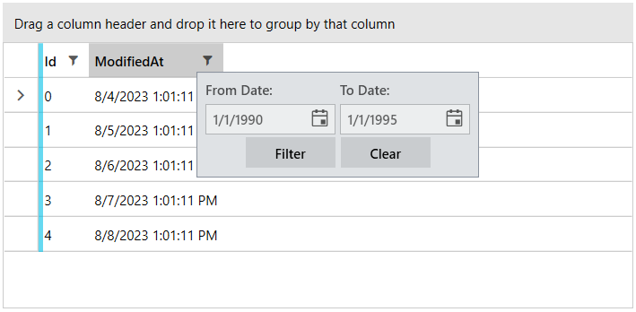

# Custom Filtering Controls

As a developer, __you are not limited to the default filtering user interface provided by RadGridView when in Popup filtering mode__. After the introduction of the Custom Filtering Controls feature, you can easily craft any filtering control that you like.

__The example in this article produces the following result__  

## Building a Custom Filtering Control

In order to be able to communicate with RadGridView, your custom filtering control will have to implement the IFilteringControl interface. This interface allows RadGridView to communicate with your control.  Let’s take a look at the interface:

<snippet id='radgridview-filtering-custom-filtering-controls-the_example_in_this_article_produces_the_following_result-cs' />

<snippet id='radgridview-filtering-custom-filtering-controls-the_example_in_this_article_produces_the_following_result-vb' />

The Prepare method is called each time the control is about to be shown (when the user clicks the funnel in the header cell). If you do not need to change anything between two consecutive times when the filtering UI is shown, there wouldn’t be much inside this method’s body. The IsActive property provides means of “filling up” the funnel when the column is filtered. Along with the IsActive CLR property that is part of the interface, you will need to add an IsActive DependencyProperty to back the CLR property.

Next, you will have to decide what UI elements your custom filtering control will display and define them in its XAML file. When the user interacts with these UI elements you will have to react and perfrom the actual filtering. Whether you will use event handlers or the MVVM pattern is up to you and is a decision which is beyond the scope if this article. Once you have reacted to an user action you will need to filter RadGridView programmatically. Basically, to filter RadGridView you need to add an IFilterDescriptor to its FilterDescriptors collection. To clear this filter, you need to remove the IFilterDescriptor from the FilterDescriptors collection. Filtering RadGridView programmactically is explained in great detail in this [article]().

Here is an example of a custom filtering control that displays two date time pickers:

<snippet id='radgridview-filtering-custom-filtering-controls-the_example_in_this_article_produces_the_following_result-xaml' />

<snippet id='radgridview-filtering-custom-filtering-controls-the_example_in_this_article_produces_the_following_result-cs' />

<snippet id='radgridview-filtering-custom-filtering-controls-the_example_in_this_article_produces_the_following_result-vb' />

Finally, you have to tell the column to use this custom filtering control like this:

<snippet id='radgridview-filtering-custom-filtering-controls-the_example_in_this_article_produces_the_following_result-xaml' />

>In case you are using [NoXaml Binaries and Implicit Styles](), please refer to the [Styling custom controls](#styling-custom-controls) section.

>tip If you want to customize the default `FilteringControl` used by the GridView, you can [edit its ControlTemplate]() as mentioned in the [Styling FilteringControl and FilteringDropDown]() article.

## See Also  
 * [Programmatic Filtering]()
