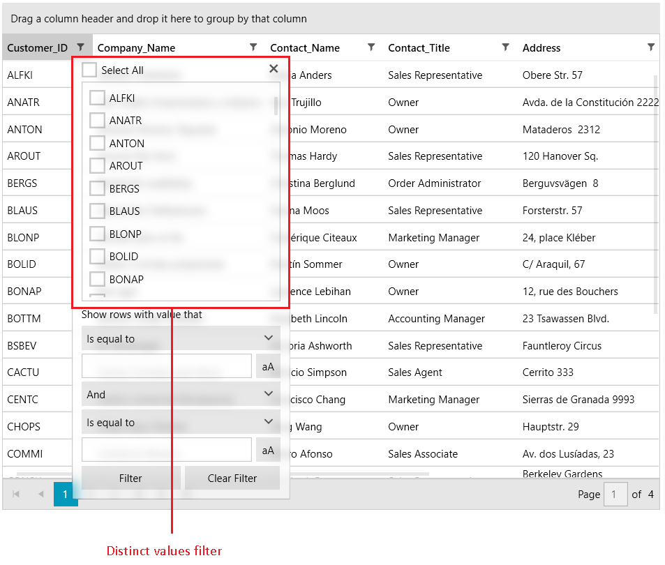
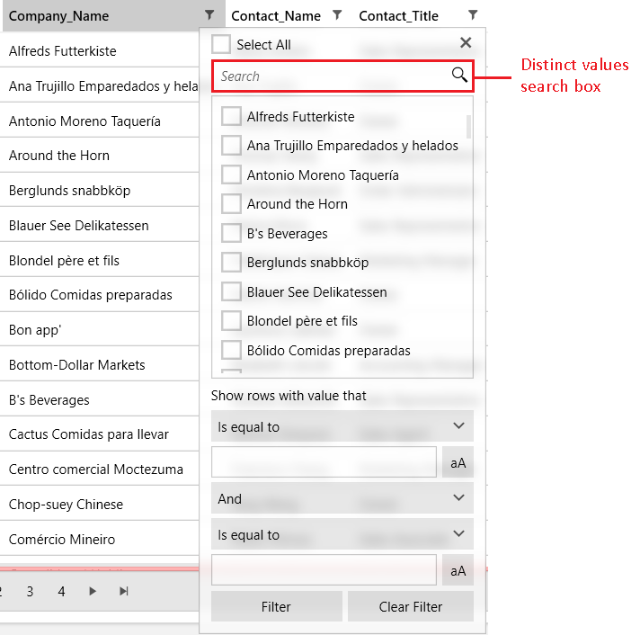
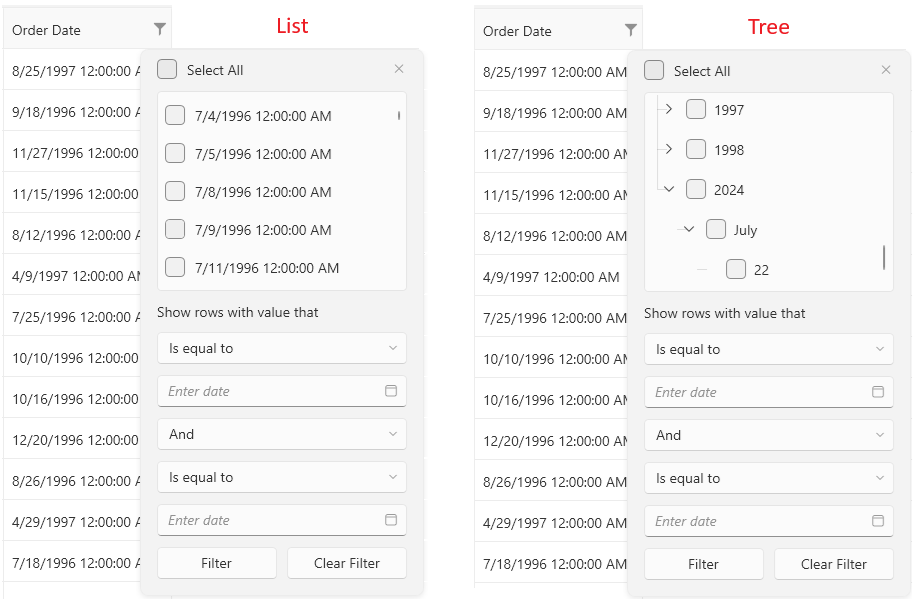

# Customizing Distinct Values 

The distinct values column filter displays only the first `1000` items by default. If other columns have an active filter that hides some of the data rows then these rows will not be considered when extracting the distinct values. This article shows how to customize the distinct values count and filtering behavior.

__The distinct values filter__  

## Changing the Distinct Values Limit

To change the default value of maximum `1000` distinct values loaded into the filter list, set the `DefaultDistinctValuesCount` property of `RadGridView`.

#### __[XAML] Setting the DefaultDistinctValuesCount__
{{region gridview-filtering-customizing-distinct-values-0}}
	<telerik:RadGridView DefaultDistinctValuesCount="2000" />
{{endregion}}

## Using the DistinctValuesLoading Event

The `DistinctValuesLoading` event of `RadGridView` is fired each time the filtering control popup of a column is about to get displayed. The event should be used solely for controlling the number of distinct values that the user will see. The original distinct values can't be replaced with different type of data, because this will break the filtering engine.

To change the number or filter the distinct values that are displayed, use the `ItemsSource` property of the event arguments. To get the proper distinct values, use the `GetDistinctValues` method of `RadGridView`. The method has two overloads, that allows you to provide the distinct values limit (1000 by default) and to tell if the items that are filtered out by other filters should be included in the query.

#### __[C#] Using the default overload of the GetDistinctValues method__
{{region gridview-filtering-customizing-distinct-values-1}}
	private void RadGridView_DistinctValuesLoading(object sender, Telerik.Windows.Controls.GridView.GridViewDistinctValuesLoadingEventArgs e)
	{
		var gridView = (RadGridView)sender;
		bool shouldIncludeFilteredOutItems = false;
		
		// this call will return the first 1000 distinct values regardless of their actual count in the data source
		e.ItemsSource = gridView.GetDistinctValues(e.Column, shouldIncludeFilteredOutItems);
	}
{{endregion}}

#### __[C#] Using the second overload of the GetDistinctValues method to change the default distinct values limit__
{{region gridview-filtering-customizing-distinct-values-2}}
	private void RadGridView_DistinctValuesLoading(object sender, Telerik.Windows.Controls.GridView.GridViewDistinctValuesLoadingEventArgs e)
	{
		var gridView = (RadGridView)sender;
		bool shouldIncludeFilteredOutItems = false;
		
		// this call will return the first 15 distinct values regardless of their actual count in the data source
		e.ItemsSource = gridView.GetDistinctValues(e.Column, shouldIncludeFilteredOutItems, 15);
	}
{{endregion}}

## Displaying Case Insensitive Distinct Values

By default, the distinct values are case-sensitive. In order to populate them case-insensitive and then filter on them, use the `Filtered` and `DistinctValuesLoading` events of `RadGridView`.
		
#### __[C#] Setting up the distinct filter to show case insensitive values__
{{region gridview-filtering-customizing-distinct-values-3}}
	private void RadGridView_Filtered(object sender, Telerik.Windows.Controls.GridView.GridViewFilteredEventArgs e)
	{
		IEnumerable<OperatorValueFilterDescriptorBase> descriptors = e.ColumnFilterDescriptor.DistinctFilter.FilterDescriptors;
	    foreach (OperatorValueFilterDescriptorBase descriptor in descriptors)
	    {
	        descriptor.IsCaseSensitive = false;
	    }
	}
	
	private void RadGridView_DistinctValuesLoading(object sender, Telerik.Windows.Controls.GridView.GridViewDistinctValuesLoadingEventArgs e)
	{
		var gridView = (RadGridView)sender;
	    e.ItemsSource = gridView.GetDistinctValues(e.Column, false).OfType<string>().Select(x => x.ToLower()).Distinct();
	}
{{endregion}}

## Optimizing Distinct Filter Query

By default, the distinct filtering uses a condition of the form 'Member IsEqualTo Value' for each distinct value selected. Then, all such conditions are combined with the OR operator. When the amount of distinct values checked grows, the query might become very slow. To optimize the LINQ query used to filter the data, thus improving the performance, set the `OptimizeDistinctFilterQuery` property of the assosicated __GridViewColumn__. 

When the optimization is enabled, the GridView will check the amount of distinct values checked. If this amount is less than or equal to half of all distinct values, the original query will be generated. If, however, the amount of distinct values checked is more than half of all distinct values, an inverted statement like this will be generated: (Member IsNotEqualTo uncheckedDistinctValue_0) ... AND ... (Member IsNotEqualTo uncheckedDistinctValue_N). If absolutely all distinct values are checked, then no statement will be generated at all, because this effectively means that there is no filter applied. Setting the property to `true` will try to generate the shortest possible LINQ Where clause.

#### __[XAML] Setting the OptimizeDistinctFilterQuery property__
{{region gridview-filtering-customizing-distinct-values-4}}
	<telerik:GridViewDataColumn DataMemberBinding="{Binding Name}" OptimizeDistinctFilterQuery="True"/>
{{endregion}}

>tip In case, the optimization is enabled, the `DefaultDistinctValuesCount` property should be set to a value equal or bigger then the count of all expected distinct values.

## Showing Distinct Values Filtering Search Box

The distinct values filter of the column has a built-in search box that allows you to filter the values in the displayed list. To enable this feature, set the `EnableDistinctValuesFiltering` property of the associated `GridViewColumn`.

#### __[XAML] Setting the EnableDistinctValuesFiltering property__
{{region gridview-filtering-customizing-distinct-values-5}}
	<telerik:GridViewDataColumn DataMemberBinding="{Binding Name}" EnableDistinctValuesFiltering="True"/>
{{endregion}}

__The distinct values filter search box__  

The search box of the distinct values filter comes with several search modes - `Contains`, `ContainsCaseSensitive`, `StartsWith`, and `StartsWithCaseSensitive`.

The current mode can be changed via the `DistinctValuesSearchMode` property of the `GridViewColumn`. The default mode is `StartsWith`.

#### __[XAML] Setting the DistinctValuesSearchMode property__
{{region gridview-filtering-customizing-distinct-values-6}}
	<telerik:GridViewDataColumn DataMemberBinding="{Binding Name}" EnableDistinctValuesFiltering="True" DistinctValuesSearchMode="Contains"/>
{{endregion}}

## Grouping DateTime Values

By default the distinct values of type `DateTime` are shown in a flat list where each record shows the full date-time value. To group the values by date-time component (year, month and day), change the distinct values display mode. This is done by setting the `DistinctValuesDisplayMode` property of the associated `GridViewColumn` to `Tree`.

#### __[XAML] Setting the DistinctValuesDisplayMode property__
{{region gridview-filtering-customizing-distinct-values-7}}
	<telerik:GridViewDataColumn DataMemberBinding="{Binding MyDate}" DistinctValuesDisplayMode="Tree"/>
{{endregion}}

__The distinct values display modes comparison__  

## Modifying the Display Values

By default the distinct values list will display the raw values of the data items. To change the appearance of the values, override the `FilteringDisplayFunc` function of the `GridViewDataColumn`.

#### __[C#] Creating a custom column and overridding the FilteringDisplayFunc__
{{region gridview-filtering-customizing-distinct-values-8}}
	public class CustomGridViewDataColumn : GridViewDataColumn 
    { 
        private Func<object, object> filteringDisplayFunc; 
 
        public CustomGridViewDataColumn() 
        { 
            this.filteringDisplayFunc = GetDistinctValueDisplayObject; 
        } 
 
        private object GetDistinctValueDisplayObject(object arg) 
        { 
			// the "arg" object is the raw data value of the cell 
			bool isEmployed = (bool)args;
			return isEmployed ? "Is employed" : "Is not employed";  
			
			// you can return also a UIElement here if you need more custom visualization
        } 
 
        protected override Func<object, object> FilteringDisplayFunc 
        { 
            get { return filteringDisplayFunc; } 
        } 
    } 
{{endregion}}

The following [KB article]() and the [ImageColumnFiltering SDK example](https://github.com/telerik/xaml-sdk/tree/master/GridView/ImageColumnFiltering) contain runnable examples showing the `FilteringDisplayFunc` feature.

__Customized display for bool distinct values__  

