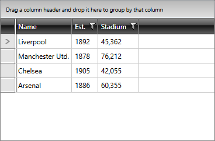

# Disable Filtering for a Specific Column

You can disable the filtering for a specific column by setting its **IsFilterable** property to **False**. This will hide the filtering UI of the respective column and the end user will not be able to perform filtering. The property's default value is **True**.

__Example 1: Disable the filtering of the Name column in XAML__

```XAML
    <telerik:GridViewDataColumn DataMemberBinding="{Binding Name}" IsFilterable="False" />
```

__Example 2: Disable the filtering of the Name column when generating it__

```C#
    private void Grid_AutoGeneratingColumn(object sender, GridViewAutoGeneratingColumnEventArgs e)
    {
        if (e.ItemPropertyInfo.Name == "Name")
        {
            e.Column.IsFilterable = false;
        }
    }
```
```VB.NET
    Private Sub Grid_AutoGeneratingColumn(ByVal sender As Object, ByVal e As GridViewAutoGeneratingColumnEventArgs)
        If e.ItemPropertyInfo.Name = "Name" Then
            e.Column.IsFilterable = False
        End If
    End Sub
```

#### Figure 1: The Name column with disabled filtering



>important If the data displayed in the column is not filterable in the first place, setting the IsFilterable property will not have any effect. To learn what your objects need to implement for the column to become filterable, please have a look at the [Filter a Custom Type]() article.

## See Also

* [Basic Filtering]()
* [Filter a Custom Type]()
* [AutoGeneratingColumn Event](#autogeneratingcolumn)
