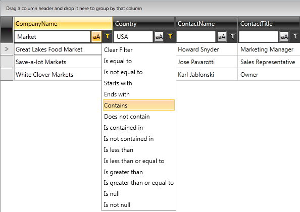

# Configure The Filtering Mode

RadGridView has three filtering modes as described in the [Filtering Basics]() article.

## Popup Filtering

To enable the popup filtering mode, set RadGridView’s `FilteringMode` property to `Popup` or do not set anything, since this is the standard default filtering mode.

 
```XAML
	<telerik:RadGridView FilteringMode="Popup" />
```

__Popup Filtering Mode__  


## Filter Row

To enable the filter row mode, set RadGridView’s `FilteringMode` property to `FilterRow`.

  
```XAML
	<telerik:RadGridView FilteringMode="FilterRow" />
```

__FilterRow Filtering Mode__  



## Filter Editor

To enable the filter editor mode, set RadGridView’s `FilteringMode` property to `FilterEditor`.

  
```XAML
	<telerik:RadGridView FilteringMode="FilterEditor" />
```

__FilterEditor Filtering Mode__  


