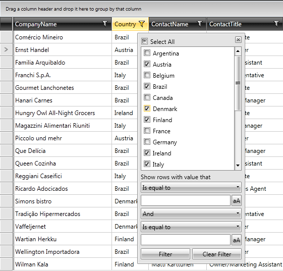
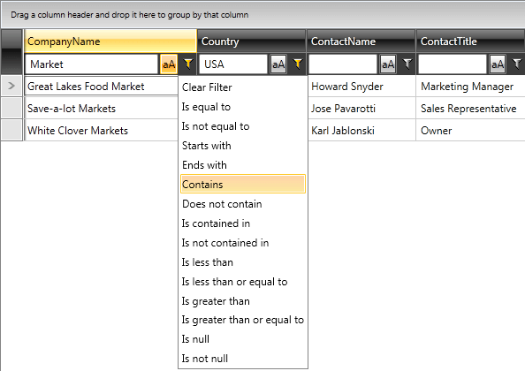
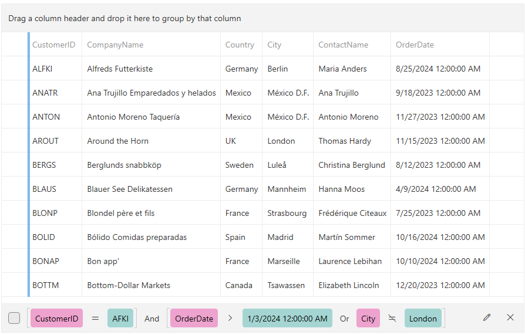

# Configure The Filtering Mode

RadGridView has three filtering modes as described in the [Filtering Basics]() article.

## Popup Filtering

To enable the popup filtering mode, set RadGridView’s `FilteringMode` property to `Popup` or do not set anything, since this is the standard default filtering mode.

 
<snippet id='radgridview-filtering-how-to-howto-configure-the-filtering-mode-block_1-xaml' />

__Popup Filtering Mode__  

## Filter Row

To enable the filter row mode, set RadGridView’s `FilteringMode` property to `FilterRow`.

  
<snippet id='radgridview-filtering-how-to-howto-configure-the-filtering-mode-popup_filtering_mode-xaml' />

__FilterRow Filtering Mode__  

## Filter Editor

To enable the filter editor mode, set RadGridView’s `FilteringMode` property to `FilterEditor`.

  
<snippet id='radgridview-filtering-how-to-howto-configure-the-filtering-mode-filterrow_filtering_mode-xaml' />

__FilterEditor Filtering Mode__  

