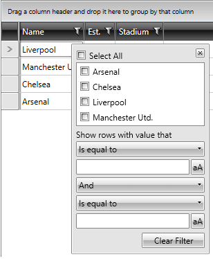

# Hide the Filter Button

When in **Popup** filtering mode, you can set **GridViewColumn.ShowFilterButton** to **False** if you want to hide the **Filter button**. This is useful when you are in immediate filtering mode, i.e. **GridViewColumn.IsFilteringDeferred** is **False**.

__Example 1: Hide filter button in XAML__

```XAML

    <telerik:GridViewDataColumn ShowFilterButton="False" IsFilteringDeferred="False" />
```

__Example 2: Hide filter button in code-behind__

```C#

    private void Grid_AutoGeneratingColumn(object sender, GridViewAutoGeneratingColumnEventArgs e)
    {
        if (e.ItemPropertyInfo.PropertyType == typeof(string))
        {
            e.Column.IsFilteringDeferred = false;
            e.Column.ShowFilterButton = false;
        }
    };
```

__Example 2: Hide filter button in code-behind__

```VB

    Private Sub Grid_AutoGeneratingColumn(ByVal sender As Object, ByVal e As GridViewAutoGeneratingColumnEventArgs)
		If e.ItemPropertyInfo.PropertyType Is GetType(String) Then
			e.Column.IsFilteringDeferred = False
			e.Column.ShowFilterButton = False
		End If
    End Sub
```

**Figure 1** and **Figure 2** demonstrate the two setups.

#### **Figure 1: RadGridView with ShowFilterButton set to True**


#### **Figure 2: RadGridView with ShowFilterButton set to False**


## See Also

* [Popup Filtering](#popup-filtering)
* [Filter on a Property Different from the Displayed One]()
* [Close Filtering Popup on Pressing Filter Button]()
