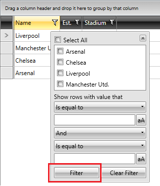
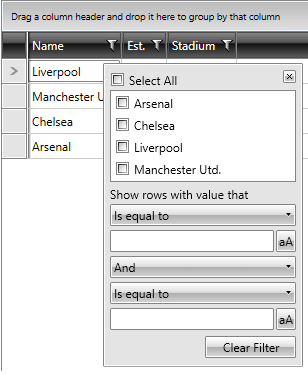

# Hide the Filter Button

When in **Popup** filtering mode, you can set **GridViewColumn.ShowFilterButton** to **False** if you want to hide the **Filter button**. This is useful when you are in immediate filtering mode, i.e. **GridViewColumn.IsFilteringDeferred** is **False**.

__Example 1: Hide filter button in XAML__

<snippet id='radgridview-filtering-how-to-howto-hide-the-filter-button-example_1_hide_filter_button_in_xaml-xaml' />

__Example 2: Hide filter button in code-behind__

<snippet id='radgridview-filtering-how-to-howto-hide-the-filter-button-example_2_hide_filter_button_in_code_behind-cs' />

__Example 2: Hide filter button in code-behind__

<snippet id='radgridview-filtering-how-to-howto-hide-the-filter-button-example_2_hide_filter_button_in_code_behind-vb' />

**Figure 1** and **Figure 2** demonstrate the two setups.

#### **Figure 1: RadGridView with ShowFilterButton set to True**

#### **Figure 2: RadGridView with ShowFilterButton set to False**

## See Also

* [Popup Filtering](#popup-filtering)
* [Filter on a Property Different from the Displayed One]()
* [Close Filtering Popup on Pressing Filter Button]()
