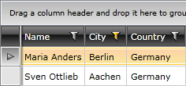
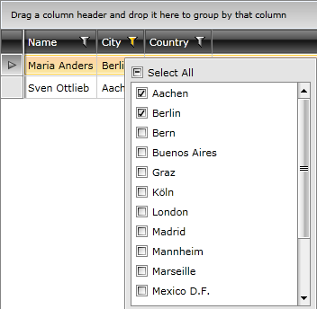
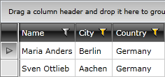

# Column Filter Descriptors

>__Important!__ Please check the [filtering breaking changes]() introduced with __Q1 2012__. 
>The __IColumnFilterDescriptor__ is introduced with the __Q1 2012__ version of RadControls.
        

>The __IColumnFilterDescriptor__ can't be instantiated in XAML and used at design-time.
        
You can easily filter the __RadGridView__ data programmatically by using the __FilterDescriptor__ and the __CompositeFilterDescriptor__ classes. The filtering UI however, will not be aware of this. Expressed in other words, this feature might sound like this: “I would like to programmatically achieve the same effect that is achieved by filtering the grid with the mouse/keyboard through the UI.”
      

To do this you will need to work with a special __IFilterDescriptor__ which is recognizable by the __RadGridView__ UI. Its name is __IColumnFilterDescriptor__ and it represents what you are already familiar with – the distinct values list and the two filters on the bottom of the filtering UI. They are represented by __DistinctFilter__ and the __FieldFilter__ properties of the __IColumnFilterDescriptor__.
      

Here is an example of filtering the __RadGridView__ via a __IColumnFilterDescriptor__ using the __DistinctFilter__ property.
      

#### __C#__

{{region cs-radgridview-filtering-icolumn-filter-descriptors_0}}
	GridViewColumn cityColumn = this.playersGrid.Columns["City"];
	// Getting it from the property will create it and associate it with its column automatically.
	IColumnFilterDescriptor columnDescriptor = cityColumn.ColumnFilterDescriptor;
	columnDescriptor.SuspendNotifications();
	columnDescriptor.DistinctFilter.AddDistinctValue("Berlin");
	columnDescriptor.DistinctFilter.AddDistinctValue("Aachen");
	columnDescriptor.ResumeNotifications();
	// There is no need to manually add the column filter to this.radGridView.FilterDescriptors
	// When the column filter is activated/deactivated it is automatically added/removed to this collection.
{{endregion}}

#### __VB.NET__

{{region vb-radgridview-filtering-icolumn-filter-descriptors_1}}
	Dim cityColumn As GridViewColumn = Me.playersGrid.Columns("City")
	' Getting it from the property will create it and associate it with its column automatically.
	Dim columnDescriptor As IColumnFilterDescriptor = cityColumn.ColumnFilterDescriptor
	columnDescriptor.SuspendNotifications()
	columnDescriptor.DistinctFilter.AddDistinctValue("Berlin")
	columnDescriptor.DistinctFilter.AddDistinctValue("Aachen")
	columnDescriptor.ResumeNotifications()
	' There is no need to manually add the column filter to this.radGridView.FilterDescriptors
	' When the column filter is activated/deactivated it is automatically added/removed to this collection.
{{endregion}}

Here is the same example done by using the FieldFilter property.

#### __C#__

{{region cs-radgridview-filtering-icolumn-filter-descriptors_2}}
	GridViewColumn cityColumn2 = this.playersGrid.Columns["City"];
	// Getting it from the property will create it and associate it with its column automatically.
	IColumnFilterDescriptor columnDescriptor2 = cityColumn2.ColumnFilterDescriptor;
	columnDescriptor2.SuspendNotifications();
	columnDescriptor2.FieldFilter.Filter1.Operator = FilterOperator.IsEqualTo;
	columnDescriptor2.FieldFilter.Filter1.Value = "Berlin";
	columnDescriptor2.FieldFilter.LogicalOperator = FilterCompositionLogicalOperator.Or;
	columnDescriptor2.FieldFilter.Filter2.Operator = FilterOperator.IsEqualTo;
	columnDescriptor2.FieldFilter.Filter2.Value = "Aachen";
	columnDescriptor2.ResumeNotifications();
	// There is no need to manually add the column filter to this.radGridView.FilterDescriptors
	// When the column filter is activated/deactivated it is automatically added/removed to this collection.
{{endregion}}

#### __VB.NET__

{{region vb-radgridview-filtering-icolumn-filter-descriptors_3}}
	Dim cityColumn2 As GridViewColumn = Me.playersGrid.Columns("City")
	' Getting it from the property will create it and associate it with its column automatically.
	Dim columnDescriptor2 As IColumnFilterDescriptor = cityColumn2.ColumnFilterDescriptor
	columnDescriptor2.SuspendNotifications()
	columnDescriptor2.FieldFilter.Filter1.[Operator] = FilterOperator.IsEqualTo
	columnDescriptor2.FieldFilter.Filter1.Value = "Berlin"
	columnDescriptor2.FieldFilter.LogicalOperator = FilterCompositionLogicalOperator.[Or]
	columnDescriptor2.FieldFilter.Filter2.[Operator] = FilterOperator.IsEqualTo
	columnDescriptor2.FieldFilter.Filter2.Value = "Aachen"
	columnDescriptor2.ResumeNotifications()
	' There is no need to manually add the column filter to this.radGridView.FilterDescriptors
	' When the column filter is activated/deactivated it is automatically added/removed to this collection.
{{endregion}}

The data is filtered by the "City" column and only these data items are displayed, which have their City equal to Berlin or Aachen.

Here is a snapshot of the result.

Notice that the programmatic filtering you have done, has been reflected in the UI.

## More Complex Example

>tipIn case you need to create more complex filters, consider defining multiple __IColumnFilterDescriptors__.
          

Such a complex filtering expression might include filters for multiple fields, like __(Country = "Germany" AND (City = "Berlin" OR City = "Aachen"))__. Check out the code snippets below to see how to declare such complex filter descriptors by using the __IColumnFilterDescriptor__ class.
        

#### __C#__

{{region cs-radgridview-filtering-icolumn-filter-descriptors_4}}
	GridViewColumn cityColumn3 = this.playersGrid.Columns["City"];
	// Getting it from the property will create it and associate it with its column automatically
	IColumnFilterDescriptor cityDescriptor = cityColumn3.ColumnFilterDescriptor;
	cityDescriptor.SuspendNotifications();
	cityDescriptor.DistinctFilter.AddDistinctValue("Berlin");
	cityDescriptor.DistinctFilter.AddDistinctValue("Aachen");
	cityDescriptor.ResumeNotifications();
	
	GridViewColumn countryColumn = this.playersGrid.Columns["Country"];
	IColumnFilterDescriptor columnDescriptor3 = countryColumn.ColumnFilterDescriptor;
	columnDescriptor3.SuspendNotifications();
	columnDescriptor3.DistinctFilter.AddDistinctValue("Germany");
	columnDescriptor3.ResumeNotifications();
	
	// There is no need to manually add the column filter to this.radGridView.FilterDescriptors
	// When the column filter is activated/deactivated it is automatically added/removed to this collection.
{{endregion}}

#### __VB.NET__

{{region vb-radgridview-filtering-icolumn-filter-descriptors_5}}
	Dim cityColumn3 As GridViewColumn = Me.playersGrid.Columns("City")
	' Getting it from the property will create it and associate it with its column automatically
	Dim cityDescriptor As IColumnFilterDescriptor = cityColumn3.ColumnFilterDescriptor
	cityDescriptor.SuspendNotifications()
	cityDescriptor.DistinctFilter.AddDistinctValue("Berlin")
	cityDescriptor.DistinctFilter.AddDistinctValue("Aachen")
	cityDescriptor.ResumeNotifications()
	
	Dim countryColumn As GridViewColumn = Me.playersGrid.Columns("Country")
	Dim columnDescriptor3 As IColumnFilterDescriptor = countryColumn.ColumnFilterDescriptor
	columnDescriptor3.SuspendNotifications()
	columnDescriptor3.DistinctFilter.AddDistinctValue("Germany")
	columnDescriptor3.ResumeNotifications()
	' There is no need to manually add the column filter to this.radGridView.FilterDescriptors
	' When the column filter is activated/deactivated it is automatically added/removed to this collection.
{{endregion}}

And here is the result:

# See Also

 * [Programmatic Filtering]()
