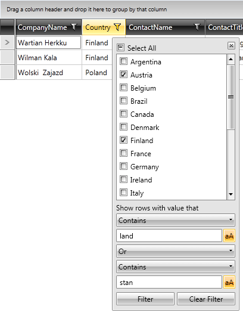
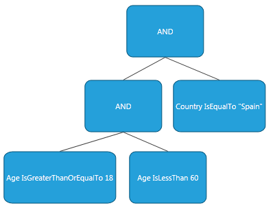
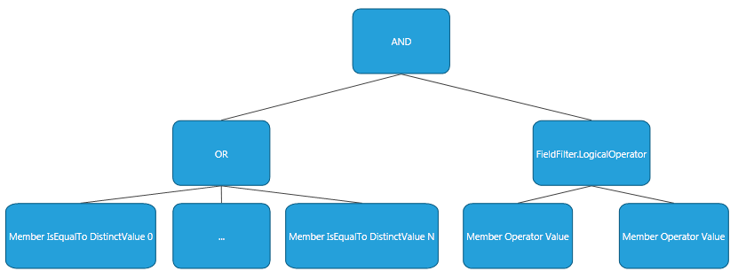

# Programmatic Filtering

RadGridView provides a rich API that allows you to filter programmatically. Everything that can be achieved by the end user through the UI can also be done by using the code-behind API. In this article we will discuss:

* [Column Filtering](#column-filtering)
	* [Filtering Single Column](#filtering-single-column)
	* [Clearing a Single Column Filter](#clearing-a-single-column-filter)
	* [Filtering Multiple Column](#filtering-multiple-column)
	* [Clearing Multiple Column Filters](#clearing-multiple-column-filters)
* [Custom Filtering](#custom-filtering)
	* [IFilterDescriptor](#ifilterdescriptor)
	* [FilterDescriptor](#filterdescriptor)
	* [CompositeFilterDescriptor](#compositefilterdescriptor)
* [Set the Culture of a FilterDescriptor](#set-the-culture-of-a-filterdescriptor)

## Column Filtering

Sometimes a developer might want to pre-filter RadGridView so the end users start off with an already filtered grid. The UI of RadGridView has to be consistent with the programmatically defined filtering criteria of course. To achieve this, one has to use the **IColumnFilterDescriptor** contract. This is the only contract that a column can "understand" and reflect in its filtering UI.

### Filtering Single Column

The IColumnFilterDescriptor interface mimics the structure of the default [Popup filtering control](#popup-filtering). It has two parts just like the filtering control does – distinct values and field filters. To obtain an IColumnFilterDescriptor you have to get it from the respective column by accessing its **ColumnFilterDescriptor** property. Once you have a reference to it, you can set its properties. Setting a property on the IColumnFilterDescriptor is the same as the end user performing the respective operation through the UI with the mouse and keyboard.

If you want to adjust many properties at once without triggering a data engine update after each one it might be a good idea to temporarily suspend the notifications of the IColumnFilterDescriptor, filter programmatically, and finally resume the notifications. When you resume the notifications the data engine will calculate the new filter. **Example 1** demonstrates how to filter a single column programmatically.

__Example 1: Filtering single column programmatically__

	```C#
	Telerik.Windows.Controls.GridViewColumn countryColumn = this.radGridView.Columns["Country"];
	Telerik.Windows.Controls.GridView.IColumnFilterDescriptor countryFilter = countryColumn.ColumnFilterDescriptor;
	
	// Suspend the notifications to avoid multiple data engine updates
	countryFilter.SuspendNotifications();
	
	// This is the same as the end user selecting a distinct value through the UI.
	countryFilter.DistinctFilter.AddDistinctValue("Poland");
	countryFilter.DistinctFilter.AddDistinctValue("Spain");
	countryFilter.DistinctFilter.AddDistinctValue("Uzbekistan");
	countryFilter.DistinctFilter.AddDistinctValue("Netherlands");
	countryFilter.DistinctFilter.AddDistinctValue("Austria");
	countryFilter.DistinctFilter.AddDistinctValue("Finland");
	countryFilter.DistinctFilter.AddDistinctValue("Pakistan");
	
	// This is the same as the end user configuring the upper field filter.
	countryFilter.FieldFilter.Filter1.Operator = Telerik.Windows.Data.FilterOperator.Contains;
	countryFilter.FieldFilter.Filter1.Value = "land";
	countryFilter.FieldFilter.Filter1.IsCaseSensitive = true;
	
	// This is the same as the end user changing the logical operator between the two field filters.
	countryFilter.FieldFilter.LogicalOperator = Telerik.Windows.Data.FilterCompositionLogicalOperator.Or;
	
	// This is the same as the end user configuring the lower field filter.
	countryFilter.FieldFilter.Filter2.Operator = Telerik.Windows.Data.FilterOperator.Contains;
	countryFilter.FieldFilter.Filter2.Value = "stan";
	countryFilter.FieldFilter.Filter2.IsCaseSensitive = true;
	
	// Resume the notifications to force the data engine to update the filter.
	countryFilter.ResumeNotifications();
```
```VB.NET
	Dim countryColumn As Telerik.Windows.Controls.GridViewColumn = Me.radGridView.Columns("Country")
	Dim countryFilter As Telerik.Windows.Controls.GridView.IColumnFilterDescriptor = countryColumn.ColumnFilterDescriptor
	
	' Suspend the notifications to avoid multiple data engine updates
	countryFilter.SuspendNotifications()
	
	' This is the same as the end user selecting a distinct value through the UI.
	countryFilter.DistinctFilter.AddDistinctValue("Poland")
	countryFilter.DistinctFilter.AddDistinctValue("Spain")
	countryFilter.DistinctFilter.AddDistinctValue("Uzbekistan")
	countryFilter.DistinctFilter.AddDistinctValue("Netherlands")
	countryFilter.DistinctFilter.AddDistinctValue("Austria")
	countryFilter.DistinctFilter.AddDistinctValue("Finland")
	countryFilter.DistinctFilter.AddDistinctValue("Pakistan")
	
	' This is the same as the end user configuring the upper field filter.
	countryFilter.FieldFilter.Filter1.[Operator] = Telerik.Windows.Data.FilterOperator.Contains
	countryFilter.FieldFilter.Filter1.Value = "land"
	countryFilter.FieldFilter.Filter1.IsCaseSensitive = True
	
	' This is the same as the end user changing the logical operator between the two field filters.
	countryFilter.FieldFilter.LogicalOperator = Telerik.Windows.Data.FilterCompositionLogicalOperator.[Or]
	
	' This is the same as the end user configuring the lower field filter.
	countryFilter.FieldFilter.Filter2.[Operator] = Telerik.Windows.Data.FilterOperator.Contains
	countryFilter.FieldFilter.Filter2.Value = "stan"
	countryFilter.FieldFilter.Filter2.IsCaseSensitive = True
	
	' Resume the notifications to force the data engine to update the filter.
	countryFilter.ResumeNotifications()
```

#### __Figure 1: Pre-filtered RadGridView__



>The **DistinctFilter** object also has a method called **RemoveDistinctValue** which does the opposite of **AddDistinctValue**.

>Note that if you are using RadGridView in its Filter Row mode, you only need to work with the **FieldFilter.Filter1** object. The filter row only displays what is stored in FieldFilter.Filter1 – it has neither distinct values nor **Filter2** and will simply ignore them.

### Clearing a Single Column Filter

If you want to programmatically clear an existing filter from a column, you simply need to call the **ClearFilters** method of the respective column. You don’t need to suspend or resume anything since this is a batch operation itself.

>If you have added a FilterDescriptor instead of an IColumnFilterDescriptor, then you need to Clear the FilterDescriptors collection.

### Filtering Multiple Columns

In case you want to pre-filter multiple columns at once without triggering a data engine update after each one, you can follow the same Suspend/Resume pattern, but this time with RadGridView's **FilterDescriptors** collection. Here is how you can filter many columns with a single batch operation:

__Example 2: Filtering multiple columns programmatically__

	```C#
	this.radGridView.FilterDescriptors.SuspendNotifications();
	// ... filter as many columns as you wish here...
	this.radGridView.FilterDescriptors.ResumeNotifications();
```
```VB.NET
	Me.radGridView.FilterDescriptors.SuspendNotifications()
	' ... filter as many columns as you wish here...
	Me.radGridView.FilterDescriptors.ResumeNotifications()
```

### Clearing Multiple Column Filters

Clearing multiple column filters is again done by using the Suspend/Resume pattern. **Example 3** demonstrates how you can clear all column filters.

__Example 3: Clearing multiple column filters__

	```C#
	this.radGridView.FilterDescriptors.SuspendNotifications();
	foreach (Telerik.Windows.Controls.GridViewColumn column in this.radGridView.Columns)
	{
	    column.ClearFilters();
	}
	this.radGridView.FilterDescriptors.ResumeNotifications();
```
```VB.NET
	Me.radGridView.FilterDescriptors.SuspendNotifications()
	For Each column As Telerik.Windows.Controls.GridViewColumn In Me.radGridView.Columns
	    column.ClearFilters()
	Next
	Me.radGridView.FilterDescriptors.ResumeNotifications()
```

## Custom Filtering

The IColumnFilterDescriptor has its limitations since it mimics the UI structure of the Popup filtering control. Sometimes, however, more complex filters have to be applied to RadGridView programmatically. While these filters cannot be reflected in the UI since they do not follow the IColumnFilterDescriptor contract, they can be arbitrarily complex. In order to filter RadGridView, you have to add an **IFilterDescriptor** instance to its **FilterDescriptors** collection property.

### IFilterDescriptor

This interface is the building block of filtering criteria trees. Its has a single method called **CreateFilterExpression**. Normally, you will never have to implement this yourself since we have provided the default implementations for all common cases. If you have a custom requirement which cannot be met by our default implementations though, you can always implement this interface and return any valid LINQ expression which will then be used by our data engine when composing the filter. More about implementing this interface you can learn from [this advanced topic]().

The IFilterDescriptor interface has two main implementations – the **FilterDescriptor** and the **CompositeFilterDescriptor**. These two classes allow you to build arbitrarily complex filter criteria trees by simply setting their properties.

### FilterDescriptor

The FilterDescriptor class represents a leaf terminal node in a filter criteria tree. It expresses a filtering criteria and has the following important properties:

* **Member**: Specifies the name of the property to filter on. This is the left hand side operand.

* **Operator**: Specifies the comparison operator to be used.

* **Value**: Specifies the value that the Member will be compared against. This is the right hand side operand.

* **IsCaseSensitive**: Used when the **MemberType** of the filter descriptor is string to determine whether the comparison should be case-sensitive.

* **MemberType**: Specifies what the actual member's **Type** is. You only need to set this if our data engine cannot automatically discover the type.

So a typical FilterDescriptor might look something like this:

__Example 4: A custom FilterDescriptor__

	```C#
	// Give me all people that are named John.
	Telerik.Windows.Data.FilterDescriptor fd = new Telerik.Windows.Data.FilterDescriptor();
	fd.Member = "FirstName";
	fd.Operator = Telerik.Windows.Data.FilterOperator.IsEqualTo;
	fd.Value = "John";
	fd.IsCaseSensitive = true;
	// In most cases the data engine will discover this automatically so you do not need to set it.
	fd.MemberType = typeof(string);
```
```VB.NET
	' Give me all people that are named John.
	Dim fd As New Telerik.Windows.Data.FilterDescriptor()
	fd.Member = "FirstName"
	fd.[Operator] = Telerik.Windows.Data.FilterOperator.IsEqualTo
	fd.Value = "John"
	fd.IsCaseSensitive = True
	' In most cases the data engine will discover this automatically so you do not need to set it.
	fd.MemberType = GetType(String)
```

When choosing the **Operator**, you have to make sure that the respective **MemberType** supports this operator. For example, you cannot use the **Contains** operator if your MemberType is **Int32** because the data engine will crash. Here is a table of filter operators and the types that support them.

#### __Table 1: Filter Operators and Types Supporting Them__

| Operators | Types |
| --------- | ----- |
| IsEqualTo, IsNotEqualTo | All filterable types |
| StartsWith, EndsWith, Contains, DoesNotContain, IsContainedIn, IsNotContainedIn, IsEmpty, IsNotEmpty | String |
| IsLessThan, IsLessThanOrEqualTo, IsGreaterThan, IsGreaterThanOrEqualTo | Numeric types, DateTime, TimeSpan, all types that overload these operators |
| IsNull, IsNotNull | All filterable null-able types |

>tipYou could localize those strings. For the complete list of the localization strings please check this [how to topic]().

To help you understand how this FilterDescriptor is used by the data engine, let’s give a practical example with the one we have created above. The data engine will build a LINQ expression based on the information it reads from the FilterDescriptor instance. It will then execute this query against the query provider of RadGridView’s source collection. Here is what the expression would be for this FilterDescriptor in pseudo-code:

__Example 5: The generated LINQ expression__
	
	```C#
	people.Where(person => person.FirstName == "John");
```
```VB.NET
	people.Where(Function(person) person.FirstName = "John")
```

The data engine builds, compiles and executes this LINQ expression at run-time. If the information stored in the FilterDescriptor is not consistent you will receive an exception at run-time.

There is one special singleton value called **FilterDesciptor.UnsetValue**. If you assign this special value to the **Value** property of the FilterDescriptor you are effectively turning it off. In other words, when the data engine encounters a FilterDescriptor whose Value is equal to FilterDesciptor.UnsetValue it will simply ignore it. This special value might be very useful when you don’t want to be constantly attaching and detaching a FilterDescriptor when you simply want to turn it on and off. You can check whether a FilterDescriptor is currently active by reading its **IsActive** property.

### Set the Culture of a FilterDescriptor

As of __R2 2018__ (2018.1.226 latest internal build) a specific Culture can be applied to a FilterDescriptor. This is done through an additional constructor that accepts a System.Globalization.CultureInfo parameter.

__Example 6: Setting the Culture of a FilterDescriptor__
```C#
	 FilterDescriptor descriptor 
                = new FilterDescriptor("Name", FilterOperator.IsNotEqualTo, "Liverpool", new CultureInfo("fr-FR"));
```
```VB.NET
	 Private descriptor As FilterDescriptor
		 = New FilterDescriptor("Name", FilterOperator.IsNotEqualTo, "Liverpool", New CultureInfo("fr-FR"))
```


### CompositeFilterDescriptor

The **CompositeFilterDescriptor** is nothing more than a collection of other IFilterDescriptors combined with a logical operator (**AND**/**OR**). Its children are stored in its FilterDescriptors property and can be any valid implementation of the IFilterDescriptor interface, which allows you to construct unlimited filtering criteria trees. These child filters are combined together with the **LogicalOperator** which can be either AND or OR.

Imagine that we would like to get only people between the ages of 18 and 60 who are from Spain. **Example 5** shows how this can be achieved:

__Example 7: Creating a CompositeFilterDescriptor__

	```C#
	Telerik.Windows.Data.FilterDescriptor olderThan18Filter = new Telerik.Windows.Data.FilterDescriptor("Age", Telerik.Windows.Data.FilterOperator.IsGreaterThanOrEqualTo, 18);
	Telerik.Windows.Data.FilterDescriptor youngerThan60Filter = new Telerik.Windows.Data.FilterDescriptor("Age", Telerik.Windows.Data.FilterOperator.IsLessThan, 60);
	
	Telerik.Windows.Data.CompositeFilterDescriptor ageFilter = new Telerik.Windows.Data.CompositeFilterDescriptor();
	ageFilter.FilterDescriptors.Add(olderThan18Filter);
	ageFilter.FilterDescriptors.Add(youngerThan60Filter);
	ageFilter.LogicalOperator = Telerik.Windows.Data.FilterCompositionLogicalOperator.And;
	
	Telerik.Windows.Data.FilterDescriptor liveInSpainFilter = new Telerik.Windows.Data.FilterDescriptor("Country", Telerik.Windows.Data.FilterOperator.IsEqualTo, "Spain");
	
	Telerik.Windows.Data.CompositeFilterDescriptor mainFilter = new Telerik.Windows.Data.CompositeFilterDescriptor();
	mainFilter.FilterDescriptors.Add(ageFilter);
	mainFilter.FilterDescriptors.Add(liveInSpainFilter);
	mainFilter.LogicalOperator = Telerik.Windows.Data.FilterCompositionLogicalOperator.And;
	
	this.radGridView.FilterDescriptors.Add(mainFilter);
```
```VB.NET
	' Give me all people that are named John.
	Dim olderThan18Filter As New Telerik.Windows.Data.FilterDescriptor("Age", Telerik.Windows.Data.FilterOperator.IsGreaterThanOrEqualTo, 18)
	Dim youngerThan60Filter As New Telerik.Windows.Data.FilterDescriptor("Age", Telerik.Windows.Data.FilterOperator.IsLessThan, 60)
	
	Dim ageFilter As New Telerik.Windows.Data.CompositeFilterDescriptor()
	ageFilter.FilterDescriptors.Add(olderThan18Filter)
	ageFilter.FilterDescriptors.Add(youngerThan60Filter)
	ageFilter.LogicalOperator = Telerik.Windows.Data.FilterCompositionLogicalOperator.[And]
	
	Dim liveInSpainFilter As New Telerik.Windows.Data.FilterDescriptor("Country", Telerik.Windows.Data.FilterOperator.IsEqualTo, "Spain")
	
	Dim mainFilter As New Telerik.Windows.Data.CompositeFilterDescriptor()
	mainFilter.FilterDescriptors.Add(ageFilter)
	mainFilter.FilterDescriptors.Add(liveInSpainFilter)
	mainFilter.LogicalOperator = Telerik.Windows.Data.FilterCompositionLogicalOperator.[And]
	
	Me.radGridView.FilterDescriptors.Add(mainFilter)
```

So in the end you will get the following filtering criteria tree:

#### __Figure 2: Filtering Criteria Tree Concept__



The data engine will generate something similar in pseudo-code:

__Example 8: The generated LINQ expression__

	```C#
	people.Where(person => (person.Country == "Spain" && (person.Age >= 18 && person.Age < 60)));
```
```VB.NET
	people.Where(Function(person) (person.Country = "Spain" AndAlso (person.Age >= 18 AndAlso person.Age < 60)))
```

The lambda expression that you see inside the Where clause was build based upon the descriptors that we defined. But if you implement the IFilterDescriptor yourself you can supply any kind of custom expression that will be used by data engine as long as it is valid and can be compiled and executed at runtime.

As you might have already guessed, the IColumnFilterDescriptor that is used for column filtering also uses these classes under the hood to construct its expression. Honoring the interface contract makes sure that you can only add things that can be displayed in the fixed layout filtering UI. Deep down inside, the IColumnFilterDescriptor looks something like this:

#### __Figure 3: ColumnFilterDescriptor Tree__



Notice how this hierarchy is the same as the Popup filtering control layout. Working through the IColumnFilterDescriptor interface makes sure that you cannot randomly add criteria which cannot be correctly displayed by the Popup filtering control.

>tipYou can check some sample code on the [Programmatic Filtering Demo](https://demos.telerik.com/silverlight/#GridView/ProgrammaticFiltering)[Programmatic Filtering Demo](https://demos.telerik.com/wpf).

## See Also

 * [Filtering Visual Structure](#filtering-visual-structure)
 * [Basic Filtering]()
 * [Custom Filtering Controls]()
