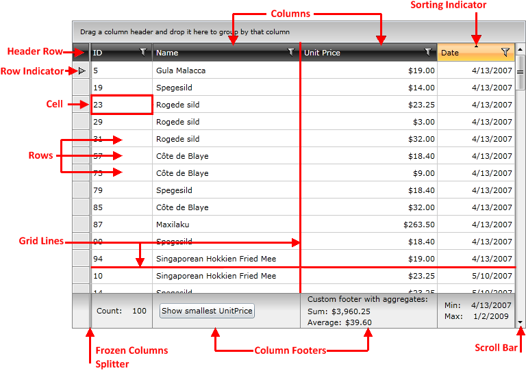
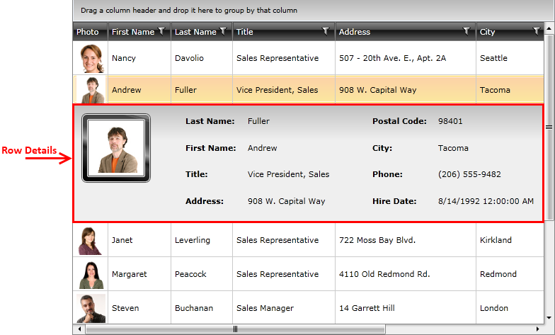
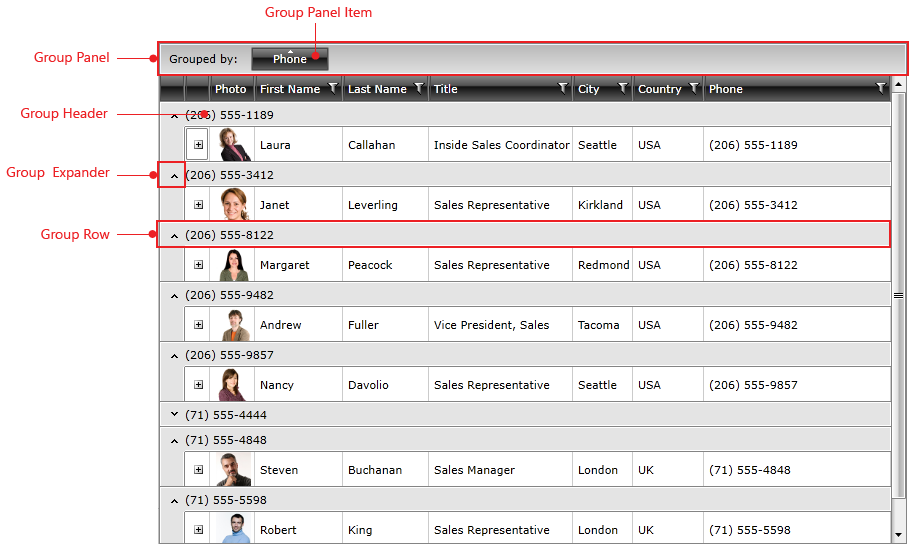

# Visual Structure

This section defines terms and concepts used in the scope of __RadGridView__ you have to get familiar with prior to continue reading this help.

__RadGridView__ is an essential user interface control used to display data in tabular format. The represented data is organized in rows and columns and can be additionally sorted, filtered or structured in groups and sub-groups. Below you can see snapshots and explanations of the main visual elements of the standard __RadGridView__ control organized in logical groups.

* [
              RadGridView Visual Structure
            ](019B87F6-1F09-4909-B16E-1561B4B0173A#radgridview-visual-structure)

* [
              Row Details Visual Structure
            ](019B87F6-1F09-4909-B16E-1561B4B0173A#row-details-visual-structure)

* [
              Filtering Visual Structure
            ](019B87F6-1F09-4909-B16E-1561B4B0173A#filtering-visual-structure)

* [
              Grouping Visual Structure
            ](019B87F6-1F09-4909-B16E-1561B4B0173A#grouping-visual-structure)

## RadGridView Visual Structure

* __Columns__ - essential building block of the __RadGridView__ control, represented by the base class __GridViewColumn__. There is a lot of functionality coming out-of-the-box for the grid columns. They can be data bound, frozen, reordered, hidden, renamed or auto generated based on the underlying data source. Moreover you can sort, filter or group your data by one or more of the grid columns. You can customize their look and feel in numerous ways. [Read more]()

* __Rows__ - another essential building block of the __RadGridView__ control, represented by the __GridViewRow__ object. Improve the way your data is presented using Row Details inside the grid or outside it using Details Presenter. Moreover you can control the data editing using the methods and events exposed by the GridViewRow object. [Read more]()

* __Cells__ - cells are the visual elements that do the actual representation of your data. They are represented by the __GridViewCell__ object. They are also responsible for validating the data entered by the user against the underlying data type.
            

* __Header Row__ - this is a special row where all column headers are displayed. It is represented by the __GridViewHeaderRow__ object.
            

* __Row Indicators__ - each row in __RadGridView__ has its own row indicator, placed on its left end. Small black arrow inside the row indicator marks the current item. You can show/hide the row indicators for the whole grid or customize the way they look. [Read more]()

* __Sorting Indicator__ - a small arrow marks the column by which your data has been sorted. This triangle is placed inside the columns header, right after the column name and it is pointing upwards or downwards depending on the type of sort - ascending or descending. To sort your grid content by certain column just click its header and the data will be reordered automatically. You can change the sorting order of a column by just clicking on its header. There are three possible states that are consequently changed - ascending, descending and none. [Read more]()

* __Column Footers -__the column footers are used to display the results of aggregate functions, such as Sum, Count, Min, Max, Average, etc . You can also customize the column footers and place any kind of controls inside them. [Read more]()

* __Frozen Columns Splitter__ - using the frozen columns splitter you can stop your columns from horizontal scrolling. Just drag and drop the splitter to your right or left and freeze/unfreeze the columns you like. It is represented by the __FrozenColumnsSplitter__ object. [Read more]()

* __Scroll bars__ - __RadGridView__ will automatically show and hide scrollbars when needed. Choose between two types of scrolling: Real time and Deferred. Every hierarchical level has its own scrollbars.
            

* __Grid Lines__ - grid lines are the markers that separate grid's visual elements from each other. You can easily control the way your grid lines are visualized. [Read more]()

## Row Details Visual Structure

Each grid row is capable of presenting additional information by means of a Row Details template. The Row Details template is a __DataTemplate__ defined on the grid- or row-level and is used for displaying row data without affecting the dimensions of the row and the cells within it.

One of the advantages of using a Row Details template is that it can be displayed for the selected row only, thus providing a more compact layout. Another benefit of Row Details is the option of placing the Details Presenter outside __RadGridView__, which provides more room for traditional rows without depriving the user of the additional information. [Read more]()

## Filtering Visual Structure

* __Filter Icon__ - you can see the filter icon placed inside the column header of each column that allows filtering.
            

* __Filtering Dialog__ - clicking the filtering icon in the column headers opens a menu with the distinct values for the current column and the user can select which of those values to be displayed. The user can enter a filter criterion in the filter box. A drop-down list allows the user to select a filter expression that is applied to the criterion for the column. When the user presses the "Filter" button, the grid displays only the records that match the filter criteria specified using the filter boxes. Using this functionality you can filter your data by multiple columns. You can easily disable this functionality by setting the __IsFilterable__ property of the __GridViewColumn__ to __False__. [Read more]()

* __Distinct Filter Values__ - each filtering dialog automatically displays a list with all of the distinct values in a certain column. This allows you to create filters with just a few clicks of your mouse.
            

* __Close Button__ - it allows closing the dialog without clearing the filters.
			

* __Field Filter__ - consists of the following parts:	 
			

* __Operator__ - it specifies the comparison operator to be used. You can find a full list of all the available 
				  
				 [FilterOperator Enumeration](http://www.telerik.com/help/wpf/t_telerik_windows_data_filteroperator.html)[FilterOperator Enumeration](http://www.telerik.com/help/silverlight/t_telerik_windows_data_filteroperator.html)
				  values.				  
				

* __Match Case ToggleButton__ - it specifies if the filtered value will be perceived as case sensitive or insensitive __(the default value is__. 
				

* __Logical Operator__ - it specifies the logical operator between the two criteria of the field filter.
				For more information you can refer to the [Basic Filtering]() and [Programmatic Filtering]() articles.
			

## Grouping Visual Structure

* __Group Panel__ - the grouping panel is placed right above the __RadGridView__ control and it displays the columns by which your grid has been grouped. To group the grid just drag and drop the needed columns in the grouping area. To remove the grouping by certain column just click the x button of the appropriate column in the grouping panel. [Read more]()

* __Group Panel Item__ - represents the column, by which the __RadGridView__ is being grouped.
            

* __Group Row__ - this is the UI element that hosts and displays group records, represented by the __GridViewGroupRow__ object. __GridViewGroupRow__ allows expanding and collapsing the records in the group.
            

* __Group Expander__ - using this button, you can expand/collapse the groups in your __RadGridView__.
            

* __Group Aggregates__- when grouping, the aggregate values are calculated taking into account every data item in the group.
            

* __Group Footer__ - you can display any kind of information inside the group footer.
            

* __Indent Cell__ - the __GridViewIndentCell__ appears when the grid data is grouped or has hierarchical structure, to facilitate the expand/collapse functionality. The expand cell is always placed in front of all other grid content columns and cannot be moved.
            

[Read more about grouping]()
