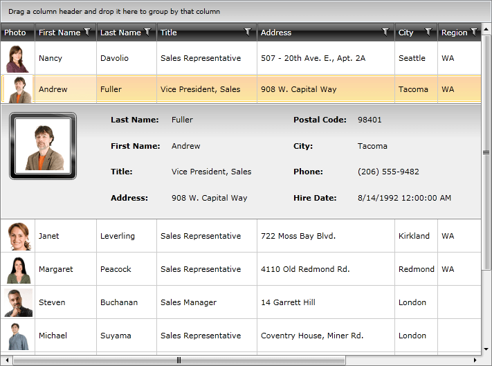

# Key Features

This is a list with short descriptions of the top-of-the line features of __RadGridView__ control.        
            
* __Powerful DataBinding__: RadGridView can be bound to various data source types, such as Objects, Collections, XML, WCF and RIA services and LINQ. [Read more]().

* __Outstanding Performance__: A major advantage of __RadGridView__ is its outstanding performance – it can handle hundreds of thousands of records at a time, without hurting the user experience. Featuring a revolutionary LINQ-based data engine, __RadGridView__ allows for manipulating data sources that are otherwise impossible to load and process. Data is processed with LINQ queries that offer unrivaled performance characteristics and extensibility. Moreover it delivers row and column virtualization utilizing a container reuse and recycling for further improving the grid performance as well as the memory footprint. [Read more]().

* __Grouping__: The users can interactively organize their data in a way that suits best their needs with a single drag and drop action. Data can be grouped according to several criteria effectively creating a tree of groups with the leaf nodes holding the actual data records. Users can group data by dragging a column header and dropping it in the group area. Users can also rearrange the grouping headers in the group area (again by dragging and dropping). [Read more]().

* __Sorting__: RadGridView has built-in sorting support out of the box. You get this functionality enabled by default. Just click on the header of the column you wish to have your data sorted by and you are ready. [Read more]().

* __Filtering__: RadGridView has built-in filtering support out of the box. You get this functionality enabled by default. Clicking the filtering icon in the column headers opens a menu with the distinct values for the current column and the user can select which of those values to be displayed. Also the user can choose to filter by certain criteria adding some of the built-in conditions like Contains, StartWith, IsEqualTo, etc. [Read more]().

* __Totals Row with Aggregate Functions__: You can add a variety of aggregate functions, such as Sum, Count, Min, Max, Average, etc, to your data model and see the results they produce in the column/group footers. Of course, aggregate result display is fully customizable. [Read more]().

* __Frozen columns__: RadGridView allows you to keep part of your data always visible putting the rest of it in context. To freeze columns, you simply set the __FrozenColumnCount__ property to the number of columns you want to freeze. [Read more]().

* __Column Groups__: Columns in RadGridView may be grouped in column groups. [Read more]().

* __Row details and details presenter__: Each grid row is capable of presenting additional information by means of a __Row Details__ template. The __Row Details__ template is a __DataTemplate__ defined on the grid- or row-level and is used for displaying row data without affecting the dimensions of the row and the cells within it. [Read more]().

* __In-place data editing__: RadGridView provides in-place data editing. [Read more]().

* __Validation__: RadGridView provides a couple of validation mechanisms. Also, the control supports validating through the [INotifyDataErrorInfo](https://msdn.microsoft.com/en-us/library/system.componentmodel.inotifydataerrorinfo(v=vs.95).aspx) and [IDataErrorInfo](https://msdn.microsoft.com/en-us/library/system.componentmodel.idataerrorinfo(v=vs.110).aspx) interfaces and DataAnnotations.

* __Enable\Disable grid elements__: Control the behavior of your __RadGridView__ control by enabling\disabling different parts of its visual structure; [Read more]().

* __ControlPanel__: As of __Q3 2013__ we have introduced a new feature allowing the developer to define __ControlPanelItems__. [Read more]().

* __Merged Cells__: As of __Q3 2014__ we have introduced support for __merged cells in RadGridView__ control. As a result the serial cells with equal values can be merged vertically or horizontally. [Read more]()

* __StyleSelectors__: RadGridView has built in support for applying Style selectors. [Read more]()

* __Styling and Appearance__: RadGridView can be fully customized using Expression Blend. There are also several pre-defined themes that can be used. Furthermore, Telerik unique style building mechanism allows you to change the skin’s color scheme with just a few clicks. [Read more]()

* __TemplateSelectors__: RadGridView has built-in support for applying DataTemplate selectors. [Read more]().

* __Templates__: RadGridView has built in templates support, which gives you the power to fully customize the look & feel. Use Expression Blend to edit existing templates or create new ones. [Read more]().

* __Custom Layout__: You have full control over the way the data is presented in the grid through cell customization and row layout customization.  Or you can combine the built-in appearance of the grid cells with a custom view that you have defined. You can let some of your cells get generated automatically and provide your own styles and templates for the rest.
You can easily customize a column’s cell template and the row layout in any way your user experience team may desire. You can also combine the built-in appearance settings of the grid with your custom one. Furthermore you can customize the grid’s column templates and use unbound data columns.
To break away from the standard tabular view, you can customize the row appearance inside the grid. Designers can unleash their imagination and present the information in a visually appealing way well-suited to your application.
            
* __Lightweight Templates__: As of __2013 Q2 SP__ we have introduced lightweight templates for RadGridView and RadTreeListView. Their main idea is to limit the number of visual elements within the templates in order to speed up the performance of the control.[Read more]()

* __Flexible Hierarchy Model__: RadGridView has an extremely flexible hierarchy model, which allows meaningful organization of complex data. To spare you the trouble of defining hierarchical relationship, __RadGridView__ can automatically detect those if bound to an ADO.NET DataSet and display the data accordingly. __RadGridView__’s hierarchy also support extends to .NET object graphs. Furthermore, the control allows you to define custom hierarchy settings using your own implemented rules instead of using data table or .NET object relations. [Read more]()

* __Self Referencing Hierarchy__: Often tabular data defines a hierarchical relationship with itself. This approach is used to model tree-like structures that can be nested to arbitrary depths. __RadGridView__ supports that scenario through its self-reference hierarchy feature that allows you to define a relation that points back to the same table. For example, consider a Customer object with a collection of related customers. [Read more]()

* __Selecting and Navigating__: __RadGridView__ provides a familiar selection API that will make the WPF developers feel at home. The control supports single and multiple records selection that can be manipulated both with the mouse and with the keyboard. [Read more]()

* __Localization Support__: RadGridView provides advanced [Localization]() support.
  
* __Flexible API__: With its easy to understand API, RadGridView provides fast and easy way to further deal with its elements and their properties in the code-behind.
            
* __Enhanced Routed Events Framework__: To help your code become even more elegant and concise, Enhanced Routed Events Framework for RadControls for SilverlightWPF is implemented. This gives you more freedom when you design your applications, since you can write instance handlers as well as class handlers for the routed events of your controls.
            
* __Expression Blend support__:  All UI Controls can be easily customized using Expression Blend.
   
* __Levels 1,2 and 3Coded UI test support__ across our controls. For more detailed information on Coded UI and Levels of support you could check this
[link](http://blogs.msdn.com/b/visualstudioalm/archive/2011/10/28/coded-ui-test-extension-for-3rd-party-controls-the-basics-explained.aspx).

* __Searching__: Through it the control extends the existing filtering functionality by enabling highlighting of the filtered data. More information can be found in the [Search as you type]() topic.

* __Pinned Rows__: As of __R2 2016 RadGridView__ provides a mechanism for pinning particular rows to the top of the control, so that they do not participate in the vertical scrolling. A detailed explanation of this feature can be found in the [Pinned Rows]() article.

## See Also  
 * [RadGridView Overview]()
 * [Visual Structure]()
 * [Getting Started]()
 * [Populating with Data]() 
 * [UI Virtualization]()
